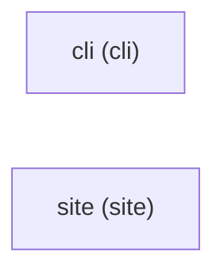

# bootstrap — Architecture

> The human-readable system shape. The machine-readable registry is
> [registry.yaml](./registry.yaml); tools parse that, never this doc.

## System Overview

bootstrap is one tool that renders shared development-tooling setup into a
repository, adds, removes and replaces tools by category, and a documentation
site that explains it. Each change is left uncommitted in the repository's
version history, which is the only rollback mechanism.

Everything runs on the user's machine or in continuous integration. The only
cloud-hosted piece is the documentation site. There are two independent
projects, so no shared-package strategy is needed.

## Projects

### cli (`cli`)

The command-line tool. It renders the shared setup into a target repository, and
adds or removes tools, from commands or an interactive terminal tool selector.
It runs locally and in CI, needs no accounts, and signals outcomes through exit
codes plus the structured result.

### site (`site`)

The documentation site. It is statically generated content describing the
CLI's commands, tools and machine-readable results. It holds no application logic and
no user data.

## How Projects Interconnect

The two projects do not call each other. The site documents the CLI's commands
and its machine-readable results, but there is no runtime link, no auth flow and no
data flow between them.

## Hosting & Deployment

- **cli** runs on developer machines and in CI. An automated pipeline publishes
  it to the public package registry with provenance, and on the same release
  updates the formula in the owner's own Homebrew tap. Users install the
  executable with the toolchain manager or with Homebrew.
- **site** is static output served from Cloudflare's edge as static assets, and
  an automated pipeline deploys it on release.

## Registry

The machine-readable system description lives in
[registry.yaml](./registry.yaml) — projects, capabilities, dependencies, and the
cross-cutting selections. It is authoritative; this doc is its prose view.
