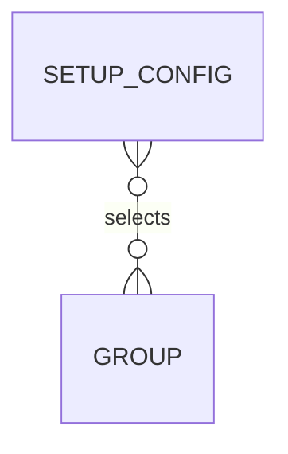

# Entities

## Entity catalog

| Entity                                 | Purpose (one line)                                                                  |
| -------------------------------------- | ----------------------------------------------------------------------------------- |
| [Setup Config](./setup-config/index.md) | Records a repository's bootstrap answers and marks it as set up.                    |
| [Group](./group/index.md)              | Named set of setup files shipped inside the tool; core groups always apply.         |

## Relationship view

