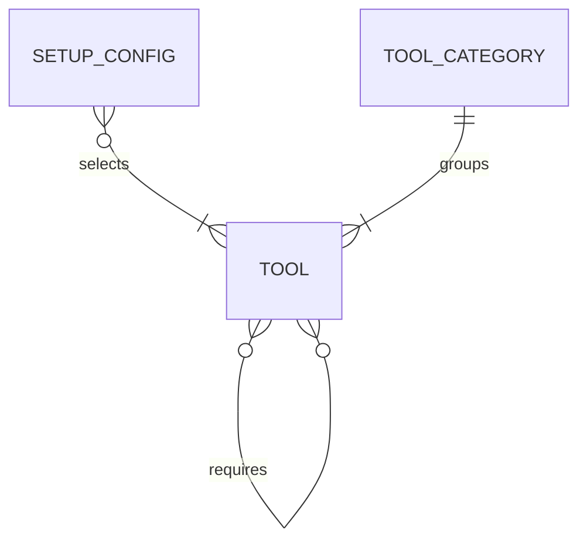

# Entities

## Entity catalog

| Entity                                 | Purpose (one line)                                                                  |
| -------------------------------------- | ----------------------------------------------------------------------------------- |
| [Setup Config](./setup-config/index.md) | Records a repository's bootstrap values and selected tools, and marks it as set up. |
| [Tool](./tool/index.md)                | Named set of setup files for one tool, shipped inside bootstrap, in a category. |
| [Tool category](./tool-category/index.md) | Group of tools that do the same job, with a limit on how many can be selected at once. |

## Relationship view

