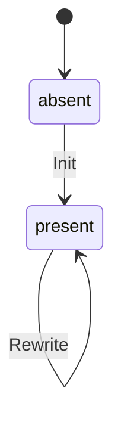

# Entity: Setup Config

## Purpose

The setup config records the answers a repository was set up with, so that
check, update and add can re-render the same setup later. It is a
human-readable, hand-editable file kept in the target repository at
`.config/bootstrap.yaml`; that path is product contract. Its presence means
"this repository has been initialised", and `bootstrap init` refuses to run
when it exists.

Used by: [Set up a repository](../../flows/cli/110-setup-repository/index.md), [Check for drift](../../flows/cli/120-check-drift/index.md),
[Update an existing repository](../../flows/cli/130-update-repository/index.md),
[Add an optional group](../../flows/cli/140-add-group/index.md)

Scale: one per set-up repository; grows with the number of repositories
bootstrapped.

## Out of Scope

- Deleting the file: removal is manual and not a contract transition.
- Core groups: always applied, never recorded here.
- Secrets or personal data: none is stored.

## Lifecycle / State Machine

| From   | To      | Trigger (actor/system)                                                                | Guard                         | Side effect                              |
| ------ | ------- | ------------------------------------------------------------------------------------- | ----------------------------- | ---------------------------------------- |
| absent | present | Init, flow step "write bootstrap.yaml" ([flow](../../flows/cli/110-setup-repository/index.md)) | no setup config exists already | `version` set to the running version |
| present | present | [Update an existing repository](../../flows/cli/130-update-repository/index.md), [Add an optional group](../../flows/cli/140-add-group/index.md) | file is valid: conforms to schema.yaml; `format` supported by the running cli (not newer); `version` not newer than the running cli; every group name shipped by the running cli (invariant 3) | Rewrite writes the running cli's current `format` (upgrading an older file) and its `version` |

## Invariants

1. Written last in an init run, so a failed init leaves no setup config behind.
2. `version` is rewritten on every write.
3. Every name in `values.groups` is an optional group of [Group](../group/index.md). A name the running cli no longer ships (removed in a major release) stops the command with exit 3 ([errors](../../conventions.md#errors)), naming the group, saying it was removed in this version and telling the user to remove it from the file; nothing is guessed.
4. `values.groups` has no duplicates.
5. A `kept` path should be one a selected group (core or optional) writes. One no selected group writes is not rejected: check reports it as a warning (stale kept entry), so a group change never breaks the file.
6. Check reports a `kept` path with status `kept`, never as drift; update never overwrites it.

## Data Model

Authoritative schema: [schema.yaml](./schema.yaml)

- `format` is independent of `version`: it changes only when the file's shape changes, and the value for 1.0 is `1`. Per [baseline](../../conventions.md#baseline) expand-contract, a newer cli reads every older format it shipped; a file whose format is newer than the running cli understands is refused (exit 3, [errors](../../conventions.md#errors)).
- `version` lets every command report "set up with X, running Y"; a recorded `version` newer than the running cli is refused by every command (exit 3, [errors](../../conventions.md#errors)) — an older cli never writes or judges a newer setup.
- `values.groups` lists selected optional groups only; core groups are implicit.
- `values.repo` defaults to the owner/name detected from the git remote.

## Relationships

| Related entity                | Cardinality | Ownership | On delete | Required |
| ----------------------------- | ----------- | --------- | --------- | -------- |
| [Group](../group/index.md)    | N–M         | reference | N/A — groups ship with the cli, not across repositories; see invariant 3 | no       |

## Concurrency & Consistency

- Concurrent-write resolution: default — per
  [baseline](../../conventions.md#baseline) (single local writer)
- Uniqueness guarantees under races: one file per repository, at a fixed path.
- Idempotency of each mutating action: init is refused when the file exists;
  update and add-group rewrite the whole file, so repeating one with the same
  answers yields the same content apart from `version`.

## References

- [baseline](../../conventions.md#baseline)
- [config](../../conventions.md#config)
- [backups](../../conventions.md#backups)

Retention: lives with the repository's git history. PII: none.
