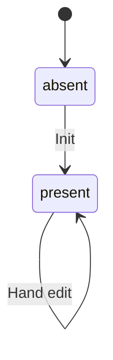

# Entity: Setup Config

## Purpose

The setup config records the answers a repository was set up with, so that
check, update and add can re-render the same setup later. It is a
human-readable, hand-editable file kept in the target repository at
`.config/bootstrap.yaml`; that path is product contract. Its presence means
"this repository has been initialised", and `bootstrap init` refuses to run
when it exists.

Used by: [Set up a repository](../../flows/cli/110-setup-repository/index.md), [Check for drift](../../flows/cli/120-check-drift/index.md),
[Update a repository](../../flows/cli/130-update-repository/index.md),
[Add a tool](../../flows/cli/140-add-tool/index.md),
[Remove a tool](../../flows/cli/150-remove-tool/index.md),
[Documentation](../../flows/site/110-documentation/index.md)

Scale: N/A — a local file on the user's machine, one per set-up repository; no
scale to measure.

## Out of Scope

- Deleting the file: removal is manual and not a contract transition.
- Core ([Tool](../tool/index.md)): never recorded here.
- Secrets or personal data: none is stored.

## Lifecycle / State Machine

| From   | To      | Trigger (actor/system)                                                                | Guard                         | Side effect                              |
| ------ | ------- | ------------------------------------------------------------------------------------- | ----------------------------- | ---------------------------------------- |
| absent | present | Repo owner or agent running init: flow step "write bootstrap.yaml" ([flow](../../flows/cli/110-setup-repository/index.md)) | no setup config exists already | `format` set to the running cli's current format; `values` set to the init answers; `version` set to the running version; `files` set to the full set the running cli produces; `kept` and `deleted` omitted (empty) |
| present | present | Repo owner or agent running [Update a repository](../../flows/cli/130-update-repository/index.md), [Add a tool](../../flows/cli/140-add-tool/index.md), [Remove a tool](../../flows/cli/150-remove-tool/index.md) | file is valid ([Validity](#validity)); for add and remove, the recorded `version` equals the running cli, else exit 3 "run `bootstrap update` first" ([errors](../../conventions.md#errors)) | Rewrite writes the running cli's current `format` (upgrading an older file) and its `version`; `files` refreshed to the full set the running cli produces. List changes by update ([flow 130](../../flows/cli/130-update-repository/index.md)): a path enters `kept` on "keep mine" or `--keep <path>`; leaves `kept` on `--take <path>` or on "recreate" for a deleted kept file; moves `kept`→`deleted` on "leave deleted" or on `--keep <path>` for a deleted kept file the running cli still produces; leaves `deleted` on `--take <path>`. Update never puts a path into `deleted` except from `kept`: a missing produced path not in `kept` is recreated. Add ([flow 140](../../flows/cli/140-add-tool/index.md)) appends the named non-core tools to `values.tools` and refreshes `files` to the full produced set; `kept` and `deleted` are untouched. Remove ([flow 150](../../flows/cli/150-remove-tool/index.md)) takes the named non-core tools out of `values.tools` and refreshes `files`; `kept` and `deleted` are untouched. `values.repo`, `values.commit_scopes` and `values.merge_model` change by update's value flags ([flow 130](../../flows/cli/130-update-repository/index.md) step 2) or a hand edit; `values.tools` changes by add and remove or a hand edit |
| present | present | Repo owner hand-edits any field (invariant 10) | none at the edit; the next command applies [Validity](#validity) | none by bootstrap; edited `values` take effect on the next `bootstrap update`; the next write by bootstrap rewrites `format`, `version` and `files` |

## Validity {#validity}

Every command except init (it refuses when the file exists) applies these
checks when it reads the file. A failed check stops the command with exit 3
([errors](../../conventions.md#errors)), naming the problem and the fix.

- The file conforms to [schema.yaml](./schema.yaml).
- `format` is not newer than the running cli understands.
- `version` is not newer than the running cli; the fix is "upgrade bootstrap".
- Every name in `values.tools` is a non-core tool the running cli ships. A
  removed name is reported as removed in this version, with the fix to remove
  it from the file; a core tool name (possible only by hand edit) is reported
  as invalid. Nothing is guessed.
- No path is in both `kept` and `deleted`; the fix is to remove it from one
  list.
- Every path in `files`, `kept` and `deleted` is a literal file path relative to
  the repository root: not absolute, no `..` segment, no wildcard. A violation
  is refused per [baseline](../../conventions.md#baseline) boundary-validation;
  the fix is to correct or remove the entry.

## Invariants

1. Written last in an init run, so a failed init leaves no setup config behind.
2. `version` is rewritten on every write.
3. Every name in `values.tools` is a non-core [Tool](../tool/index.md).
4. `values.tools` has no duplicates.
5. A `kept` path should be one a selected tool (core or non-core) writes. One no selected tool writes is not rejected: check reports it as the warning "kept file no longer produced", so a tool change never breaks the file.
6. Check reports a `kept` path with status `kept`, never as drift.
7. After every write, `files` lists every path the full selected set (core plus selected non-core tools) produces under the running cli — the whole set, not only what that run wrote. `kept` and `deleted` paths still produced are included; a `kept` path the cli no longer produces is not in `files` (it stays in `kept`; check warns).
8. A path is never in both `kept` and `deleted`.
9. Bootstrap never recreates or asks about a `deleted` path, except on an explicit `--take <path>` from update; check reports it as `deleted`, not drift. A `deleted` path the running cli no longer produces stays in `deleted` and is not in `files`.
10. The owner may edit any field by hand ([config](../../conventions.md#config)); the next command validates the file. Edited `values` take effect on the next `bootstrap update`.

## Data Model

Authoritative schema: [schema.yaml](./schema.yaml)

- `format` is independent of `version`: it changes only when the file's shape changes, and the value for 1.0 is `1`. Per [baseline](../../conventions.md#baseline) expand-contract, a newer cli reads every older format it shipped.

## Relationships

| Related entity                | Cardinality | Ownership | On delete | Required |
| ----------------------------- | ----------- | --------- | --------- | -------- |
| [Tool](../tool/index.md)     | N–M         | reference | N/A — tools ship with the cli, not across repositories; see invariant 3 | no       |

## Concurrency & Consistency

- Concurrent-write resolution: default — per
  [baseline](../../conventions.md#baseline) (single local writer)
- Uniqueness guarantees under races: one file per repository, at a fixed path.
- Idempotency of each mutating action: init is refused when the file exists;
  a run with nothing to change does not rewrite the file at all. A running
  `version` or `format` that differs from the recorded one is a change, so the
  file is rewritten (invariant 2).

## References

- [baseline](../../conventions.md#baseline)
- [config](../../conventions.md#config)
- [backups](../../conventions.md#backups)

Retention: lives with the repository's git history. PII: none.
