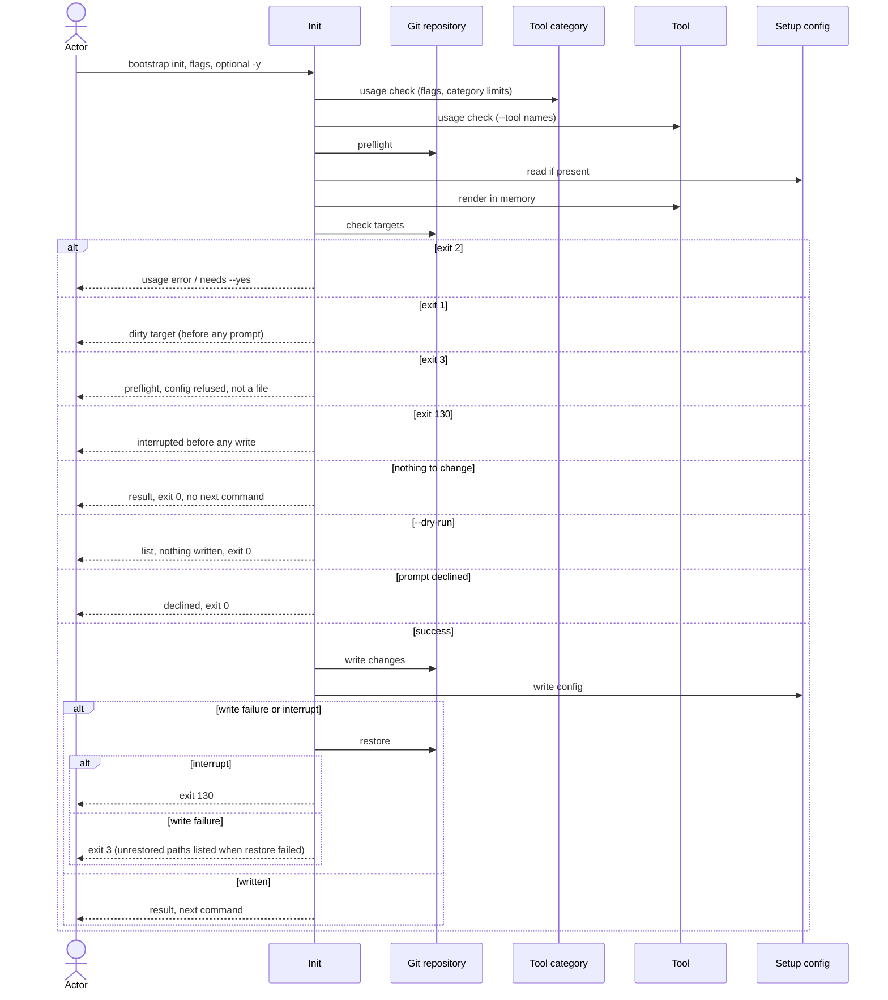

# Flow: Set up a repository

## Purpose

`bootstrap init` writes the baseline files of the selected tools into a git
repository and records what it did in one config file. Run again on a set-up
repository it is a re-run: it renders with the running bootstrap and writes only
what changed.

Serves: [Fast new-repo setup](../../../product.md#goal-fast-setup),
[Zero setup drift](../../../product.md#goal-zero-drift)

## Trigger & Actors

| Actor                      | May trigger                                                                                               | Authorization                       | Audit-recorded                                                             |
| -------------------------- | --------------------------------------------------------------------------------------------------------- | ----------------------------------- | -------------------------------------------------------------------------- |
| Repo owner, AI agent or CI | the command `bootstrap init`, in any terminal, with flags; `-y` or the consent prompt applies the changes | write access to the repository root | no — no audit foundation; git history keeps every replaced or deleted file |

Interactive setup is `bootstrap tui`
([Select tools](../160-select-tools/index.md)).

## Steps

Usage errors come first and exit 2 before the preflight and before
`.config/bootstrap.yaml` is read. Nothing is written. They are:

- an unknown flag;
- a flag value that breaks its rule (`--merge-develop` or `--merge-main` not
  `direct`\|`pr`; an `--add-scope` or `--remove-scope` value not lowercase
  kebab-case; `--repo` not two or more `/`-separated segments), with a message
  naming the flag and the allowed form;
- `--reset-scope` together with `--add-scope` or `--remove-scope`;
- the same scope value given to both `--add-scope` and `--remove-scope`;
- an unknown `--tool` name ([Tool](../../../entities/tool/index.md)), or two
  `--tool` names of one `max: one` category
  ([Tool category](../../../entities/tool-category/index.md));
- a `--tool` naming another tool of a `max: one` category whose unremovable tool
  is not replaceable (`mise`; an attempt to replace a non-replaceable tool, per
  [Tool category](../../../entities/tool-category/index.md) invariant 4). A
  `--tool` naming another tool of the `version-control` or `git-hooks` category
  is not a usage error: with `--replace` it replaces that tool (step 5).

A `--tool` whose required tool is not in the request is not a usage error
([Tool](../../../entities/tool/index.md#requires-and-dependencies)).

1. Init runs the preflight per [errors](../../../conventions.md#errors); nothing
   is written on failure.
2. Init looks for `.config/bootstrap.yaml`. Absent → a first run. Present → a
   re-run: init validates it per
   [Setup config validity](../../../entities/setup-config/index.md#validity),
   repairs it per
   [repair on read](../../../entities/setup-config/index.md#repair), and takes
   every value and the tool selection from it. Init is exempt from the version
   guard: an older `version` or `format` is never refused, it is an upgrade
   re-run handled as any re-run (step 3 onward). A newer `version` or `format`
   fails that validity check.

   [Setup config](../../../entities/setup-config/index.md)
3. Actor supplies the values:

   | Value                | Flag                                                                         | Required          | Default                                                |
   | -------------------- | ---------------------------------------------------------------------------- | ----------------- | ------------------------------------------------------ |
   | repo path            | `--repo`                                                                     | yes               | the recorded value, else read from the remote `origin` |
   | commit scopes        | `--add-scope` (repeatable) / `--remove-scope` (repeatable) / `--reset-scope` | no — zero allowed | the recorded list, else none                           |
   | merge model, develop | `--merge-develop` `direct`\|`pr`                                             | yes               | `direct`                                               |
   | merge model, main    | `--merge-main` `direct`\|`pr`                                                | yes               | `pr`                                                   |

   The `--repo` default and the host (step 4) are read from the remote named
   `origin` only, on any host:

   | `origin` URL form                     | Repo default (`<path>`: owner segments then the name) | Host |
   | ------------------------------------- | ----------------------------------------------------- | ---- |
   | scp-like `<user>@<host>:<path>(.git)` | yes                                                   | yes  |
   | `ssh://…`                             | no                                                    | yes  |
   | `https://<host>/<path>(.git)`         | yes                                                   | yes  |
   | `http://…`                            | no                                                    | yes  |
   | no `origin`, or an unreadable URL     | no                                                    | no   |

   A `<path>` is `owner/name`, or nested `group/subgroup/name`.

   The scope flags change the recorded list (`values.commit_scopes`):
   - `--add-scope <scope>` adds a scope; a scope already in the list is used
     once.
   - `--remove-scope <scope>` removes a scope; a scope not in the list is
     ignored and reported in `warnings` ("scope `<s>` is not recorded").
   - `--reset-scope` empties the list (zero scopes).
     ([config](../../../conventions.md#config))

   Precedence, defaults and a missing value follow
   [config](../../../conventions.md#config) and
   [errors](../../../conventions.md#errors). `--repo` is the only value that can
   be missing (no flag, no recorded value, none readable from `origin`): init
   exits 2 naming `--repo`.
   [Setup config](../../../entities/setup-config/index.md) (recorded values)
4. Actor selects the tools. Tools and their categories come from the
   [Tool](../../../entities/tool/index.md) and
   [Tool category](../../../entities/tool-category/index.md) catalogs.
   - First-run defaults: every tool whose `default` is `on`, plus each `origin`
     tool whose `origin_hosts` contains the host of the `origin` remote (the
     host column of the step 3 table), compared ignoring case.
   - First run without `--tool`: the selection is the default tools plus their
     dependencies, with or without `-y`; consent to apply them comes in step 6.
     A re-run without `--tool` keeps the recorded selection.
   - `--tool <name>` (repeatable) gives the full list of selected removable
     tools; unremovable tools are always added. A name given more than once is
     used once.
   - Each `requires` slot with no selected tool gets a dependency, recorded with
     its parents in `values.dependencies`
     ([Tool](../../../entities/tool/index.md#requires-and-dependencies)). A
     dependency is installed and rendered like a selected tool.
5. Replacement, re-run only: a selection that puts a different tool in a
   `max: one` category than the recorded one is a replacement. It needs
   `--replace`; without it init exits 2 before consent
   ([config](../../../conventions.md#config)). Replacing a recorded tool whose
   `replaceable` is false needs the setup file, so it is checked here, after the
   config is read, and exits 2 ([safety](../../../conventions.md#safety)
   Precedence). `--replace` with no replacement to make is ignored.
   [Tool category](../../../entities/tool-category/index.md)
6. Init computes every render and decision in memory per
   [safety](../../../conventions.md#safety).
   - A re-run that drops a recorded removable tool, or replaces one, takes it
     out of `values.tools`. If a selected tool still requires it, it stays as a
     dependency (for an init re-run the requires check never fails; see
     [Requires and dependencies](../../../entities/tool/index.md#requires-and-dependencies)).
     Otherwise its files are removed as [Remove a tool](../150-remove-tool/index.md)
     does.
   - A re-run prunes each dependency that no parent needs: it is on the list of
     changes and its files are deleted and reported as usual. It also corrects
     the parent lists. A dependency the config lacks is repaired per
     [Repair on read](../../../entities/setup-config/index.md#repair).

   - The computed list is every file to create, change, delete or replace, plus
     a repair of the setup file; the repair counts as a change. Refusals,
     consent, `--dry-run` and the empty list follow
     [config](../../../conventions.md#config) steps 1–5.

   [Tool](../../../entities/tool/index.md)
7. Init writes only the changes: creates, changes and deletes the targets.
   [Tool](../../../entities/tool/index.md) (target files)
8. Init writes `.config/bootstrap.yaml` last, recording the format, the
   bootstrap version running, the values (`values.tools` = every direct tool;
   `values.dependencies` = every dependency with its parents) and `files` (every
   tool path init renders for the selected tools and dependencies, plus any
   `orphaned` path; not `.config/bootstrap.yaml` itself). It rewrites the whole
   file per
   [write format](../../../entities/setup-config/index.md#write-format); on an
   upgrade re-run `version` and `format` move to the running bootstrap's.
   [Setup config](../../../entities/setup-config/index.md)
9. Init prints the result, the next command and the closing line per
   [errors](../../../conventions.md#errors); `.config/bootstrap.yaml` is in
   `created` on a first run and in `changed` when rewritten. The `--json`
   success document adds `created`, `changed`, `deleted`, `unchanged`, `kept`,
   `orphaned` (paths), `replaced` (objects `{from, to}`), `dependencies_added`
   (the tools init added as dependencies in this run) and `dependencies_pruned`
   (the dependencies it pruned) to the document keys of
   [errors](../../../conventions.md#errors); the human output reports the same
   lists. `dependencies_added` and `dependencies_pruned` are tool names sorted
   by name, always present; a tool the user named in `--tool` is never in them.
   With nothing to create, change, delete or replace, init lists every path by
   its status. Init never installs software or runs that task itself.

`--dry-run` follows [config](../../../conventions.md#config); it exits 0 on
success, otherwise with the code of the failing step, and `--json` adds
`"dry_run": true` to the success or the error document.

## Guarantees

| Step             | Consistency                 | On failure                                                                                                                                                                                                                                                                                                                                                                   | Idempotency                                                                               | Load & latency          |
| ---------------- | --------------------------- | ---------------------------------------------------------------------------------------------------------------------------------------------------------------------------------------------------------------------------------------------------------------------------------------------------------------------------------------------------------------------------- | ----------------------------------------------------------------------------------------- | ----------------------- |
| usage check, 1–6 | atomic — nothing is written | none — nothing written yet; the usage check exits 2, steps 1–6 exit 1, 2, 3 or 130 per step (0 when the consent prompt is declined)                                                                                                                                                                                                                                          | n/a — a retry starts from the same repo state                                             | n/a — one local command |
| 7–8              | atomic — all-or-nothing     | restore per [safety](../../../conventions.md#safety); a write failure exits 3 naming the failing path, an interrupt exits 130; a failed restore exits 3 per [errors](../../../conventions.md#errors). An uncatchable kill is out of the guarantee; the config is written last, so the repo is then not marked set up (first run) or still records the earlier state (re-run) | a re-run with nothing changed writes nothing and exits 0; after a restore it starts clean | n/a — one local command |
| 9                | atomic — output only        | none — changes no repo state                                                                                                                                                                                                                                                                                                                                                 | n/a                                                                                       | n/a — one local command |

## Diagram

## Background Jobs

N/A — runs synchronously in one command invocation.

## Acceptance

- Given an empty git repository, when `bootstrap init` runs with all flags and
  `-y`, then the files of the selected tools exist, `.config/bootstrap.yaml`
  records the version, values (`values.tools` = every direct tool,
  `values.dependencies` = every dependency with its parents) and files, and the
  exit code is 0.
- Given no prompt is possible (stdin or stdout not a terminal, or `--json`) and
  no `-y`, when init would make a change, then it does not prompt, nothing is
  written, the exit code is 2 "changes need --yes" and the next command is the
  same command plus `--yes`. This covers: a first run (also one whose repo path
  is read from `origin`); a re-run that would create, change, delete or replace
  a file, or repair the setup file; a re-run that drops a recorded removable
  tool (whether or not it deletes files); a re-run that replaces a tool with
  `--replace`; and a repair.
- Given a terminal on stdin and stdout, no `--json` and no `-y`, when init runs
  a change, then the list of changes is shown and "apply these changes? y/N" is
  asked; answering "n" (or Enter) writes nothing and exits 0 with "nothing
  changed"; answering "y" applies the list and exits 0.
- Given a dirty target and no `-y`, in a terminal or not, when init runs, then
  the exit code is 1 listing the path before any prompt and nothing is written.
- Given `--dry-run` (in a terminal or not, with or without `-y`, also with
  `--json`), when init runs a first run, a re-run with a change, a drop, a
  replacement or a repair, then it never prompts, reports the would-be created,
  changed, deleted, kept, orphaned and replaced paths (the list the real run
  would apply), writes nothing and the exit code is 0.
- Given `bootstrap init` with no `--tool` on a first run (with or without
  `--yes`), when init runs, then the default tools are selected and the runtimes
  they require arrive as dependencies (for example `python` and `uv` for
  `pre-commit`, `node` and `pnpm` for `dprint`, `jq` and `yq` for `claude`);
  with `--yes` they are applied and the exit code is 0, without it consent
  follows the prompt rule above.
- Given a first run, when init runs `--tool dprint -y`, then `dprint` is
  selected and `node` and `pnpm` are recorded in `values.dependencies`, next to
  the dependencies of the unremovable tools: `node` with parents
  `[dprint, pnpm]` (`pnpm` requires `node`), `pnpm` with parents `[dprint]`;
  `dependencies_added` lists `node` and `pnpm` (and the other dependencies this
  run added), not `dprint`; the exit code is 0.
- Given the remote `origin` is `git@<host>:o/r.git` or `https://<host>/o/r.git`,
  when init reads defaults, then the repo default is `o/r`; for
  `https://<host>/a/b/c.git` it is `a/b/c`; for `ssh://git@github.com/o/r.git`
  the repo default is not readable; and whenever the `origin` host is
  `github.com`, `github` is selected by default.
- Given a set-up repository and a re-run with nothing to create, change, delete
  or replace, when init runs (in any terminal, with or without `-y`), then
  nothing is written, an existing `create_only` file is listed `kept`, an
  unrendered recorded path is listed `orphaned`, every other file is listed
  `unchanged`, there is no closing line and no `next_command`, and the exit code
  is 0 (a `--dry-run` follows the same rule).
- Given a re-run with `-y` and `--merge-main direct` over a recorded `pr`, when
  init runs, then the flag value is rendered and recorded and the other recorded
  values are kept as supplied.
- Given a re-run whose config records a newer version or format, when init runs,
  then nothing is written and the exit code is 3 "upgrade bootstrap".
- Given a repository set up by an older bootstrap `version` or `format`, when a
  newer bootstrap re-runs init with `-y`, then the older format is read and not
  refused, the changed files are rewritten, `version` and `format` move to the
  running bootstrap's, `files` is refreshed and orphaned paths are reported
  `orphaned`.
- Given a first run, when init finishes, then no path is reported `orphaned`.
- Given a config that fails the schema, or a `files` entry that is empty,
  absolute, uses `..` or has a wildcard, when init runs, then nothing is
  written, the exit code is 3 and the message names the failing field and says
  "fix the file, then run again".
- Given an unknown flag, an invalid flag value (for example
  `--merge-main squash`), an unknown `--tool` name, two `--tool` names of one
  `max: one` category, or a `--tool` naming another tool of a `max: one`
  category whose unremovable tool is not replaceable (`mise`), when init runs
  (with or without `-y`, even in a directory that is not a git repository or
  with a config that fails the schema), then these are usage errors: nothing is
  written and the exit code is 2 before the preflight, not 3; for an invalid
  flag value the message names the flag and the allowed form.
- Given `--tool` naming another tool of the `version-control` or `git-hooks`
  category over the recorded one, when init re-runs with `--replace` and `-y`, then it is a
  replacement, not a usage error; without `--replace` the exit code is 2.
- Given a `values.tools` name the running catalog does not have, or two tools of
  one `max: one` category, when init runs, then nothing is written and the exit
  code is 3 naming the fix (for example "remove `fnox` from values.tools").
- Given a recorded selection with a tool whose required tool is not recorded,
  when init re-runs with `-y`, then the missing dependency is added back as a
  repair ([Repair on read](../../../entities/setup-config/index.md#repair)), the
  warning "added back dependency `<name>`" is reported (`warnings`), the
  dependency is listed in `dependencies_added` and the exit code is 0.
- Given a re-run after which a recorded dependency has no parent left (or whose
  parent list is wrong), when init runs with `-y`, then the dependency is pruned
  (its non-`create_only` files are deleted and reported `deleted`, its
  `create_only` files kept), it is listed in `dependencies_pruned` and the
  parent lists are corrected.
- Given a `values.tools` that misses an unremovable tool and no other tool of
  its `max: one` category is recorded, when init runs with `-y`, then the tool
  is added again, the warning "added back unremovable tool `<name>`" is reported
  (`warnings`) and the exit code is 0.
- Given `.config/bootstrap.yaml` has uncommitted changes and its content differs
  from the render, when init re-runs, then nothing is written and the exit code
  is 1 listing it; once committed, it is listed `changed` when rewritten and
  `unchanged` when not.
- Given `--tool taplo` without `--tool dprint`, when init runs with `-y`, then
  `dprint` is added as a dependency of `taplo` (with `node` and `pnpm` as its
  dependencies), `dependencies_added` lists `dprint`, `node` and `pnpm`, and the
  exit code is 0; given `--tool taplo --tool dprint`, `dprint` is selected
  directly and is recorded in `values.tools`, not in `values.dependencies`.
- Given `--tool github --tool github`, when init runs with `-y`, then github is
  applied once.
- Given a recorded list without `api`, when init runs with `-y --add-scope api`
  (also repeated as `--add-scope api --add-scope api`), then `api` is recorded
  once, the files are rendered again and every changed file is a target; given
  `api` already in the list, the list is unchanged.
- Given a recorded list with `api`, when init runs with `-y --remove-scope api`,
  then `api` is no longer recorded and the changed files are rewritten; given
  `--remove-scope web` with `web` not in the list, then the list is unchanged
  and `warnings` has "scope `web` is not recorded".
- Given a recorded list with scopes, when init runs with `-y --reset-scope`,
  then `values.commit_scopes` is empty and the changed files are rewritten; it
  also works together with every non-scope flag.
- Given `--reset-scope` with `--add-scope` or `--remove-scope`, when init runs,
  then nothing is written and the exit code is 2.
- Given `--add-scope api --remove-scope api`, when init runs, then nothing is
  written and the exit code is 2.
- Given `--add-scope api --remove-scope web` with `web` recorded, when init runs
  with `-y`, then both are applied: `api` is added and `web` is removed.
- Given a first run with `--add-scope api`, when init runs with `-y`, then the
  list is `api` alone.
- Given `--add-scope Api` (not lowercase kebab-case), when init runs, then
  nothing is written and the exit code is 2 naming the flag and the allowed
  form.
- Given the directory is not inside a git repository, when init runs, then
  nothing is written and the exit code is 3.
- Given `mise` is not on `PATH`, when init runs, then nothing is written, the
  exit code is 3 and the message says "mise not installed" with the install
  command.
- Given `mise` is found at a path other than `~/.local/bin/mise`, when init
  runs, then it continues and prints one warning naming that path (`--json`: in
  `warnings`).
- Given init runs from a subdirectory of a repository, when it succeeds with
  `-y`, then `.config/bootstrap.yaml` and every tool file are at the repository
  root.
- Given a target path that is modified, staged, untracked or ignored in git,
  when init runs, then nothing is written, the exit code is 1 and the output
  lists the path with "commit or stash these files, then run again".
- Given a tracked target deleted in the working tree with the deletion not
  committed, when init runs, then nothing is written and the exit code is 1
  listing the path; once the deletion is committed, init with `-y` creates the
  file again.
- Given a dirty file (including `.config/bootstrap.yaml`) whose content and mode
  already equal the render, when init runs, then it is listed `unchanged` and
  the run is not refused.
- Given a tool target path that exists as a directory or a symlink, or whose
  parent directory is a symlink or a regular file, when init runs, then nothing
  is written and the exit code is 3 naming that path.
- Given both a not-a-file target and an uncommitted target, when init runs, then
  nothing is written, the exit code is 3 and the output lists every path of both
  kinds.
- Given an existing `create_only` file, when init runs, then it is untouched and
  listed `kept`.
- Given a path in `files` that the running bootstrap no longer renders for a
  selected tool, when init runs, then it is left in place and listed `orphaned`;
  a recorded path that is no longer rendered and is absent on disk leaves
  `files` silently.
- Given a re-run that needs a replacement (a different tool in a `max: one`
  category than recorded) without `--replace`, when init runs in any terminal
  (also with `-y`, `--dry-run` or `--json`), then it does not prompt, nothing is
  written and the exit code is 2; with `--replace` and `-y` the replacement is
  applied, the replaced tool's non-`create_only` files are deleted, it is listed
  in `replaced` and the exit code is 0; with `--replace` and no `-y` it asks the
  consent prompt in a terminal (`--dry-run` needs no consent).
- Given `--replace` and no replacement to make, when init runs, then the flag is
  ignored and the run proceeds as without it.
- Given `-y` or `--yes`, when init runs, then both behave identically.
- Given a replacement of a recorded tool whose `replaceable` is false, when init
  runs, then the config is read, nothing is written and the exit code is 2, also
  when a target is dirty.
- Given a re-run whose selection drops a recorded removable tool (whether or not
  it deletes files), when init runs in a terminal without `-y`, then the list is
  shown and the prompt asked; with `-y` (or "y") that tool's non-`create_only`
  files are deleted and its `create_only` files are kept and reported.
- Given a successful run, when init finishes, then a first run's `created` lists
  `.config/bootstrap.yaml`, every task file has mode `0755` and every path list
  is sorted by path.
- Given a write failure injected mid-run, when init runs with `-y`, then every
  changed target is restored from `HEAD`, every created file is deleted and the
  exit code is 3 naming the failing path.
- Given an interrupt signal mid-write, when init is running with `-y`, then the
  working tree is as before and the exit code is 130.
- Given a required value with no flag, no recorded value and no default, in any
  terminal including an interactive one (also with `--dry-run` or `--json`),
  when init runs, then it does not prompt, the exit code is 2, the message names
  the missing flag, and the error's next command offers `bootstrap tui` or the
  missing flag (never `-y`); with `--json` stdout is one JSON document carrying
  the error.
- Given a first run, a repo path readable from `origin`, `--merge-develop` and
  `--merge-main` given and no `-y`, when init runs with no `--repo`, then the
  path from `origin` is used without consent (no value is missing); the run
  itself needs consent to write: in a terminal the prompt is asked, and with
  `-y` the exit code is 0.
- Given a re-run with a recorded `values.repo` that differs from the path read
  from `origin`, when init runs with no `--repo`, then the recorded value is
  kept; with `--repo` the flag value is rendered and recorded.
- Given a first run, no `--repo` and no repo path readable from `origin`, when
  init runs with or without `-y`, then there is no default, it does not prompt,
  the exit code is 2, the message names `--repo` and the next command offers
  `bootstrap tui` or `--repo`.
- Given a successful run or a `--dry-run` that adds a tool or creates, changes
  or deletes a `mise` config file, when init finishes, then the human output
  ends with exactly "commit the changes, then run
  `MISE_ENV=dev mise run setup:all`"; with `--json` the success document has
  `exit` 0, `created`, `changed`, `deleted`, `unchanged`, `kept`, `orphaned`,
  `replaced` (each `{from, to}`), `dependencies_added`, `dependencies_pruned`,
  `warnings`, and `next_command` equal to `MISE_ENV=dev mise run setup:all`.
- Given a re-run that only changes a value (for example `--merge-main direct`)
  and no `mise` config file, when init finishes with `-y`, then the human output
  ends with exactly "commit the changes", there is no `next_command` and the
  exit code is 0.
- Given `--dry-run --json`, when init runs, then the document has the same keys
  and values a real run would return plus `"dry_run": true`; on a non-zero exit
  it is the same error document plus `"dry_run": true`.
- Given `--json`, when init runs, then stdout parses as exactly one JSON
  document and contains nothing else.
- Given a recorded `values.tools` that misses an unremovable tool whose
  `replaceable` is false (`mise`) while another tool of its `max: one` category
  is recorded, when init runs, then nothing is written and the exit code is 3
  naming the fix
  ([Validity](../../../entities/setup-config/index.md#validity)).
- Given a recorded `values.tools` that misses a replaceable unremovable tool
  (`git`, `pre-commit`) while another tool of its `max: one` category is
  recorded, when init runs, then the other tool is a valid replacement: the exit
  code is not 3 and there is no repair.
- Abuse case: n/a — runs locally with the caller's own permissions on the
  caller's own repository; no remote surface; every input is validated per
  [baseline](../../../conventions.md#baseline) boundary-validation.

## References

- [baseline](../../../conventions.md#baseline),
  [safety](../../../conventions.md#safety),
  [errors](../../../conventions.md#errors),
  [config](../../../conventions.md#config),
  [tool-versions](../../../conventions.md#tool-versions)
- [Terminal UX](../../../design-system.md#terminal-ux)
- API surface: N/A — no service project; the flow is a local command
- Screens surface: N/A — cli has no screen platform
