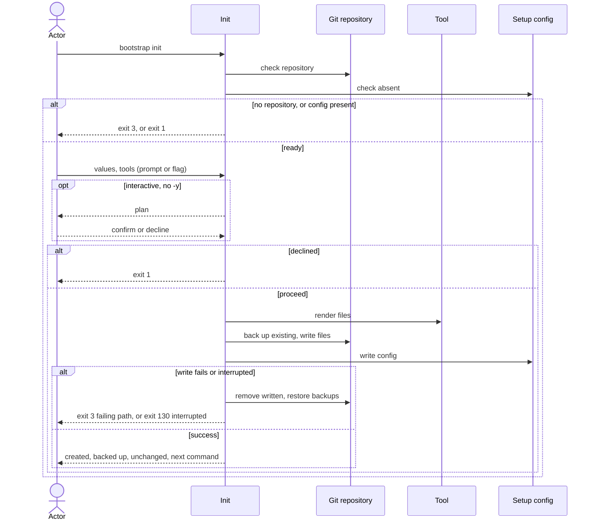

# Flow: Set up a repository

## Purpose

`bootstrap init` writes the baseline files of core and the chosen non-core tools
into a git repository and records what it did in one config file.

Serves: [Fast new-repo setup](../../../product.md#goal-fast-setup)

## Trigger & Actors

| Actor | May trigger | Authorization | Audit-recorded |
| ----- | ----------- | ------------- | -------------- |
| Repo owner (interactive terminal) | the command `bootstrap init` | write access to the repository root | no |
| AI agent or CI (non-interactive) | `bootstrap init`, every value by flag; `-y` accepts detected defaults | write access to the repository root | no |

## Steps

1. Init checks the working directory is inside a git repository — otherwise
   writes nothing, exits 3 with "not a git repository — run `git init` first".
   Init never creates a repository.
2. Init checks `.config/bootstrap.yaml` is absent — if present, writes nothing,
   exits 1 and the message points to `bootstrap update`.
   [Setup config](../../../entities/setup-config/index.md)
3. Actor supplies the values, each by prompt or flag:

   | Value | Flag | Required | Default |
   | ----- | ---- | -------- | ------- |
   | repo path | `--repo` | yes | read from the remote `origin` |
   | commit scopes | `--scope` (repeatable) | no — zero allowed | none |
   | merge model, develop | `--merge-develop` `direct`\|`pr` | yes | `direct` |
   | merge model, main | `--merge-main` `direct`\|`pr` | yes | `pr` |

   The `--repo` default is read from the remote named `origin` only: an ssh URL
   `<user>@<host>:<path>(.git)` or an https URL `https://<host>/<path>(.git)`, on
   any host, gives `<path>`: one or more owner segments, then the name
   (`owner/name`, or nested `group/subgroup/name`). No `origin`, or a URL not
   readable as such a path, gives no default and no error:
   interactive without `-y` asks, every other mode needs the flag.
   Invalid values: a flag value that breaks its rule (`--merge-develop` or
   `--merge-main` not `direct`\|`pr`; `--scope` not lowercase kebab-case;
   `--repo` not two or more `/`-separated segments) exits 2 naming the flag and the allowed form; an
   invalid answer at an interactive prompt repeats the prompt with the rule.
   ([config](../../../conventions.md#config))

   Behaviour by mode — the one place that says what is prompted, defaulted,
   picked, confirmed or refused. A run is *interactive* when stdin and stdout are
   both terminals and `--json` is not given
   ([errors](../../../conventions.md#errors)); `--json` is always
   non-interactive. A flag always supplies its value, and the table covers the
   values a flag does not. `--dry-run` rows apply in either terminal state.

   | Mode | Value prompts (step 3) | Detected/fixed defaults | Scopes prompt | Tool picker (step 4) | Confirm (step 5) | Required value missing |
   | ---- | ---------------------- | ----------------------- | ------------- | -------------------- | ---------------- | ---------------------- |
   | interactive, no `-y` | yes, one per value without a flag | offered at the prompt | yes without `--scope`: one comma-separated answer, lowercase kebab-case, empty = zero scopes; an invalid answer repeats the prompt with the rule | shown without `--tool`; with `--tool` the flag supplies the tools | yes; decline exits 1; Ctrl-C at any prompt exits 130 | asked (no `origin` default: asks for `--repo`) |
   | interactive, `-y` | none | every one accepted | no — zero scopes without `--scope` | not shown; core only without `--tool` | none | exits 2 naming the flag |
   | non-interactive, no `-y` | never | none counts as supplied | no — zero scopes without `--scope` | not shown; core only without `--tool` | none; proceeds | exits 2 naming the flag |
   | non-interactive, `-y` | never | every one accepted | no — zero scopes without `--scope` | not shown; core only without `--tool` | none; proceeds | exits 2 naming the flag |
   | `--dry-run` | never; values from flags and `-y` only | accepted only with `-y` | no — zero scopes without `--scope` | not shown; core only without `--tool`, `-y` or not | none | exits 2 naming the flag |
   | `--json` | never (non-interactive) | accepted only with `-y` | no — zero scopes without `--scope` | not shown; core only without `--tool`, `-y` or not | none; proceeds | exits 2 naming the flag, with the error as the one JSON document |

   `-y` with no `--repo` and no repo path readable from `origin` exits 2 naming
   `--repo` in every mode.
4. Actor chooses non-core tools (today `github` and `gitlab`, which may be
   chosen together) — the picker is a multi-select, or the repeatable
   `--tool <name>`; per the mode table (step 3), none chosen means core only.
   `core` is the fixed set of 13 tools (`mise`,
   `git`, `pre-commit`, `vscode`, `dprint`, `taplo`, `gitleaks`, `grype`,
   `virajp-linter`, `claude`, `graphify`, `mempalace`, `fnox`); it is not itself
   a tool, is always included, takes no flag and cannot be deselected. An
   unknown tool name, `core` or a core tool name given to `--tool` exits 2; a
   name given more than once is used once.
   [Tool](../../../entities/tool/index.md)
5. Where the mode table (step 3) says confirm, init shows the plan (files to
   create, to back up, unchanged) and asks once to proceed. Declining writes
   nothing and exits 1; Ctrl-C exits 130 per
   [errors](../../../conventions.md#errors).
6. Init renders every file of core plus the chosen tools, handling existing
   files per [backups](../../../conventions.md#backups).
   [Tool](../../../entities/tool/index.md)
7. Init writes `.config/bootstrap.yaml` last, recording the format, the bootstrap
   version that wrote it, the values (`values.tools` lists the chosen non-core
   tools only; an empty list when none) and `files` (every tool path init wrote:
   created, replaced after backup, or left unchanged because identical; not
   `.config/bootstrap.yaml` itself);
   setup-config goes absent → present.
   [Setup config](../../../entities/setup-config/index.md)
8. Init prints the result: files created (`.config/bootstrap.yaml` included),
   backed up (each original → backup path) and unchanged, and exactly one next
   command, `MISE_ENV=dev mise run setup:all`
   (the run command of the setup task installed by the core `mise` tool,
   [Tool](../../../entities/tool/index.md)) — the same text in the human output and
   as `--json` `next_command` — to install tools and enable hooks. Init never
   installs software or runs that task itself.

Modes: `--dry-run` runs steps 1–4 (prompting per the mode table, step 3),
reports what would be created, backed up and unchanged, writes nothing and
exits 0. `--json` success document has top-level
keys `exit`, `created` (paths), `backed_up` (objects `{path, backup}`),
`unchanged` (paths) and `next_command`; on exit 1, 2, 3 or 130 it carries `exit`
and `error` per [errors](../../../conventions.md#errors) instead of results.
`--dry-run --json` prints the document a real run would return, `backed_up`
carrying the backup name it would use, plus `"dry_run": true`. Output rules follow
[Terminal UX](../../../design-system.md) and
[errors](../../../conventions.md#errors).

## Guarantees

| Step | Consistency | On failure | Idempotency | Load & latency |
| ---- | ----------- | ---------- | ----------- | -------------- |
| 1–5 | atomic — nothing is written | none — nothing written yet; exit 1, 2, 3 or 130 per step | n/a — a re-run starts from the same repo state | n/a — one local command |
| 6–7 | atomic — all-or-nothing | a write failure or an interrupt (signal, per [baseline](../../../conventions.md#baseline) graceful shutdown) triggers full rollback: remove every file this run wrote, restore every backup, so the repo is byte-identical to before; a write failure exits 3 naming the failing path, an interrupt exits 130 per [errors](../../../conventions.md#errors). If the rollback itself fails, exit 3 listing every path not restored and where its backup sits (`--json`: `unrestored` per [errors](../../../conventions.md#errors)). An uncatchable kill is out of the guarantee; the config is written last, so the repo is then not marked set up | a re-run after success exits 1 (step 2); after rollback it starts clean | n/a — one local command |
| 8 | atomic — output only | none — changes no repo state | n/a | n/a — one local command |

## Diagram

## Background Jobs

N/A — runs synchronously in one command invocation.

## Acceptance

- Given an empty git repository, when `bootstrap init` runs non-interactively
  with all flags, then every core file and the chosen non-core tools' files
  exist, `.config/bootstrap.yaml` records the version, values (including
  `values.tools`) and files, and the exit code is 0.
- Given a non-interactive run with every required value flagged, no `-y` and
  no `--tool`, when init runs, then only core files are written and the exit
  code is 0.
- Given `bootstrap init --yes` with no `--tool` in a repository with a readable
  `origin`, when init runs, then only core files are written, the picker is not
  shown, `values.tools` is an empty list and the exit code is 0.
- Given `.config/bootstrap.yaml` exists, when init runs, then no file changes,
  the exit code is 1 and the message names `bootstrap update`.
- Given the directory is not inside a git repository, when init runs, then
  nothing is written and the exit code is 3.
- Given init runs from a subdirectory of a repository, when it succeeds, then
  `.config/bootstrap.yaml` and every tool file are at the repository root.
- Given a `.gitignore` exists and `.config/bootstrap.yaml` does not, when init
  runs, then the original is preserved byte-identical as `.gitignore.bak`, the
  new `.gitignore` is written, and the backup is listed in the output.
- Given a successful run, when init finishes, then `created` lists
  `.config/bootstrap.yaml` and every path list is sorted by path.
- Given `--tool core` or `--tool mise`, when init runs, then nothing is written
  and the exit code is 2; given `--tool github --tool github`, github is applied
  once.
- Given a tool target path that exists as a directory or a symlink, when init
  runs, then nothing is written and the exit code is 3 naming that path.
- Given `.gitignore.bak` already exists, when init backs up `.gitignore`, then
  the new backup is `.gitignore.1.bak` and the older backup is untouched.
- Given a pre-existing file byte-identical to what init would write, when init
  runs, then it is untouched, listed `unchanged`, and no `.bak` is created.
- Given an interactive run, when the actor declines at the confirm, then nothing
  is written and the exit code is 1.
- Given a write failure injected mid-run, when init runs, then the repository
  tree is identical to before and the exit code is 3 naming the failing path.
- Given an interrupt signal mid-write, when init is running, then the repository
  tree is identical to before and the exit code is 130.
- Given `--dry-run`, when init runs, then no file changes, the would-be created,
  backed-up and unchanged files are reported, and the exit code is 0.
- Given non-interactive mode with a required value missing, when init runs, then
  the exit code is 2 and the message names the missing flag.
- Given non-interactive mode, no `-y`, no `--repo` flag and an `origin` URL not
  readable as a repo path, when init runs, then there is no default and the exit
  code is 2.
- Given `-y`, no `--repo` and no repo path readable from `origin`, when init
  runs in an interactive terminal or not, then it does not prompt, the exit code
  is 2 and the message names `--repo`.
- Given an interactive run without `-y` or `--scope`, when the actor answers
  `api, web-ui` (or nothing), then scopes are `api` and `web-ui` (or zero); an
  invalid answer repeats the prompt with the rule.
- Given `--dry-run` and a required value with neither flag nor `-y`, when init
  runs, then it does not prompt, the exit code is 2 and the message names the flag.
- Given a successful run with `--json`, when init finishes, then the document
  has `exit` 0, `created`, `backed_up` (each `{path, backup}` pairing an original
  with its backup), `unchanged`, and `next_command` equal to
  `MISE_ENV=dev mise run setup:all`, the same text the human output prints.
- Given `--dry-run --json`, when init runs, then the document has the same keys
  and values a real run would return, `backed_up` naming the backup it would use,
  plus `"dry_run": true`, and no file changes.
- Given an unknown `--tool` name, when init runs, then nothing is written and
  the exit code is 2.
- Given an invalid flag value (for example `--merge-main squash`), when init
  runs, then the exit code is 2 and the message names the flag and the allowed
  form.
- Given `--json`, when init runs, then stdout parses as exactly one JSON
  document and contains nothing else.
- Given an interactive terminal, `--json`, and no `-y` or flag for a required
  value, when init runs, then it does not prompt, the exit code is 2, and stdout
  is one JSON document carrying the error.
- Given the remote `origin` is `git@<host>:o/r.git` or `https://<host>/o/r.git`,
  when init reads defaults, then the repo default is `o/r`; for
  `https://<host>/a/b/c.git` it is `a/b/c`.
- Abuse case: n/a — runs locally with the caller's own permissions on the
  caller's own repository; no remote surface; every input is validated per
  [baseline](../../../conventions.md#baseline) boundary-validation.

## References

- [baseline](../../../conventions.md#baseline),
  [backups](../../../conventions.md#backups),
  [errors](../../../conventions.md#errors),
  [config](../../../conventions.md#config)
- [design-system](../../../design-system.md) — Terminal UX
- API surface: N/A — no service project; the flow is a local command
- Screens surface: N/A — cli has no screen platform
