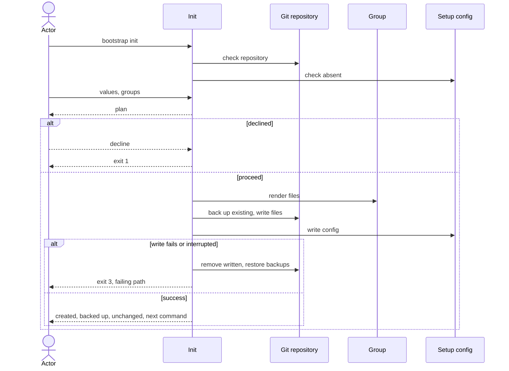

# Flow: Set up a repository

## Purpose

`bootstrap init` writes the baseline files of the chosen groups into a git
repository and records what it did in one config file, so a new repository is
set up in a single command.

Serves: [Fast new-repo setup](../../../product.md#goal-fast-setup)

## Trigger & Actors

| Actor | May trigger | Authorization | Audit-recorded |
| ----- | ----------- | ------------- | -------------- |
| Repo owner (interactive terminal) | the command `bootstrap init` | write access to the working directory | no |
| AI agent or CI (non-interactive) | `bootstrap init`, every value by flag; `-y` accepts detected defaults | write access to the working directory | no |

Not audit-recorded: the product has no audit foundation.

## Steps

1. Init checks the working directory is inside a git repository — otherwise
   writes nothing, exits 3 with "not a git repository — run `git init` first".
   Init never creates a repository.
2. Init checks `.config/bootstrap.yaml` is absent — its presence is the marker
   of "already initialised"; if present, writes nothing, exits 1 and the message
   points to `bootstrap update`.
   [Setup config](../../../entities/setup-config/index.md)
3. Actor supplies the values, each by prompt or flag:

   | Value | Flag | Required | Default |
   | ----- | ---- | -------- | ------- |
   | repo owner/name | `--repo` | yes | detected from the git remote |
   | commit scopes | `--scope` (repeatable) | no — zero allowed | none |
   | merge model, develop | `--merge-develop` `direct`\|`pr` | yes | `direct` |
   | merge model, main | `--merge-main` `direct`\|`pr` | yes | `pr` |

   Interactive: each default is offered and confirmed; `-y` accepts every
   default without prompting. Non-interactive: a default (detected or fixed)
   counts as supplied only with `-y`; a required value with neither its flag
   nor `-y` is missing, and init exits 2 naming the flag. With no remote there
   is no `--repo` default: interactive asks, non-interactive needs the flag.
4. Actor chooses optional groups — interactive multi-select, or repeatable
   `--group <name>`; none chosen means core only. Core groups are always
   included and cannot be deselected; an unknown group name exits 2.
   [Group](../../../entities/group/index.md)
5. Interactive only: init shows the plan (files to create, to back up, unchanged)
   and asks once to proceed. Declining, or cancelling any prompt, writes nothing
   and exits 1. `-y` skips the confirm; non-interactive runs never prompt.
6. Init renders every file of the chosen groups, handling existing files per
   [backups](../../../conventions.md#backups).
   [Group](../../../entities/group/index.md)
7. Init writes `.config/bootstrap.yaml` last, recording the format, the bootstrap
   version that wrote it, the values and the selected groups; setup-config goes
   absent → present.
   [Setup config](../../../entities/setup-config/index.md)
8. Init prints the result: files created, backed up (each original → backup
   path) and unchanged, and exactly one next command — the repo's own setup task
   — to install tools and enable hooks. Init never installs software or runs that
   task itself.

Modes: `--dry-run` runs steps 1–4, reports what would be created, backed up and
unchanged, writes nothing and exits 0. `--json` makes stdout exactly one JSON
report document (created, backed_up, unchanged, next_command, exit status). Output rules
follow [Terminal UX](../../../design-system.md) and
[errors](../../../conventions.md#errors).

## Guarantees

| Step / group | Consistency | On failure | Idempotency | Load & latency |
| ------------ | ----------- | ---------- | ----------- | -------------- |
| 1–5 | atomic — nothing is written | none — nothing written yet; exit 1, 2 or 3 per step | n/a — a re-run starts from the same repo state | n/a — one local command |
| 6–7 | atomic — all-or-nothing | a write failure or an interrupt (signal, per [baseline](../../../conventions.md#baseline) graceful shutdown) triggers full rollback: remove every file this run wrote, restore every backup, so the repo is byte-identical to before; exit 3 naming the failing path. If the rollback itself fails, exit 3 listing every path not restored and where its backup sits. An uncatchable kill is out of the guarantee; the config is written last, so the repo is then not marked set up | a re-run after success exits 1 (step 2); after rollback it starts clean | n/a — one local command |
| 8 | atomic — output only | none — changes no repo state | n/a | n/a — one local command |

## Diagram

## Background Jobs

N/A — runs synchronously in one command invocation.

## Acceptance

- Given an empty git repository, when `bootstrap init` runs non-interactively
  with all flags, then every core file and the chosen optional groups' files
  exist, `.config/bootstrap.yaml` records the version, values and groups, and the
  exit code is 0.
- Given `.config/bootstrap.yaml` exists, when init runs, then no file changes,
  the exit code is 1 and the message names `bootstrap update`.
- Given the directory is not inside a git repository, when init runs, then
  nothing is written and the exit code is 3.
- Given a `.gitignore` exists and `.config/bootstrap.yaml` does not, when init
  runs, then the original is preserved byte-identical as `.gitignore.bak`, the
  new `.gitignore` is written, and the backup is listed in the output.
- Given `.gitignore.bak` already exists, when init backs up `.gitignore`, then
  the new backup is `.gitignore.1.bak` and the older backup is untouched.
- Given a pre-existing file byte-identical to what init would write, when init
  runs, then it is untouched, listed `unchanged`, and no `.bak` is created.
- Given an interactive run, when the actor declines at the confirm, then nothing
  is written and the exit code is 1.
- Given a write failure injected mid-run, when init runs, then the repository
  tree is identical to before and the exit code is 3 naming the failing path.
- Given an interrupt signal mid-write, when init is running, then the repository
  tree is identical to before.
- Given `--dry-run`, when init runs, then no file changes, the would-be created,
  backed-up and unchanged files are reported, and the exit code is 0.
- Given non-interactive mode with a required value missing, when init runs, then
  the exit code is 2 and the message names the missing flag.
- Given non-interactive mode, no `-y`, no `--repo` flag and a remote present,
  when init runs, then the exit code is 2.
- Given `--json`, when init runs, then stdout parses as exactly one JSON
  document and contains nothing else.
- Given the remote is `git@<host>:o/r.git` or `https://<host>/o/r.git` on the
  code host, when init detects defaults, then the owner/name default is `o/r`.
- Abuse case: n/a — runs locally with the caller's own permissions on the
  caller's own repository; no remote surface; every input is validated per
  [baseline](../../../conventions.md#baseline) boundary-validation.

## References

- [baseline](../../../conventions.md#baseline),
  [backups](../../../conventions.md#backups),
  [errors](../../../conventions.md#errors),
  [config](../../../conventions.md#config)
- [design-system](../../../design-system.md) — Terminal UX
- API surface: N/A — no service project; the flow is a local command
- Screens surface: N/A — cli has no screen platform; terminal behaviour per
  design-system.md Terminal UX
