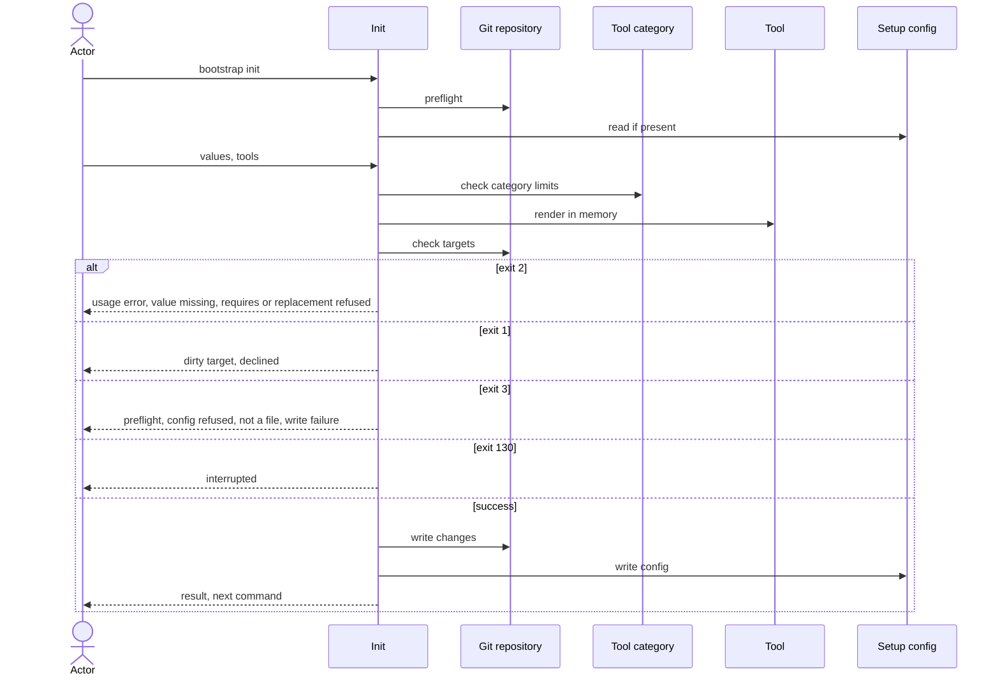

# Flow: Set up a repository

## Purpose

`bootstrap init` writes the baseline files of the selected tools into a git
repository and records what it did in one config file. Run again on a set-up
repository it is a re-run: it renders with the running bootstrap and writes only
what changed. Git history is the only record of earlier states; init never
overwrites a file with uncommitted changes.

Serves: [Fast new-repo setup](../../../product.md#goal-fast-setup),
[Zero setup drift](../../../product.md#goal-zero-drift)

## Trigger & Actors

| Actor | May trigger | Authorization | Audit-recorded |
| ----- | ----------- | ------------- | -------------- |
| Repo owner (interactive terminal) | the command `bootstrap init` | write access to the repository root | no |
| AI agent or CI (non-interactive) | `bootstrap init`, every value by flag or recorded in the config; `-y` (long form `--yes`) accepts defaults | write access to the repository root | no |

## Steps

Usage errors come first and exit 2 before the preflight and before
`.config/bootstrap.yaml` is read. Nothing is written. They are:

- an unknown flag;
- a flag value that breaks its rule (`--merge-develop` or `--merge-main` not
  `direct`\|`pr`; `--scope` not lowercase kebab-case; `--repo` not two or more
  `/`-separated segments), with a message naming the flag and the allowed form;
- an unknown `--tool` name, or two `--tool` names of one `max: one` category
  (the catalog ships inside bootstrap).

An invalid answer at an interactive prompt repeats the prompt with the rule.

1. Preflight, before anything else but the usage check; nothing is written on
   failure ([errors](../../../conventions.md#errors)):
   - not inside a git repository → exit 3 "not a git repository — run
     `git init` first". Init never creates a repository.
   - `mise` not on `PATH` → exit 3 "mise not installed", with the command that
     installs it.
   - `mise` found at a path other than `~/.local/bin/mise` → one warning naming
     the path; init continues (`--json`: in `warnings`).
2. Init looks for `.config/bootstrap.yaml`. Absent → a first run. Present → a
   re-run: init validates it per
   [Setup config validity](../../../entities/setup-config/index.md#validity),
   repairs it per [repair on read](../../../entities/setup-config/index.md#repair)
   and guards its version per
   [version guard](../../../entities/setup-config/index.md#version-guard), and
   takes every value and the tool selection from it. Messages and exits:
   - a newer version or format exits 3 "upgrade bootstrap";
   - a config that fails validity exits 3 naming the failing field and saying
     "fix the file, then run again"; an invalid `values.tools` writes nothing
     and exits 3 naming the fix (for example "remove `fnox` from values.tools");
   - a repaired missing unremovable tool is reported as the warning "added back
     unremovable tool `<name>`" (`warnings`);
   - an older `version` or `format` is never refused: it is an upgrade re-run,
     handled as any re-run (step 6 onward).

   [Setup config](../../../entities/setup-config/index.md)
3. Actor supplies the values, each by prompt or flag:

   | Value | Flag | Required | Default |
   | ----- | ---- | -------- | ------- |
   | repo path | `--repo` | yes | read from the remote `origin` |
   | commit scopes | `--scope` (repeatable) | no — zero allowed | none |
   | merge model, develop | `--merge-develop` `direct`\|`pr` | yes | `direct` |
   | merge model, main | `--merge-main` `direct`\|`pr` | yes | `pr` |

   The `--repo` default is read from the remote named `origin` only: an ssh URL
   `<user>@<host>:<path>(.git)` or an https URL `https://<host>/<path>(.git)`, on
   any host, gives `<path>`: one or more owner segments, then the name
   (`owner/name`, or nested `group/subgroup/name`). No `origin`, or a URL not
   readable as such a path, gives no default and no error:
   interactive without `-y` asks, every other mode needs the flag.
   A repeated scope (flag or answer) is used once.
   ([config](../../../conventions.md#config))

   In a re-run a recorded value counts as supplied, like a flag, in the
   non-interactive modes, and an interactive prompt is shown pre-filled with it.
   A flag replaces a recorded value.
   [Setup config](../../../entities/setup-config/index.md) (recorded values)

   Behaviour by mode. A run is *interactive* when stdin and stdout are
   both terminals and `--json` is not given
   ([errors](../../../conventions.md#errors)); `--json` is always
   non-interactive. A flag always supplies its value, and the table covers the
   values a flag does not. `--dry-run` rows apply in either terminal state.

   | Mode | Value prompts (step 3) | Detected/fixed defaults | Scopes prompt | Tool picker (step 4) | Replacement (step 5) | Drop of a recorded tool (step 6) | Confirm (step 6) | Required value missing |
   | ---- | ---------------------- | ----------------------- | ------------- | -------------------- | -------------------- | -------------------------------- | ---------------- | ---------------------- |
   | interactive, no `-y` | yes, one per value without a flag; pre-filled with the recorded value in a re-run | offered at the prompt | yes without `--scope`: one comma-separated answer, lowercase kebab-case, empty = zero scopes (re-run: pre-filled with the recorded scopes); an invalid answer repeats the prompt with the rule | shown without `--tool`, defaults (first run) or the recorded selection (re-run) pre-selected; with `--tool` the flag supplies the tools | asks "replace `<old>` with `<new>`?" unless `--replace`; decline exits 1 | covered by the confirm | yes; decline exits 1; Ctrl-C at any prompt exits 130 | asked (no `origin` default: asks for `--repo`) |
   | interactive, `-y` | none | every one accepted | no | not shown; defaults (first run) or the recorded selection (re-run) without `--tool` | never asked; exits 2 unless `--replace` | proceeds (`-y` given) | none | exits 2 naming the flag |
   | non-interactive, no `-y` | never | none counts as supplied | no | not shown; only the unremovable tools (first run) or the recorded selection (re-run) without `--tool` | exits 2 unless `--replace` | exits 2 "removing files needs -y" | none; proceeds | exits 2 naming the flag |
   | non-interactive, `-y` | never | every one accepted | no | not shown; defaults (first run) or the recorded selection (re-run) without `--tool` | exits 2 unless `--replace` | proceeds (`-y` given) | none; proceeds | exits 2 naming the flag |
   | `--dry-run` | never; values from flags, recorded values and `-y` only | accepted only with `-y` | no | not shown; as the non-interactive rows, `-y` or not | exits 2 unless `--replace` | reported, needs no `-y` | none | exits 2 naming the flag |
   | `--json` | never (non-interactive) | accepted only with `-y` | no | not shown; as the non-interactive rows, `-y` or not | exits 2 unless `--replace` | exits 2 "removing files needs -y" without `-y`; proceeds with it | none; proceeds | exits 2 naming the flag, with the error as the one JSON document |

   Where the Scopes prompt is `no`, the scopes are the recorded scopes (re-run)
   or zero scopes without `--scope`.

4. Actor selects the tools. Tools and their categories come from the
   [Tool](../../../entities/tool/index.md) and
   [Tool category](../../../entities/tool-category/index.md) catalogs; both are
   data.
   - First-run defaults: every tool whose `default` is `on`, plus each `origin`
     tool whose `origin_hosts` contains the host of the `origin` remote. The
     host is read from any remote URL form (scp-like `user@host:path`,
     `ssh://`, `https://`, `http://`), even where step 3 reads no repo default.
   - The picker is a multi-select grouped by category with the defaults (or, in
     a re-run, the recorded selection) pre-selected; unremovable tools are shown
     selected and locked; a `max: one` category accepts at most one tool.
   - `--tool <name>` (repeatable) gives the full list of selected removable
     tools; unremovable tools are always added. A name given more than once is
     used once.
   - A selected tool whose `requires` tool is not in the selection after the
     request (the tools given, plus the unremovable ones) exits 2 naming the
     required tool, for `--tool` and non-interactive runs;
     `--tool taplo --tool dprint` is allowed. In the interactive picker the same
     case is an invalid answer: the picker is shown again with the rule naming
     the required tool, and there is no exit 2.
5. Replacement, re-run only: a selection that puts a different tool in a
   `max: one` category than the recorded one is a replacement. A tool whose
   `replaceable` is false exits 2. `--replace` with no replacement to make is
   ignored.
   [Tool category](../../../entities/tool-category/index.md)
6. Init computes every render and decision in memory per
   [safety](../../../conventions.md#safety): the targets are the paths to
   create, change (content or mode) or delete. `.config/bootstrap.yaml` is a
   target like any file: an uncommitted change to it exits 1 below, and it is
   listed `created`, `changed` or `unchanged` like any other path.
   - A re-run that drops a recorded removable tool, or replaces one, removes it
     as [Remove a tool](../150-remove-tool/index.md) does. For a drop, the `-y`
     rule is the mode table's "Drop of a recorded tool" column; for a
     replacement, its consent (`--replace` or the prompt, step 5) also covers
     deleting the replaced tool's files, and no `-y` is needed.
   - A target modified, staged, untracked, ignored or deleted in the working
     tree (a tracked file whose deletion is not committed) → writes nothing,
     exit 1 listing each path with "commit or stash these files, then run
     again". A file is created again only when it is absent and its absence is
     committed (not in `HEAD` and not in the working tree).
   - A dirty file (including `.config/bootstrap.yaml`) whose content and mode
     already equal the render is not a target: it is listed `unchanged` and does
     not refuse the run ([safety](../../../conventions.md#safety)).
   - When nothing is to be created, changed, deleted or replaced, no plan and no
     prompt are shown; init exits 0, lists an existing `create_only` file as
     `kept`, an unrendered recorded path as `orphaned` and every other file as
     `unchanged`.
   - A target that is a directory or symlink, or whose parent directory is a
     symlink or a regular file → writes nothing, exit 3 naming every such path
     ([safety](../../../conventions.md#safety)). When both kinds of refusal are
     found, exit 3 wins and the message lists every path of both kinds.
   - A `create_only` file is written only when absent, else reported `kept`. Any
     other recorded path in `files` that the running catalog does not render,
     whichever tool it belonged to, stays in `files`, is left in place and is
     reported `orphaned` (init never deletes it); a recorded path
     absent on disk leaves `files` silently
     ([safety](../../../conventions.md#safety)).
   - Where the mode table says confirm (interactive, no `-y`), init shows the
     plan (files to create, change, delete, unchanged, kept, orphaned, and
     replacements) and asks once to proceed.

   [Tool](../../../entities/tool/index.md)
7. Init writes only the changes: creates, changes and deletes the targets, with
   every task file `0755` and every other file `0644`. Init never commits.
   [Tool](../../../entities/tool/index.md) (target files)
8. Init writes `.config/bootstrap.yaml` last, recording the format, the
   bootstrap version running, the values (`values.tools` = every selected tool)
   and `files` (every tool path init renders for the selected tools, plus any
   `orphaned` path; not `.config/bootstrap.yaml` itself). It rewrites the whole
   file in schema order with sorted lists and no comments; on an upgrade re-run
   `version` and `format` move to the running bootstrap's. Setup-config goes
   absent → present, or stays present with its changes.
   [Setup config](../../../entities/setup-config/index.md)
9. Init prints the result (keys under Modes; `.config/bootstrap.yaml` is in
   `created` on a first run and in `changed` when rewritten) and exactly one
   next command, `MISE_ENV=dev mise run setup:all` (the run command of the setup
   task installed by the `mise` tool,
   [Tool](../../../entities/tool/index.md)). The human output ends with exactly "commit the changes, then run" that
   command; `--json` carries it as `next_command`. Every path list is sorted by
   path. Init never installs software or runs that task itself.

Modes: `--dry-run` runs steps 1–6 (failing as a real run would), reports what would be created, changed, deleted, kept, orphaned and replaced,
writes nothing and exits 0. A human `--dry-run` prints the same closing line as
a real run ("commit the changes, then run `MISE_ENV=dev mise run setup:all`").
`--json` success document has top-level keys
`exit`, `created`, `changed`, `deleted`, `unchanged`, `kept`, `orphaned`
(paths), `replaced` (objects `{from, to}`), `warnings` and `next_command`; on
exit 1, 2, 3 or 130 it carries `exit` and `error` per
[errors](../../../conventions.md#errors) instead of results. `--dry-run --json`
prints the document a real run would return plus `"dry_run": true`; on a
non-zero exit it is the same error document plus `"dry_run": true`. The
`--json` output is the "JSON result". Output rules
follow [Terminal UX](../../../design-system.md) and
[errors](../../../conventions.md#errors).

## Guarantees

| Step | Consistency | On failure | Idempotency | Load & latency |
| ---- | ----------- | ---------- | ----------- | -------------- |
| 1–6 | atomic — nothing is written | none — nothing written yet; exit 1, 2, 3 or 130 per step | n/a — a retry starts from the same repo state | n/a — one local command |
| 7–8 | atomic — all-or-nothing | a write failure or an interrupt (signal, per [baseline](../../../conventions.md#baseline) graceful shutdown) restores every changed or deleted target from `HEAD` and deletes every created file ([safety](../../../conventions.md#safety)); a write failure exits 3 naming the failing path, an interrupt exits 130 per [errors](../../../conventions.md#errors). If the restore itself fails, exit 3 listing every path not restored (`--json`: `unrestored` per [errors](../../../conventions.md#errors)). An uncatchable kill is out of the guarantee; the config is written last, so the repo is then not marked set up (first run) or still records the earlier state (re-run) | a re-run with nothing changed writes nothing and exits 0; after a restore it starts clean | n/a — one local command |
| 9 | atomic — output only | none — changes no repo state | n/a | n/a — one local command |

## Diagram

## Background Jobs

N/A — runs synchronously in one command invocation.

## Acceptance

- Given an empty git repository, when `bootstrap init` runs non-interactively
  with all flags, then the files of the selected tools exist,
  `.config/bootstrap.yaml` records the version, values (`values.tools` = every
  selected tool) and files, and the exit code is 0.
- Given a non-interactive first run with every required value flagged, no `-y`
  and no `--tool`, when init runs, then only the unremovable tools' files are
  written and the exit code is 0.
- Given `bootstrap init --yes` with no `--tool` on a first run, when init runs,
  then the default tools are selected, the picker is not shown and the exit code
  is 0.
- Given the remote `origin` is `git@<host>:o/r.git` or `https://<host>/o/r.git`,
  when init reads defaults, then the repo default is `o/r`; for
  `https://<host>/a/b/c.git` it is `a/b/c`; for `ssh://git@github.com/o/r.git`
  the repo default is not readable; and whenever the `origin` host is
  `github.com`, `github` is selected by default.
- Given a set-up repository and a re-run with nothing to create, change, delete
  or replace, when init runs (including interactively without `-y`), then
  nothing is written, no plan and no prompt are shown, an existing
  `create_only` file is listed `kept`, an unrendered recorded path is listed
  `orphaned`, every other file is listed `unchanged` and the exit code is 0.
- Given a re-run with `-y` and `--merge-main direct` over a recorded `pr`,
  when init runs, then the flag value is rendered and recorded and the other recorded
  values are kept without being asked again.
- Given a re-run whose config records a newer version or format, when init
  runs, then nothing is written and the exit code is 3 "upgrade bootstrap".
- Given a repository set up by an older bootstrap `version` or `format`, when a
  newer bootstrap re-runs init, then the older format is read and not refused,
  the changed files are rewritten, `version` and `format` move to the running
  bootstrap's, `files` is refreshed and orphaned paths are reported `orphaned`.
- Given a first run, when init finishes, then no path is reported `orphaned`.
- Given a config that fails the schema, or a `files` entry that is empty,
  absolute, uses `..` or has a wildcard, when init runs, then nothing is written,
  the exit code is 3 and the message names the failing field and says "fix the
  file, then run again".
- Given an unknown flag, an invalid flag value (for example
  `--merge-main squash`), an unknown `--tool` name or two `--tool` names of one
  `max: one` category, when init runs (even in a directory that is not a git
  repository or with a config that fails the schema), then nothing is written
  and the exit code is 2, not 3; for an invalid flag value the message names the
  flag and the allowed form.
- Given a `values.tools` name the running catalog does not have, or two tools
  of one `max: one` category, or a tool whose `requires` tool is not selected,
  when init runs, then nothing is written and the exit code is 3 naming the fix
  (for example "remove `fnox` from values.tools").
- Given a `values.tools` that misses an unremovable tool, when init runs, then
  the tool is added again, the warning "added back unremovable tool `<name>`" is
  reported (`warnings`) and the exit code is 0.
- Given `.config/bootstrap.yaml` has uncommitted changes, when init re-runs,
  then nothing is written and the exit code is 1 listing it; once committed, it
  is listed `changed` when rewritten and `unchanged` when not.
- Given `--tool taplo` with `dprint` neither selected nor named, when init runs,
  then nothing is written and the exit code is 2 naming `dprint`; given an
  interactive picker answer with `taplo` without `dprint`, when the actor
  confirms the picker, then the picker is shown again with the rule naming
  `dprint`, nothing is written and init does not exit; given
  `--tool taplo --tool dprint`, the requires check passes on the selection after
  the request and both are selected.
- Given `--scope api --scope api` (or the answer `api, api`), when init runs,
  then `api` is recorded once; given `--tool github --tool github`, github is
  applied once.
- Given the directory is not inside a git repository, when init runs, then
  nothing is written and the exit code is 3.
- Given `mise` is not on `PATH`, when init runs, then nothing is written, the
  exit code is 3 and the message says "mise not installed" with the install
  command.
- Given `mise` is found at a path other than `~/.local/bin/mise`, when init
  runs, then it continues and prints one warning naming that path (`--json`: in
  `warnings`).
- Given init runs from a subdirectory of a repository, when it succeeds, then
  `.config/bootstrap.yaml` and every tool file are at the repository root.
- Given a target path that is modified, staged, untracked or ignored in git,
  when init runs, then nothing is written, the exit code is 1 and the output
  lists the path with "commit or stash these files, then run again".
- Given a tracked target deleted in the working tree with the deletion not
  committed, when init runs, then nothing is written and the exit code is 1
  listing the path; once the deletion is committed, init creates the file again.
- Given a dirty file (including `.config/bootstrap.yaml`) whose content and mode
  already equal the render, when init runs, then it is listed `unchanged` and
  the run is not refused.
- Given a tool target path that exists as a directory or a symlink, or whose
  parent directory is a symlink or a regular file, when init runs, then nothing
  is written and the exit code is 3 naming that path.
- Given both a not-a-file target and an uncommitted target, when init runs, then
  nothing is written, the exit code is 3 and the output lists every path of both
  kinds.
- Given an existing `create_only` file, when init runs, then it is untouched and
  listed `kept`.
- Given a path in `files` that the running bootstrap no longer renders for a
  selected tool, when init runs, then it is left in place and listed `orphaned`;
  a path recorded in `files` that is absent on disk leaves `files` silently.
- Given a re-run whose new selection puts a different tool in a `max: one`
  category, when init runs interactively, then it asks "replace `<old>` with
  `<new>`?" and declining exits 1 with nothing written.
- Given a re-run with such a replacement and no `--replace`, when init runs
  non-interactively, with `-y` (interactive or not), with `--dry-run` or with
  `--json`, then it does not prompt, nothing is written and the exit code is 2;
  with `--replace` the replacement is applied without a prompt and listed in
  `replaced`.
- Given `--replace` and no replacement to make, when init runs, then the flag is
  ignored and the run proceeds as without it.
- Given `-y` or `--yes`, when init runs, then both behave identically.
- Given a replacement of a tool whose `replaceable` is false, when init runs,
  then nothing is written and the exit code is 2.
- Given a re-run whose selection drops a recorded removable tool, when init
  runs, then that tool's non-`create_only` files are deleted and its
  `create_only` files are kept and reported.
- Given a re-run whose selection drops a recorded tool and so deletes files,
  when init runs non-interactively (including `--json`) without `-y`, then
  nothing is written and the exit code is 2 "removing files needs -y"; with
  `-y` the files are deleted, and `--dry-run` reports the deletions without
  needing `-y`.
- Given a successful run, when init finishes, then a first run's `created`
  lists `.config/bootstrap.yaml`, every task file has mode `0755` and every path
  list is sorted by path.
- Given an interactive run, when the actor declines at the confirm, then nothing
  is written and the exit code is 1.
- Given a write failure injected mid-run, when init runs, then every changed
  target is restored from `HEAD`, every created file is deleted and the exit
  code is 3 naming the failing path.
- Given an interrupt signal mid-write, when init is running, then the working
  tree is as before and the exit code is 130.
- Given `--dry-run`, when init runs, then no file changes, the would-be
  created, changed, deleted, kept, orphaned and replaced paths are reported, and
  the exit code is 0.
- Given a required value with no flag, no recorded value and no default accepted
  by `-y` — non-interactive, `--dry-run`, or `--json` in an interactive
  terminal — when init runs, then it does not prompt, the exit code is 2 and the
  message names the missing flag; with `--json` stdout is one JSON document
  carrying the error.
- Given no `--repo` and no repo path readable from `origin`, when init runs
  non-interactively, or with `-y` in an interactive terminal or not, then there
  is no default, it does not prompt, the exit code is 2 and the message names
  `--repo`.
- Given an interactive run without `-y` or `--scope`, when the actor answers
  `api, web-ui` (or nothing), then scopes are `api` and `web-ui` (or zero); an
  invalid answer repeats the prompt with the rule.
- Given a successful run or a `--dry-run`, when init finishes, then the human
  output ends with exactly "commit the changes, then run
  `MISE_ENV=dev mise run setup:all`"; with `--json` the success document has
  `exit` 0, `created`, `changed`, `deleted`, `unchanged`, `kept`, `orphaned`,
  `replaced` (each `{from, to}`), `warnings`, and `next_command` equal to
  `MISE_ENV=dev mise run setup:all`.
- Given `--dry-run --json`, when init runs, then the document has the same keys
  and values a real run would return plus `"dry_run": true`, and no file
  changes; on a non-zero exit it is the same error document plus
  `"dry_run": true`.
- Given `--json`, when init runs, then stdout parses as exactly one JSON
  document and contains nothing else.
- Abuse case: n/a — runs locally with the caller's own permissions on the
  caller's own repository; no remote surface; every input is validated per
  [baseline](../../../conventions.md#baseline) boundary-validation.

## References

- [baseline](../../../conventions.md#baseline),
  [safety](../../../conventions.md#safety),
  [errors](../../../conventions.md#errors),
  [config](../../../conventions.md#config),
  [tool-versions](../../../conventions.md#tool-versions)
- [design-system](../../../design-system.md) — Terminal UX
- API surface: N/A — no service project; the flow is a local command
- Screens surface: N/A — cli has no screen platform
