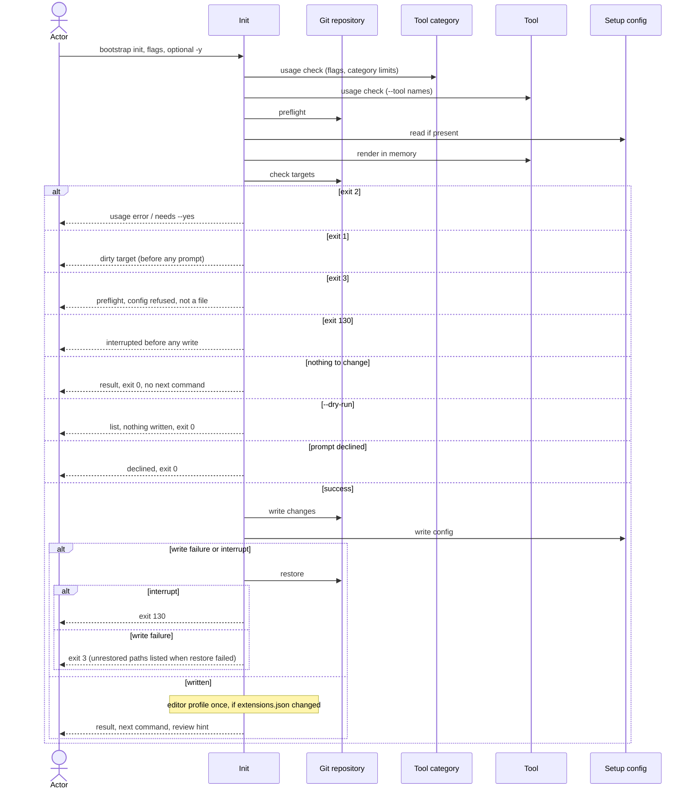

# Flow: Set up a repository

## Purpose

`bootstrap init` writes the baseline files of the selected tools into a git
repository and records what it did in one config file. Run again on a set-up
repository it is a re-run: it renders with the running bootstrap and writes only
what changed.

Serves: [Fast new-repo setup](../../../product.md#goal-fast-setup),
[Zero setup drift](../../../product.md#goal-zero-drift)

## Trigger & Actors

| Actor                      | May trigger                                                                                               | Authorization                       | Audit-recorded                                                             |
| -------------------------- | --------------------------------------------------------------------------------------------------------- | ----------------------------------- | -------------------------------------------------------------------------- |
| Repo owner, AI agent or CI | the command `bootstrap init`, in any terminal, with flags; `-y` or the consent prompt applies the changes | write access to the repository root | no — no audit foundation; git history keeps every replaced or deleted file |

Interactive setup is `bootstrap tui`
([Select tools](../160-select-tools/index.md)).

## Steps

Usage errors (exit 2, nothing written; cases in Acceptance) are checked first,
before the preflight and before `.config/bootstrap.yaml` is read. Value rules:
`--repo` is two or more `/`-separated segments; two `--member` paths with one
slug are refused. Scopes are not an init flag: they come from
[Manage scopes](../180-manage-scopes/index.md) and the tui. `--tool` names are
checked against [Tool](../../../entities/tool/index.md) and
[Tool category](../../../entities/tool-category/index.md#invariants) invariants
2 and 4. `mise` is a hidden tool: naming it is an unknown name.

1. Init runs the preflight on the target repository and `mise`
   ([tool-versions](../../../conventions.md#tool-versions)) per
   [errors](../../../conventions.md#errors); nothing is written on failure.
2. Init looks for `.config/bootstrap.yaml`. Absent → a first run. Present → a
   re-run: init validates it per
   [Setup config validity](../../../entities/setup-config/index.md#validity),
   repairs it per
   [repair on read](../../../entities/setup-config/index.md#repair), and takes
   every value and the tool selection from it. The repair includes a tool rename
   (a recorded old name read as the new name, with the warning "renamed tool
   `<old>` to `<new>`"). The repair covers only the dependencies the selection
   after the request needs: a missing dependency the request leaves unneeded is
   never added back and never reported (no warning, not in `dependencies_added`
   or `dependencies_pruned`). Init is exempt from the version guard for an older
   `version` or `format` only: it is never refused, it is an upgrade re-run
   handled as any re-run (step 3 onward). A newer `version` or `format` fails
   validity: exit 3, nothing written.

   [Setup config](../../../entities/setup-config/index.md)
3. Actor supplies the values:

   | Value                | Flag                             | Required          | Default                                                |
   | -------------------- | -------------------------------- | ----------------- | ------------------------------------------------------ |
   | repo path            | `--repo`                         | yes               | the recorded value, else read from the remote `origin` |
   | members              | `--member <path>` (repeatable)   | no — zero allowed | the recorded list, else none                           |
   | merge model, develop | `--merge-develop` `direct`\|`pr` | yes               | `direct`                                               |
   | merge model, main    | `--merge-main` `direct`\|`pr`    | yes               | `pr`                                                   |

   The `--repo` default and the host (step 4) are read from the remote named
   `origin` only, on any host:

   | `origin` URL form                     | Repo default (`<path>`: owner segments then the name) | Host |
   | ------------------------------------- | ----------------------------------------------------- | ---- |
   | scp-like `<user>@<host>:<path>(.git)` | yes                                                   | yes  |
   | `ssh://…`                             | no                                                    | yes  |
   | `https://<host>/<path>(.git)`         | yes                                                   | yes  |
   | `http://…`                            | no                                                    | yes  |
   | no `origin`, or an unreadable URL     | no                                                    | no   |

   A `<path>` is `owner/name`, or nested `group/subgroup/name`.

   `--member` only adds to `values.members`. The path rules (a leading `./` and
   a trailing `/` dropped, no whitespace, a repeated path counted once) and the
   slug rule (an empty slug or `all` refused) are those of
   [Manage members](../190-manage-members/index.md); the path is not checked. A
   result with two members of one slug exits 2, nothing written. Init does not
   change `values.scopes`; removing a member is
   [Manage members](../190-manage-members/index.md). Precedence, defaults and a
   missing value follow [config](../../../conventions.md#config) and
   [errors](../../../conventions.md#errors); `--repo` is the only value that can
   be missing. [Setup config](../../../entities/setup-config/index.md) (recorded
   values)
4. Actor selects the tools. Tools and their categories come from the
   [Tool](../../../entities/tool/index.md) and
   [Tool category](../../../entities/tool-category/index.md) catalogs.
   - A hidden tool (`mise`) is never selected by the actor, never recorded and
     never listed; its files are always rendered like a selected tool's.
   - First-run defaults: every tool whose `default` is `on`, plus each `origin`
     tool whose `origin_hosts` contains the host of the `origin` remote (the
     host column of the step 3 table), compared ignoring case.
   - First run without `--tool`: the selection is the default tools plus their
     dependencies, with or without `-y`; consent to apply them comes in step 6.
     A re-run without `--tool` keeps the recorded selection.
   - `--tool <name>` (repeatable) gives the full list of selected removable
     tools; unremovable tools are always added, except one whose `max: one`
     category holds a named tool: the named tool takes its place. On a first run
     that needs no `--replace` (nothing is recorded); on a re-run it is a
     replacement (step 5) and the unremovable tool is removed.
   - `--tool` naming a tool whose `host_os` is not the running host, for a new
     selection, exits 2 with the other refusals of the usage and setup-file
     phase ([errors](../../../conventions.md#errors)). A recorded tool of
     another host stays and is rendered on any host.
   - Each unmet requirement gets a dependency, recorded with its parents in
     `values.dependencies`: a required tool that is not selected, and for an
     engine with no selected runtime the engine's default runtime
     ([Tool](../../../entities/tool/index.md#requires-and-dependencies)). A
     dependency is installed and rendered like a selected tool.
5. Replacement, re-run only: a selection that puts a different tool in a
   `max: one` category, or a different runtime in a `max: one` engine
   ([Engines](../../../entities/tool/index.md#engines)), than the recorded one
   is a replacement. It needs `--replace`; without it init exits 2 before
   consent ([config](../../../conventions.md#config)). A replacement that would
   leave a selected tool dangling (the
   [Dangling rule](../../../entities/tool/index.md#requires-and-dependencies))
   exits 2 naming that tool (checked on the selection after the request, before
   consent; [errors](../../../conventions.md#errors)). `--replace` with no
   replacement to make is ignored. A re-run that adds another runtime of a
   `max: many` engine whose held runtime meets it (for example
   `--tool effect --tool bun` with `node` held for `effect`) is not a
   replacement without `--replace`: as `add bun` in
   [Add a tool](../140-add-tool/index.md), the held runtime stays with its
   parents, the named one becomes direct and nothing is pruned. With `--replace`
   it swaps as `add bun --replace` does: the engine links move to the named
   runtime and the held one leaves the selection (and gets a `replaced` entry),
   unless another selected tool requires it specifically (for example `pnpm`
   requiring `node`), when it stays as that tool's dependency and only the links
   move. [Tool category](../../../entities/tool-category/index.md)
6. Init computes every render and decision in memory per
   [safety](../../../conventions.md#safety).
   - A re-run that drops a recorded removable tool takes it out of
     `values.tools`. If a selected tool still requires it, it stays as a
     dependency
     ([Requires and dependencies](../../../entities/tool/index.md#requires-and-dependencies))
     and is never in `dependencies_added` or `dependencies_pruned`. Otherwise
     its files are removed as [Remove a tool](../150-remove-tool/index.md) does.
     A replaced tool is taken out of `values.tools` and its files are removed
     the same way. A held runtime kept beside another runtime of its `max: many`
     engine (step 5, no `--replace`) is neither dropped nor pruned.
   - A re-run prunes each dependency that the request leaves without a parent (a
     drop, a remove, a replacement): that is a change, on the list of changes,
     and its files are deleted and reported as usual (`dependencies_pruned`).
   - A re-run whose `--tool` names a tool recorded in `values.dependencies`
     makes it direct: it moves to `values.tools` and its parents do not change.
     That is a tool change (on the list of changes, needs consent, rewrites the
     setup file), as `add` of a held dependency is in
     [Add a tool](../140-add-tool/index.md). It is never in
     `dependencies_pruned` or `dependencies_added`.
   - Bookkeeping is never a change on its own: a recorded path in `files` that
     the running bootstrap no longer renders and that is absent on disk; a stale
     dependency (one no selected tool needs, whose loss of parents the request
     did not cause); a wrong parent list in `values.dependencies`. When the
     setup file is rewritten for another change (a tool change, a value change,
     a repair, a file change), init also drops the stale path, prunes the stale
     dependency (its files deleted and reported as usual, listed in
     `dependencies_pruned`) and corrects the parent lists. When bookkeeping is
     the only difference, nothing is written, no consent is asked and the exit
     code is 0. An `orphaned` path (present on disk) is unchanged: reported,
     never a change.
   - A `values.dependencies` name the running catalog does not have is dropped
     on the rewrite as a repair (a change on the list) and reported as the
     warning "dropped unknown dependency `<name>`" (`warnings`).

   - The computed list is every file to create, change, delete or replace, plus
     a repair of the setup file; the repair counts as a change. Refusals,
     consent, `--dry-run` and the empty list follow
     [config](../../../conventions.md#config) steps 1–5.

   [Tool](../../../entities/tool/index.md)
7. Init writes only the changes: creates, changes and deletes the targets. A
   shared file is rendered again; a `create_only` file is written only when
   absent ([safety](../../../conventions.md#safety)). In a `mise` config file an
   existing pin is kept. A new tool line, or a renamed package, gets bootstrap's
   own exact pin in `mise.toml` and `*.ci.toml`, and `latest` in `*.dev.toml`
   ([tool versions](../../../conventions.md#tool-versions)).
   [Tool](../../../entities/tool/index.md) (target files)
8. Init writes `.config/bootstrap.yaml` last, recording the format, the
   bootstrap version running, the values (`values.tools` = every direct tool;
   `values.dependencies` = every dependency with its parents) and `files` (every
   tool path init renders for the selected tools, dependencies and hidden tools,
   plus any `orphaned` path; not `.config/bootstrap.yaml` itself). It rewrites
   the whole file per
   [write format](../../../entities/setup-config/index.md#write-format); on an
   upgrade re-run `version` and `format` move to the running bootstrap's.
   [Setup config](../../../entities/setup-config/index.md)
9. After a write that created or changed `.vscode/extensions.json`, init runs
   the editor's command line once to create the `REPO_NAME` profile, install
   every listed extension and uninstall every extension no selected tool lists,
   so the profile equals the file
   ([Tool](../../../entities/tool/index.md#selection-dependent-files)); an
   absent command line, or a present one that fails (the profile, an extension
   install or uninstall), is a warning, the written files stay and the exit code
   stays 0 ([errors](../../../conventions.md#errors)). Init then prints the
   result; the next command only when the run changed a `mise` config file; and,
   only on a run that changed a file, the closing line and then one more line
   "review `git diff`; restore your own lines with `git restore -p <file>`" per
   [errors](../../../conventions.md#errors); the human output reports the same
   lists as the `--json` document (keys in Acceptance). `dependencies_added`
   (added as dependencies this run) and `dependencies_pruned` are tool names
   sorted by name, always present, never holding a tool named in `--tool`. No
   tool-name list holds a hidden tool; its file paths are listed as any path.
   Init never installs software other than the editor extensions above, and
   never runs the next command (`MISE_ENV=dev mise run setup:all`,
   [errors](../../../conventions.md#errors)) itself. `--dry-run` follows
   [config](../../../conventions.md#config) and exits with the code of the
   failing step.

## Guarantees

| Step                    | Consistency                                      | On failure                                                                                                                                                                                                                                                                                                                                                                   | Idempotency                                                                               | Load & latency          |
| ----------------------- | ------------------------------------------------ | ---------------------------------------------------------------------------------------------------------------------------------------------------------------------------------------------------------------------------------------------------------------------------------------------------------------------------------------------------------------------------- | ----------------------------------------------------------------------------------------- | ----------------------- |
| usage check, 1–6        | atomic — nothing is written                      | none — nothing written yet; the usage check exits 2, steps 1–6 exit 1, 2, 3 or 130 per step (0 when the consent prompt is declined)                                                                                                                                                                                                                                          | n/a — a retry starts from the same repo state                                             | n/a — one local command |
| 7–8                     | atomic — all-or-nothing                          | restore per [safety](../../../conventions.md#safety); a write failure exits 3 naming the failing path, an interrupt exits 130; a failed restore exits 3 per [errors](../../../conventions.md#errors). An uncatchable kill is out of the guarantee; the config is written last, so the repo is then not marked set up (first run) or still records the earlier state (re-run) | a re-run with nothing changed writes nothing and exits 0; after a restore it starts clean | n/a — one local command |
| 9 (editor profile sync) | best effort — outside the repository, not atomic | a failed editor command line, install or uninstall is a warning, the written files stay, exit 0; an interrupt stops the sync, the written files stay, exit 130 ([errors](../../../conventions.md#errors))                                                                                                                                                                    | n/a — runs only after a write that changed `.vscode/extensions.json`                      | n/a — one local command |
| 9 (output)              | atomic — output only                             | none — changes no repo state                                                                                                                                                                                                                                                                                                                                                 | n/a                                                                                       | n/a — one local command |

## Diagram

## Background Jobs

N/A — runs synchronously in one command invocation.

## Acceptance

A case that names or records a second tool of the `version-control` or
`git-hooks` category, or replaces a tool another selected tool requires, cannot
be reached with the 1.0 catalog (one tool in each such category, and no tool
requires a tool of a `max: one` category); it holds for a later catalog.

- Given an empty git repository, when `bootstrap init` runs with all flags and
  `-y`, then the files of the selected tools exist, `.config/bootstrap.yaml`
  records the version, values (`values.tools` = every direct tool,
  `values.dependencies` = every dependency with its parents) and files, and the
  exit code is 0.
- Given no prompt is possible (stdin or stdout not a terminal, or `--json`), no
  `-y` and no `--dry-run`, when init would make a change, then it does not
  prompt, nothing is written, the exit code is 2 "changes need --yes" and the
  next command is the same command plus `--yes`. This covers: a first run (also
  one whose repo path is read from `origin`); a re-run that would create,
  change, delete or replace a file, or repair the setup file; a re-run that
  drops a recorded removable tool (whether or not it deletes files); a re-run
  that replaces a tool with `--replace`; and a repair.
- Given a terminal on stdin and stdout, no `--json`, no `-y` and no `--dry-run`,
  when init runs a change, then the list of changes is shown and "apply these
  changes? y/N" is asked; answering "n" (or Enter) writes nothing and exits 0
  with "nothing changed"; answering "y" applies the list and exits 0.
- Given a dirty target and no `-y`, in a terminal or not, when init runs, then
  the exit code is 1 listing the path before any prompt and nothing is written.
- Given `--dry-run` (in a terminal or not, with or without `-y`, also with
  `--json`), when init runs a first run, a re-run with a change, a drop, a
  replacement or a repair, then it never prompts, reports the would-be created,
  changed, deleted, kept, orphaned and replaced paths (the list the real run
  would apply), writes nothing and the exit code is 0.
- Given `bootstrap init` with no `--tool` on a first run (with or without
  `--yes`), when init runs, then the default tools are selected and the tools
  they require arrive as dependencies (`python`, the `python` engine's default
  runtime, and `uv` for `pre-commit`, `graphify` and `mempalace`; `node`, the
  `javascript` engine's default runtime, for `virajp-linter`; `jq` and `yq` for
  `claude`; `dprint` needs nothing); with `--yes` they are applied and the exit
  code is 0, without it consent follows the prompt rule above.
- Given a first run, when init runs `--tool effect -y`, then `effect` is
  selected and `node` is recorded in `values.dependencies` with parents
  `[effect]`, next to the dependencies of the unremovable tools: `python` with
  parents `[pre-commit, uv]` and `uv` with parents `[pre-commit]`;
  `dependencies_added` lists `node`, `python` and `uv`, not `effect`; the exit
  code is 0.
- Given a first run, when init runs `--tool effect --tool bun -y`, then `bun`
  meets `effect`'s `javascript` engine, `node` is not added,
  `values.dependencies` has no `node` or `bun` entry and the exit code is 0.
- Given `effect` recorded and `node` recorded as its dependency, when init
  re-runs with `--tool effect --tool bun -y` without `--replace`, then `bun` is
  added to `values.tools`, `node` stays in `values.dependencies` with parents
  `[effect]` and keeps its files, nothing is pruned, `replaced` is empty and the
  exit code is 0.
- Given `effect` recorded and `node` recorded as its dependency, when init
  re-runs with `--tool effect --tool bun --replace -y`, then `effect`'s link
  moves from `node` to `bun`, `node` is pruned (listed in `dependencies_pruned`,
  its files removed except `create_only` ones), `replaced` lists
  `{from: node, to: bun}` and the exit code is 0; with `pnpm` also selected,
  `node` stays in `values.dependencies` with parents `[pnpm]`, only `effect`'s
  link moves and `replaced` has no entry for `node`.
- Given a first run, when init runs `--tool pnpm -y`, then `node` is recorded in
  `values.dependencies` with parents `[pnpm]` (`pnpm` requires `node` itself)
  and the exit code is 0.
- Given the remote `origin` is `git@<host>:o/r.git` or `https://<host>/o/r.git`,
  when init reads defaults, then the repo default is `o/r`; for
  `https://<host>/a/b/c.git` it is `a/b/c`; for `ssh://git@github.com/o/r.git`
  the repo default is not readable; and whenever the `origin` host is
  `github.com`, `github` is selected by default.
- Given a set-up repository and a re-run with nothing to create, change, delete
  or replace (bookkeeping alone is not a change), when init runs (in any
  terminal, with or without `-y`), then nothing is written, an existing
  `create_only` file is listed `kept`, an unrendered recorded path is listed
  `orphaned`, every other file is listed `unchanged`, there is no closing line
  and no `next_command`, and the exit code is 0 (a `--dry-run` follows the same
  rule).
- Given a re-run with `-y` and `--merge-main direct` over a recorded `pr`, when
  init runs, then the flag value is rendered and recorded and the other recorded
  values are kept as supplied.
- Given a re-run whose config records a newer version or format, when init runs,
  then nothing is written and the exit code is 3 "upgrade bootstrap".
- Given a first run, when init finishes, then no path is reported `orphaned`.
- Given a config that fails the schema, or a `files` entry that is empty,
  absolute, uses `..` or has a wildcard, when init runs, then nothing is
  written, the exit code is 3 and the message names the failing field and says
  "fix the file, then run again".
- Given an unknown flag, an invalid flag value (for example
  `--merge-main squash`, `--merge-develop squash`, or `--repo r` with fewer than
  two `/`-separated segments), an unknown `--tool` name (also `--tool mise`), or
  two `--tool` names of one `max: one` category or of one `max: one` engine (for
  example `--tool openjdk --tool temurin`), when init runs (with or without
  `-y`, even in a directory that is not a git repository or with a config that
  fails the schema), then these are usage errors: nothing is written and the
  exit code is 2 before the preflight, not 3; for an invalid flag value the
  message names the flag and the allowed form.
- Given `--tool` naming another tool of the `version-control` or `git-hooks`
  category over the recorded one, when init re-runs with `--replace` and `-y`,
  then it is a replacement, not a usage error, and the unremovable tool is
  removed; without `--replace` the exit code is 2.
- Given a first run, when init runs `--tool` naming another tool of the
  `version-control` or `git-hooks` category with `-y` and no `--replace`, then
  the named tool takes the place of that category's unremovable tool, which is
  not selected, and the exit code is 0.
- Given `temurin` recorded, when init re-runs with `--tool openjdk` (and the
  other recorded tools) and `-y` but without `--replace`, then nothing is
  written and the exit code is 2 with the next command the same command plus
  `--replace`; with `--replace`, `openjdk` takes `temurin`'s engine links,
  `temurin` leaves and `replaced` lists `{from: temurin, to: openjdk}`.
- Given a re-run that replaces a recorded tool that a selected tool requires
  (with no other way to meet that requirement), when init runs with `--replace`
  and `-y`, then nothing is written and the exit code is 2 naming the dependent
  tool.
- Given a `values.tools` name the running catalog does not have, or two tools of
  one `max: one` category, when init runs, then nothing is written and the exit
  code is 3 naming the fix (for example "remove `fnox` from values.tools").
- Given a recorded selection with a tool whose required tool is not recorded,
  when init re-runs with `-y`, then the missing dependency is added back as a
  repair ([Repair on read](../../../entities/setup-config/index.md#repair)), the
  warning "added back dependency `<name>`" is reported (`warnings`), the
  dependency is listed in `dependencies_added` and the exit code is 0.
- Given a re-run whose request (a drop, a remove or a replacement) leaves a
  recorded dependency without a parent, when init runs with `-y`, then the
  dependency is pruned (its non-`create_only` files are deleted and reported
  `deleted`, its `create_only` files kept) and it is listed in
  `dependencies_pruned`.
- Given a recorded dependency whose parent list is wrong, when the setup file is
  rewritten for another change, then the parent list is corrected and the
  dependency is kept; only a dependency no parent needs is pruned.
- Given a recorded dependency no tool of the selection needs, whose loss of
  parents the request did not cause, when the setup file is rewritten for
  another change, then it is pruned (files deleted and reported, listed in
  `dependencies_pruned`) and the parent lists are corrected.
- Given a set-up repository whose only difference is bookkeeping (a recorded
  path the running bootstrap no longer renders and that is absent on disk, a
  stale dependency, or a wrong parent list), when init runs (with or without
  `-y`, in any terminal), then nothing is written, no consent is asked, the
  stale entries stay as recorded and the exit code is 0 with the "nothing to
  change" result.
- Given a recorded selection with a missing dependency that the request leaves
  unneeded (for example `--tool` drops the only parent), when init runs with
  `-y`, then the dependency is not added back, no warning is reported and it is
  in neither `dependencies_added` nor `dependencies_pruned`.
- Given a `values.tools` that misses an unremovable tool and no other tool of
  its `max: one` category is recorded, when init runs with `-y`, then the tool
  is added again, the warning "added back unremovable tool `<name>`" is reported
  (`warnings`) and the exit code is 0.
- Given a recorded `values.dependencies` name the running catalog does not have,
  when init re-runs with `-y`, then the name is dropped from the config, the
  warning "dropped unknown dependency `<name>`" is reported (`warnings`) and the
  exit code is 0.
- Given `.config/bootstrap.yaml` has uncommitted changes and its content differs
  from the render, when init re-runs, then nothing is written and the exit code
  is 1 listing it; once committed, it is listed `changed` when rewritten and
  `unchanged` when not.
- Given `--tool taplo` without `--tool dprint`, when init runs with `-y`, then
  `dprint` is added as a dependency of `taplo` (it needs nothing itself),
  `dependencies_added` lists `dprint` (next to `python` and `uv` of the
  unremovable `pre-commit`), and the exit code is 0; given
  `--tool taplo --tool dprint`, `dprint` is selected directly and is recorded in
  `values.tools`, not in `values.dependencies`.
- Given a recorded dependency (for example `dprint`, a dependency of `taplo`),
  when init re-runs with `--tool` naming it (and the other recorded direct
  tools) and `-y`, then it moves to `values.tools` with no parent change, the
  setup file is rewritten, it is in neither `dependencies_added` nor
  `dependencies_pruned`, and the exit code is 0; without `-y` and no prompt
  possible, the exit code is 2 "changes need --yes".
- Given `--tool github --tool github`, when init runs with `-y`, then github is
  applied once.
- Given a first run or a re-run, when init runs with `-y --member ../Api_Server`
  (repeatable), then each member is added to `values.members` with the slug
  `api-server` (folder name lowercased, other characters `-`), the path is not
  checked, the recorded members are kept and the exit code is 0.
- Given a recorded member `../web`, when init runs with `-y --member ../web/`,
  then the trailing `/` is dropped, the path is already recorded (in
  `already_recorded` as `../web`), nothing is written and the exit code is 0.
- Given `--member a/Web` and `--member b/web`, or `--member` whose slug a
  recorded member already has, when init runs, then nothing is written and the
  exit code is 2.
- Given `--tool` naming a tool whose `host_os` is not the running host (for
  example `swiftlint` on Linux) that is not recorded, when init runs, then
  nothing is written and the exit code is 2 with the other refusals; given the
  same tool already recorded, it stays and is rendered on any host.
- Given a recorded old tool name that the running catalog lists in a tool's
  `renamed_from`, when init re-runs with `-y`, then it is read as the new name,
  rewritten under it, the warning "renamed tool `<old>` to `<new>`" is reported
  (`warnings`) and the exit code is 0.
- Given a `mise` config file whose tool line has an exact pin, when init
  re-runs, then the pin is kept; a new tool line, or a renamed package, gets
  bootstrap's own exact pin in `mise.toml` and `*.ci.toml`, and `latest` in
  `*.dev.toml`.
- Given a shared file edited by hand and committed, when init re-runs with `-y`,
  then it is rendered again and listed `changed`; a `create_only` file is
  written only when absent.
- Given a run that created or changed `.vscode/extensions.json`, when init
  finishes with `-y`, then the editor's command line has run once to create the
  `REPO_NAME` profile, install every listed extension and uninstall every
  extension no selected tool lists; with the command line absent there is one
  warning and the exit code is 0.
- Given a run that created or changed `.vscode/extensions.json` and an editor
  command line that fails (creating the profile, or installing or uninstalling
  an extension), when init finishes with `-y`, then there is one warning, the
  written files stay and the exit code is 0.
- Given a run that changed a file, when init finishes, then the human output
  ends with the closing line, then one more line "review `git diff`; restore
  your own lines with `git restore -p <file>`".
- Given the directory is not inside a git repository, when init runs, then
  nothing is written and the exit code is 3.
- Given `mise` is not on `PATH`, when init runs, then nothing is written, the
  exit code is 3 and the message says "mise not installed" with the install
  command.
- Given `mise` is found at a path other than `~/.local/bin/mise`, when init
  runs, then it continues and prints one warning naming that path (`--json`: in
  `warnings`).
- Given init runs from a subdirectory of a repository, when it succeeds with
  `-y`, then `.config/bootstrap.yaml` and every tool file are at the repository
  root.
- Given a target path that is modified, staged, untracked or ignored in git,
  when init runs, then nothing is written, the exit code is 1 and the output
  lists the path with "commit or stash these files, then run again".
- Given a tracked target deleted in the working tree with the deletion not
  committed, when init runs, then nothing is written and the exit code is 1
  listing the path; once the deletion is committed, init with `-y` creates the
  file again.
- Given a dirty file (including `.config/bootstrap.yaml`) whose content and mode
  already equal the render, when init runs, then it is listed `unchanged` and
  the run is not refused.
- Given a tool target path that exists as a directory or a symlink, or whose
  parent directory is a symlink or a regular file, when init runs, then nothing
  is written and the exit code is 3 naming that path.
- Given both a not-a-file target and an uncommitted target, when init runs, then
  nothing is written, the exit code is 3 and the output lists every path of both
  kinds.
- Given an existing `create_only` file, when init runs, then it is untouched and
  listed `kept`.
- Given a path in `files` that the running bootstrap no longer renders for a
  selected tool, when init runs, then it is left in place and listed `orphaned`;
  a recorded path that is no longer rendered and is absent on disk is
  bookkeeping: it leaves `files` silently, only when the setup file is rewritten
  for another change, and is never a change on its own.
- Given a re-run that needs a replacement (a different tool in a `max: one`
  category than recorded) without `--replace`, when init runs in any terminal
  (also with `-y`, `--dry-run` or `--json`), then it does not prompt, nothing is
  written and the exit code is 2; with `--replace` and `-y` the replacement is
  applied, the replaced tool's non-`create_only` files are deleted, it is listed
  in `replaced` and the exit code is 0; with `--replace` and no `-y` it asks the
  consent prompt in a terminal (`--dry-run` needs no consent).
- Given `--replace` and no replacement to make, when init runs, then the flag is
  ignored and the run proceeds as without it.
- Given `-y` or `--yes`, when init runs, then both behave identically.
- Given a re-run whose selection drops a recorded removable tool (whether or not
  it deletes files), when init runs in a terminal without `-y`, then the list is
  shown and the prompt asked; with `-y` (or "y") that tool's non-`create_only`
  files are deleted and its `create_only` files are kept and reported.
- Given a successful run, when init finishes, then a first run's `created` lists
  `.config/bootstrap.yaml`, every task file has mode `0755` and every path list
  is sorted by path.
- Given a write failure injected mid-run, when init runs with `-y`, then every
  changed target is restored from `HEAD`, every created file is deleted and the
  exit code is 3 naming the failing path.
- Given an interrupt signal mid-write, when init is running with `-y`, then the
  working tree is as before and the exit code is 130.
- Given a required value with no flag, no recorded value and no default, in any
  terminal including an interactive one (also with `--dry-run` or `--json`),
  when init runs, then it does not prompt, the exit code is 2, the message names
  the missing flag, and the error's next command offers `bootstrap tui` or the
  missing flag (never `-y`); with `--json` stdout is one JSON document carrying
  the error.
- Given a first run, a repo path readable from `origin`, `--merge-develop` and
  `--merge-main` given and no `-y`, when init runs with no `--repo`, then the
  path from `origin` is used without consent (no value is missing); the run
  itself needs consent to write: in a terminal the prompt is asked, and with
  `-y` the exit code is 0.
- Given a re-run with a recorded `values.repo` that differs from the path read
  from `origin`, when init runs with no `--repo`, then the recorded value is
  kept; with `--repo` the flag value is rendered and recorded.
- Given a first run, no `--repo` and no repo path readable from `origin`, when
  init runs with or without `-y`, then there is no default, it does not prompt,
  the exit code is 2, the message names `--repo` and the next command offers
  `bootstrap tui` or `--repo`.
- Given a successful run or a `--dry-run` that newly applies a tool (a direct
  tool, a dependency, a repair that adds one back included, or the incoming tool
  of a replacement; each creates its own `mise` config file) or creates, changes
  or deletes a `mise` config file, when init finishes, then the human output
  ends with exactly the closing line "commit the changes, then run
  `MISE_ENV=dev mise run setup:all`", then the review hint line ("review
  `git diff`; restore your own lines with `git restore -p <file>`"); with
  `--json` the success document has `exit` 0, `created`, `changed`, `deleted`,
  `unchanged`, `kept`, `orphaned`, `replaced` (each `{from, to}`),
  `dependencies_added`, `dependencies_pruned`, `warnings`, and `next_command`
  equal to `MISE_ENV=dev mise run setup:all`.
- Given a re-run whose only change creates, changes or deletes no `mise` config
  file and adds no tool, when init finishes with `-y`, then the human output
  ends with exactly the closing line "commit the changes", then the review hint
  line, there is no `next_command` and the exit code is 0. A merge-model change
  (for example `--merge-main direct`) changes `.config/mise/conf.d/env.toml`, a
  `mise` config file, so it prints the next command.
- Given `--dry-run --json`, when init runs, then the document has the same keys
  and values a real run would return plus `"dry_run": true`; on a non-zero exit
  it is the same error document plus `"dry_run": true`.
- Given `--json`, when init runs, then stdout parses as exactly one JSON
  document and contains nothing else.
- Given a recorded `values.tools` that names `mise`, when init runs, then
  nothing is written and the exit code is 3 naming the fix "remove `mise` from
  values.tools" ([Validity](../../../entities/setup-config/index.md#validity)).
- Given a recorded `values.tools` that misses an unremovable tool (`git`,
  `pre-commit`) while another tool of its `max: one` category is recorded, when
  init runs, then the other tool is a valid replacement: the exit code is not 3
  and there is no repair.
- Abuse case: n/a — runs locally with the caller's own permissions on the
  caller's own repository; no remote surface; every input is validated per
  [baseline](../../../conventions.md#baseline) boundary-validation.

## References

- [baseline](../../../conventions.md#baseline),
  [safety](../../../conventions.md#safety),
  [errors](../../../conventions.md#errors),
  [config](../../../conventions.md#config),
  [tool-versions](../../../conventions.md#tool-versions)
- [Terminal UX](../../../design-system.md#terminal-ux)
- API surface: N/A — no service project; the flow is a local command
- Screens surface: N/A — cli has no screen platform
