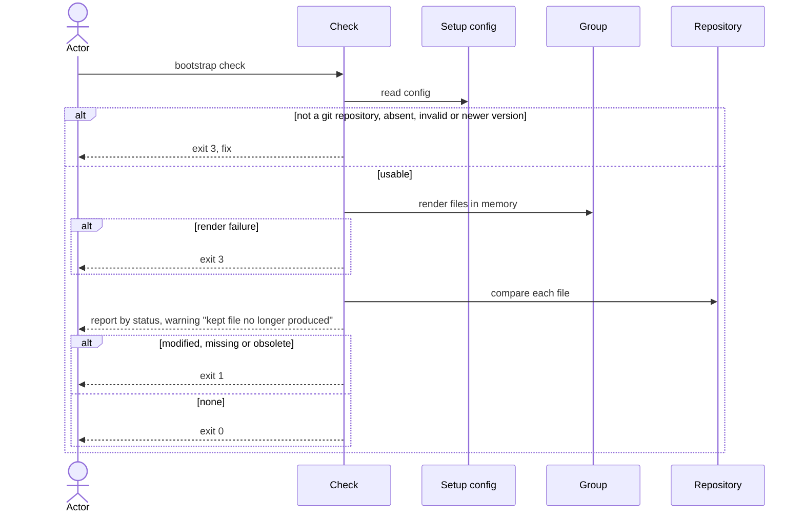

# Flow: Check for drift

## Purpose

`bootstrap check` compares a repository with the files its recorded setup would
produce today and reports every difference, changing nothing.

Serves: [Zero setup drift](../../../product.md#goal-zero-drift),
[Agent-resolvable drift](../../../product.md#goal-agent-resolvable)

## Trigger & Actors

| Actor | May trigger | Authorization | Audit-recorded |
| ----- | ----------- | ------------- | -------------- |
| Repo owner | the command `bootstrap check` | read access to the working directory | no |
| AI agent | `bootstrap check --json` | read access to the working directory | no |
| CI | `bootstrap check`; the exit code decides the build | read access to the working directory | no |

## Steps

1. Outside a git repository check exits 3 per
   [errors](../../../conventions.md#errors). Check reads `.config/bootstrap.yaml`. Absent → writes nothing, exits 3 "not
   set up — run `bootstrap init`". A file failing
   [Setup config validity](../../../entities/setup-config/index.md#validity) → exits 3 naming the problem and the fix. This
   includes a recorded `version` newer than the running cli: "set up with X,
   running Y — upgrade bootstrap"; no comparison runs.
2. When the running cli is newer than the recorded `version`, the comparison uses
   the running cli's files and the report states both versions.
   [Setup config](../../../entities/setup-config/index.md)
3. Check renders, in memory only, every file of the core groups plus the selected
   optional groups, using the recorded values. A render failure exits 3 per
   [errors](../../../conventions.md#errors).
   [Group](../../../entities/group/index.md)
4. Check compares each rendered file with the repository and assigns each
   produced or listed path exactly one status, first matching row wins
   ([Setup config](../../../entities/setup-config/index.md) lists):

   | Status | Condition | Drift |
   | ------ | --------- | ----- |
   | `kept` | path in `kept`, present with any content or absent; never `obsolete` | no |
   | `deleted` | path in `deleted` | no |
   | `obsolete` | path in `files` the running cli no longer produces, still in the repo | yes |
   | `missing` | produced, absent | yes |
   | `modified` | produced, differs | yes |
   | `unchanged` | produced, byte-identical | no |

   A path in `files` no longer produced and absent from the repo gets no status.
5. Check reports. Human output states both versions and lists files grouped by
   status; `--verbose` adds the diffs; output rules per
   [Terminal UX](../../../design-system.md#terminal-ux). `--json` prints exactly
   one document on every exit ([errors](../../../conventions.md#errors)); on exit
   2, 3 or 130 it carries the `error` instead of file statuses ("interrupted —
   nothing written" on 130), otherwise: recorded version, running version, and
   per file its path, group (null for a path no group of the running cli
   produces) and status, plus for
   `modified`, `missing` and `obsolete` a unified diff from the current content
   to the expected content (`missing`: from empty; `obsolete`: to empty), and a
   warnings array. A `kept` path the running cli no longer produces is the
   warning "kept file no longer produced" — never changes the exit code.
6. Check exits 0 when no path has a drift status, and 1 when at least one does,
   per [errors](../../../conventions.md#errors); every other exit (2, 3, 130) is
   per that anchor and steps 1 and 3.

## Guarantees

| Step / group | Consistency | On failure | Idempotency | Load & latency |
| ------------ | ----------- | ---------- | ----------- | -------------- |
| all | atomic — read-only: the repository is byte-identical after the run, whatever the outcome | none — nothing written; exits per steps 1, 3 and 6 | repeated runs on an unchanged repo give the same report | completes in under 5 seconds on a typical repository with every group selected, bootstrap already installed |

## Diagram

## Background Jobs

N/A — runs synchronously in one command invocation.

## Acceptance

- Given a freshly initialised repository, when check runs, then every file is
  `unchanged` and the exit code is 0.
- Given one managed file was edited, when check runs with `--json`, then that
  file is `modified` with a unified diff and the exit code is 1.
- Given one managed file was deleted, when check runs, then it is `missing` with
  a diff from empty and the exit code is 1.
- Given a file listed in `files` that the running cli no longer produces, when
  check runs, then it is `obsolete` and the exit code is 1.
- Given an edited file is listed in `kept`, when check runs, then its status is
  `kept` and the exit code is 0.
- Given a `kept` path is absent from the repository, when check runs, then its
  status is `kept` and the exit code is 0.
- Given a path is listed in `deleted`, when check runs, then its status is
  `deleted` and the exit code is 0.
- Given `kept` lists a path the running cli no longer produces, when check runs,
  then the report carries the warning "kept file no longer produced" and the exit
  code is unaffected.
- Given the directory is not inside a git repository, when check runs, then the
  exit code is 3 and nothing is written.
- Given no `.config/bootstrap.yaml`, when check runs, then the exit code is 3 and
  the message names `bootstrap init`.
- Given a setup file failing Validity (schema violation, newer format, removed or
  core group name, a path in both `kept` and `deleted`), when check runs, then the
  exit code is 3 and the message names the problem.
- Given the recorded version is newer than the running cli (step 1), when check
  runs, then the exit code is 3 and no file status is reported.
- Given an unknown flag, when check runs, then the exit code is 2 with short
  usage; with `--json`, stdout is one document with `error`.
- Given a `deleted` path the running cli no longer produces, when check runs, then
  its status is `deleted` and the exit code is 0.
- Given a `deleted` path the owner put back in the repository, when check runs,
  then its status is `deleted`, not drift, and the exit code is 0.
- Given Ctrl-C at any moment, when check runs, then the exit code is 130, the
  message is "interrupted — nothing written", and with `--json` it is the
  document's `error`.
- Given the running cli is newer and its templates changed, when check runs, then
  the affected files are `modified`, the report shows both versions and the exit
  code is 1.
- Given any run and any outcome, when it ends, then the repository is unchanged:
  no file written, no prompt shown.
- Given `--json`, when check runs on any exit including 3, then stdout is exactly
  one JSON document.
- Given a typical repository with every group selected, when check runs, then it
  completes in under 5 seconds.
- Given only the `--json` report of the edited-file case, when an agent reads it,
  then it can restore the expected file from the diff alone.
- Abuse case: n/a — read-only, runs locally with the caller's own permissions;
  every input is validated per [baseline](../../../conventions.md#baseline)
  boundary-validation.

## References

- [baseline](../../../conventions.md#baseline),
  [errors](../../../conventions.md#errors),
  [config](../../../conventions.md#config)
- [design-system](../../../design-system.md#terminal-ux) — Terminal UX
- [Set up a repository](../110-setup-repository/index.md) — writes the config
- API surface: N/A — no service project; the flow is a local command
- Screens surface: N/A — cli has no screen platform
