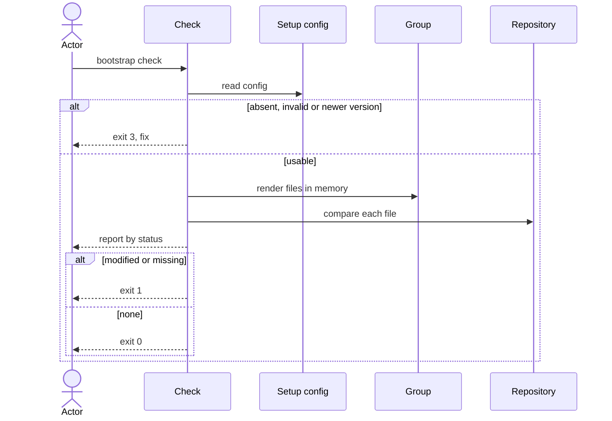

# Flow: Check for drift

## Purpose

`bootstrap check` compares a repository with the files its recorded setup would
produce today and reports every difference, changing nothing.

Serves: [Zero setup drift](../../../product.md#goal-zero-drift),
[Agent-resolvable drift](../../../product.md#goal-agent-resolvable)

## Trigger & Actors

| Actor | May trigger | Authorization | Audit-recorded |
| ----- | ----------- | ------------- | -------------- |
| Repo owner | the command `bootstrap check` | read access to the working directory | no |
| AI agent | `bootstrap check --json` | read access to the working directory | no |
| CI | `bootstrap check`; the exit code decides the build | read access to the working directory | no |

Read-only: the command never writes a file and never prompts, interactive or
not. Not audit-recorded: the product has no audit foundation.

## Steps

1. Check reads `.config/bootstrap.yaml`. Absent → writes nothing, exits 3 "not
   set up — run `bootstrap init`". Invalid against its schema, a `format` newer
   than the running cli understands, or naming a group the running cli no longer
   ships → exits 3 naming the problem and the fix, per the setup-config
   invariants.
   [Setup config](../../../entities/setup-config/index.md)
2. Check applies the version gate. Recorded `version` newer than the running cli
   → exits 3 "set up with X, running Y — upgrade bootstrap" and runs no
   comparison. Running cli newer → the comparison runs against the running cli's
   files, so changed templates of the newer release appear as drift until update
   runs.
   [Setup config](../../../entities/setup-config/index.md)
3. Check renders, in memory only, every file of the core groups plus the selected
   optional groups, using the recorded values.
   [Group](../../../entities/group/index.md)
4. Check compares each rendered file with the repository and assigns exactly one
   status: `unchanged` (byte-identical), `modified` (differs), `missing`
   (absent), `kept` (path listed in setup-config `kept` — never drift, whatever its
   content).
   [Setup config](../../../entities/setup-config/index.md)
5. Check reports. Human output lists files grouped by status; `--verbose` adds
   the diffs. `--json` prints exactly one document on every exit
   ([errors](../../../conventions.md#errors)); on exit 2 or 3 it carries the
   `error` instead of file statuses, otherwise: recorded version, running
   version, and per file its path, group and status, plus for `modified` and
   `missing` a unified diff from the current content to the expected content
   (`missing`: from empty), and a warnings array. A `kept` path no selected group
   writes is a warning (stale kept entry) — never drift, never changes the exit
   code.
6. Check exits 0 when no file is `modified` or `missing`, and 1 when at least one
   is (drift), per [errors](../../../conventions.md#errors).

The human report states both versions. Output rules follow
[Terminal UX](../../../design-system.md#terminal-ux).

## Guarantees

| Step / group | Consistency | On failure | Idempotency | Load & latency |
| ------------ | ----------- | ---------- | ----------- | -------------- |
| all | atomic — read-only: the repository is byte-identical after the run, whatever the outcome | none — nothing written; exit 1 means drift, exit 3 a setup or version problem | repeated runs on an unchanged repo give the same report | completes in under 5 seconds on a typical repository with every group selected, bootstrap already installed |

## Diagram

## Background Jobs

N/A — runs synchronously in one command invocation.

## Acceptance

- Given a freshly initialised repository, when check runs, then every file is
  `unchanged` and the exit code is 0.
- Given one managed file was edited, when check runs with `--json`, then that
  file is `modified` with a unified diff and the exit code is 1.
- Given one managed file was deleted, when check runs, then it is `missing` with
  a diff from empty and the exit code is 1.
- Given an edited file is listed in `kept`, when check runs, then its status is
  `kept` and the exit code is 0.
- Given `kept` lists a path no selected group writes, when check runs, then the
  report carries a warning and the exit code is unaffected.
- Given no `.config/bootstrap.yaml`, when check runs, then the exit code is 3 and
  the message names `bootstrap init`.
- Given the recorded version is newer than the running cli, when check runs, then
  the exit code is 3 and no file status is reported.
- Given the running cli is newer and its templates changed, when check runs, then
  the affected files are `modified`, the report shows both versions and the exit
  code is 1.
- Given any run and any outcome, when it ends, then the repository is unchanged:
  no file written, no prompt shown.
- Given `--json`, when check runs on any exit including 3, then stdout is exactly
  one JSON document.
- Given a typical repository with every group selected, when check runs, then it
  completes in under 5 seconds.
- Given only the `--json` report of the edited-file case, when an agent reads it,
  then it can restore the expected file from the diff alone.
- Abuse case: n/a — read-only, runs locally with the caller's own permissions;
  every input is validated per [baseline](../../../conventions.md#baseline)
  boundary-validation.

## References

- [baseline](../../../conventions.md#baseline),
  [errors](../../../conventions.md#errors),
  [config](../../../conventions.md#config)
- [design-system](../../../design-system.md#terminal-ux) — Terminal UX
- [Set up a repository](../110-setup-repository/index.md) — writes the config
  this flow reads
- API surface: N/A — no service project; the flow is a local command
- Screens surface: N/A — cli has no screen platform; terminal behaviour per
  design-system.md Terminal UX
