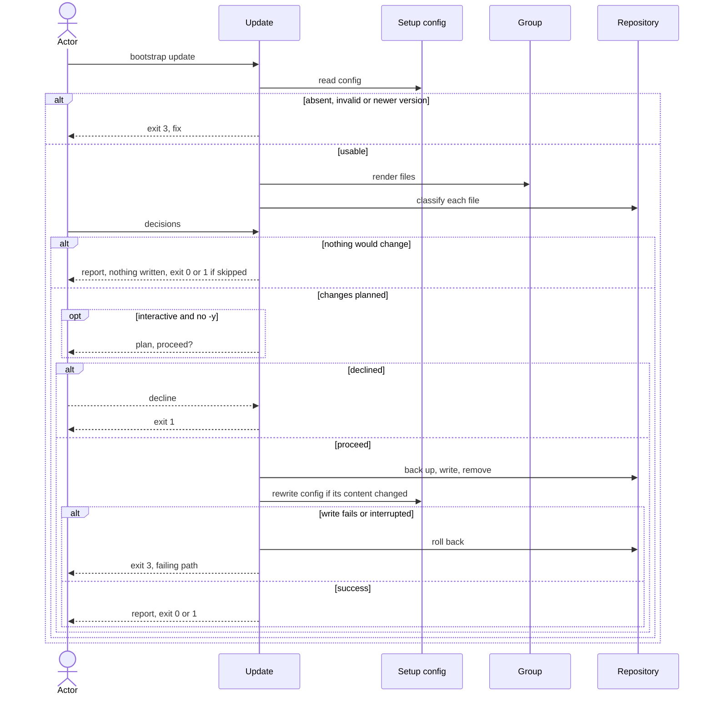

# Flow: Update a repository

## Purpose

`bootstrap update` brings a set-up repository in line with the running release
without losing a hand edit; it validates the assumption that re-applying keeps a
repository's own edits ([risks & assumptions](../../../product.md#risks--assumptions)).

Serves: [Zero setup drift](../../../product.md#goal-zero-drift)

## Trigger & Actors

| Actor | May trigger | Authorization | Audit-recorded |
| ----- | ----------- | ------------- | -------------- |
| Repo owner (interactive terminal) | the command `bootstrap update` | write access to the working directory | no |
| AI agent or CI (non-interactive) | `bootstrap update`, every value and decision by flag | write access to the working directory | no |

Not audit-recorded: the product has no audit foundation.

## Steps

1. Update reads `.config/bootstrap.yaml`. Absent → writes nothing, exits 3 "not
   set up — run `bootstrap init`" (a repository without the file is adopted by
   init, which backs up existing files). Invalid, a `format` newer than the
   running cli understands, a recorded `version` newer than the running cli, or a
   group the cli no longer ships → exits 3 per the setup-config invariants.
   [Setup config](../../../entities/setup-config/index.md)
2. Actor may change recorded values with the init value flags (`--repo`,
   `--scope`, `--merge-develop`, `--merge-main`; rules as in
   [Set up a repository](../110-setup-repository/index.md) step 3). With no value
   flag the recorded values are reused and nothing is asked.
   [Setup config](../../../entities/setup-config/index.md)
3. Update renders every file of the core groups plus the selected optional groups
   with the running cli, and gives each path exactly one status: `unchanged`
   (left alone), `missing` (created), `kept` (listed in setup-config `kept` —
   never touched unless the owner chooses recreate or passes `--take <path>`,
   step 4), `deleted` (listed in setup-config `deleted` — never recreated
   or asked about, whatever else is true of the path), `obsolete` (listed in `files`, no longer produced, present in
   the repo — removed), `modified` (differs; needs a decision). Precedence: `kept`
   wins over `obsolete` — the file is untouched, stays in `kept`, is dropped from
   `files`, and check then warns "kept file no longer produced". A path in `files`
   no longer produced and already absent from the repo is dropped from `files`
   silently, with no status and no backup. A `deleted` path the running cli no
   longer produces stays in `deleted`, leaves `files`, and any hand-made copy in
   the repo is ignored.
   [Group](../../../entities/group/index.md),
   [Setup config](../../../entities/setup-config/index.md)
4. Actor decides each `modified` file. Interactive: update shows the diff and
   offers take source (the current file moves to a backup, the source version is
   written), keep mine (path added to `kept`, file untouched) or skip for now
   (left as drift). A `kept` path absent from the repo that the running cli still
   produces is asked once: recreate (source version written, path leaves `kept`)
   or leave deleted (path moves from `kept` to `deleted`); one the cli no longer
   produces gets no question and stays in `kept` (step 3). Non-interactive: `--take <path>` and
   `--keep <path>` (repeatable) or `--take-all`; a modified file with no decision
   is skipped, a deleted `kept` file is left as is.
   - `--take <path>` on a `kept` path writes the source version and removes it
     from `kept`; on a `deleted` path it recreates the file and removes the path
     from `deleted`.
   - `--take-all` never touches `kept` or `deleted` paths; a per-path
     `--take`/`--keep` overrides it.
   - `--keep <path>` is valid on a `modified` path (adds it to `kept`) or a path
     already in `kept` (no-op); `--take <path>` is valid on a `modified`, `kept`
     or `deleted` path the running cli still produces. Any other use of either
     flag, or the same path in both, exits 2 naming the path.
   - Interactive: a flag pre-answers that path's question, so it is not prompted.
     `--json` implies non-interactive ([errors](../../../conventions.md#errors)).
   - An `obsolete` file needs no decision: it is always moved to a backup before
     removal, per [backups](../../../conventions.md#backups).
   [Setup config](../../../entities/setup-config/index.md)
5. Interactive only: update shows the plan, listing paths under the outcomes
   (created, taken, kept, recreated, left deleted, removed, unchanged, skipped;
   `left deleted` also covers paths already in `deleted`), and asks once to
   proceed. When nothing would change no plan confirm is shown: the run reports
   and exits 0, or exits 1 when any file is skipped. Declining, or cancelling any prompt, writes nothing and exits 1.
   `-y` skips the confirm; non-interactive runs never prompt.
6. Update writes the planned changes all-or-nothing, then writes
   `.config/bootstrap.yaml` last with the running cli's version, the current
   format, the values, `kept`, `deleted`, and `files` (the full set the core and
   selected optional groups produce under the running cli, including `kept` and
   `deleted` paths still produced); setup-config stays present. The config follows the same unchanged
   rule as every file ([backups](../../../conventions.md#backups)): it is
   rewritten only when its new content differs (a version or format bump, a
   changed `files`, `kept` or `deleted` list, or a changed value). A run where no
   file and no config content would change writes nothing and exits 0, or 1 when
   any file is skipped.
   [Setup config](../../../entities/setup-config/index.md)
7. Update reports files under the same outcomes as step 5: created, taken
   (original → backup), kept, recreated, left deleted, removed (original →
   backup), unchanged, skipped. Exit 0 when nothing was skipped;
   exit 1 when any file was skipped, even if nothing was written, or the run was
   declined; 2 and 3 per
   [errors](../../../conventions.md#errors).

Modes: `--dry-run` never prompts (like `--json`), applies the decision flags,
shows any modified file without a decision as `skipped`, writes nothing and
exits with exactly the code the real run would return. `--json`
prints exactly one document on every exit, per
[errors](../../../conventions.md#errors). Output rules follow
[Terminal UX](../../../design-system.md#terminal-ux).

## Guarantees

| Step / group | Consistency | On failure | Idempotency | Load & latency |
| ------------ | ----------- | ---------- | ----------- | -------------- |
| 1–5 | atomic — nothing is written | none — nothing written yet; exit 1, 2 or 3 per step | n/a — a re-run starts from the same repo state | n/a — one local command |
| 6 | atomic — all-or-nothing | a write failure or an interrupt triggers full rollback per [baseline](../../../conventions.md#baseline) atomic-multi-write and graceful-shutdown: the repo is byte-identical to before; exit 3 naming the failing path | a second run with nothing to do reports every path as unchanged, kept, left deleted or skipped and writes nothing, `.config/bootstrap.yaml` included (step 6) | n/a — one local command |
| 7 | atomic — output only | none — changes no repo state | n/a | n/a — one local command |

A hand edit is never lost: every replaced or removed file goes to a backup, and
a `kept` file is never touched except by recreate or `--take <path>`.

## Diagram

## Background Jobs

N/A — runs synchronously in one command invocation.

## Acceptance

- Given a repository after a newer release with no local edits, when
  `bootstrap update --take-all -y` runs non-interactively, then every file
  matches the source, the recorded version is the running version and the exit
  code is 0; then `bootstrap check` exits 0.
- Given a modified file, when the owner chooses keep mine interactively, then the
  file is byte-identical, its path is in `kept`, and a later check reports it
  `kept`.
- Given a modified file, when `--take <path>` runs, then the original is
  preserved as a backup and the file equals the source.
- Given a modified file and non-interactive mode with no decision flag, when
  update runs, then the file is untouched, reported skipped and the exit code is
  1.
- Given a path in `kept`, when `--take <path>` runs, then the file equals the
  source and the path is no longer in `kept`.
- Given a file listed in `files` that the running cli no longer produces, when
  update runs, then it is moved to a backup, removed from `files` and reported
  removed.
- Given a missing managed file, when update runs, then it is recreated.
- Given `--scope api`, when update runs, then the recorded scopes are updated and
  the affected files are re-rendered.
- Given no `.config/bootstrap.yaml`, when update runs, then the exit code is 3
  and the message names `bootstrap init`.
- Given a recorded version newer than the running cli, when update runs, then the
  exit code is 3 and nothing is written.
- Given a write failure injected mid-run, when update runs, then the repository
  is byte-identical to before and the exit code is 3.
- Given `--dry-run`, when update runs, then nothing is written.
- Given non-interactive `--dry-run` and one modified file with no decision, when
  update runs, then nothing is written, the file is reported skipped and the exit
  code is 1.
- Given a run whose only outcome is a skipped modified file, when update runs,
  then nothing is written and the exit code is 1.
- Given an older-format `.config/bootstrap.yaml`, when update runs, then it is
  rewritten in the current format.
- Given a newer release that changes no rendered file, when update runs, then
  only `.config/bootstrap.yaml` is rewritten, with the new version, and the exit
  code is 0.
- Given an update that just succeeded, when update runs again with nothing to
  do, then no file is written, `.config/bootstrap.yaml` included, and the exit
  code is 0.
- Given a path in `kept` that the running cli no longer produces, when update
  runs, then the file is untouched, the path stays in `kept` and leaves `files`,
  and a later check warns "kept file no longer produced".
- Given a `kept` file deleted from the repo, when update runs interactively and
  the owner chooses leave deleted, then the path moves from `kept` to `deleted`;
  a later update neither recreates nor asks about it, and `--take <path>`
  recreates it and removes the path from `deleted`.
- Given a path in `deleted` that the running cli no longer produces, when update
  runs, then it is not reported `obsolete`, any copy in the repo is untouched,
  the path stays in `deleted` and leaves `files`.
- Given a `kept` path absent from the repo that the running cli no longer
  produces, when update runs interactively, then no question is asked and the
  path stays in `kept`.
- Given `kept` and `deleted` paths, when `--take-all` runs, then neither is
  touched; given the same path in `--take` and `--keep`, or a flag naming a path
  that is not `modified`, `kept` or `deleted`, then the exit code is 2 and
  nothing is written.
- Abuse case: n/a — runs locally with the caller's own permissions on the
  caller's own repository; every input is validated per
  [baseline](../../../conventions.md#baseline) boundary-validation.

## References

- [baseline](../../../conventions.md#baseline),
  [backups](../../../conventions.md#backups),
  [errors](../../../conventions.md#errors),
  [config](../../../conventions.md#config)
- [design-system](../../../design-system.md#terminal-ux) — Terminal UX
- [Set up a repository](../110-setup-repository/index.md) — writes the config
  and defines the value rules
- [Check for drift](../120-check-drift/index.md) — reports what this flow
  resolves
- API surface: N/A — no service project; the flow is a local command
- Screens surface: N/A — cli has no screen platform; terminal behaviour per
  [design-system.md#terminal-ux](../../../design-system.md#terminal-ux)
