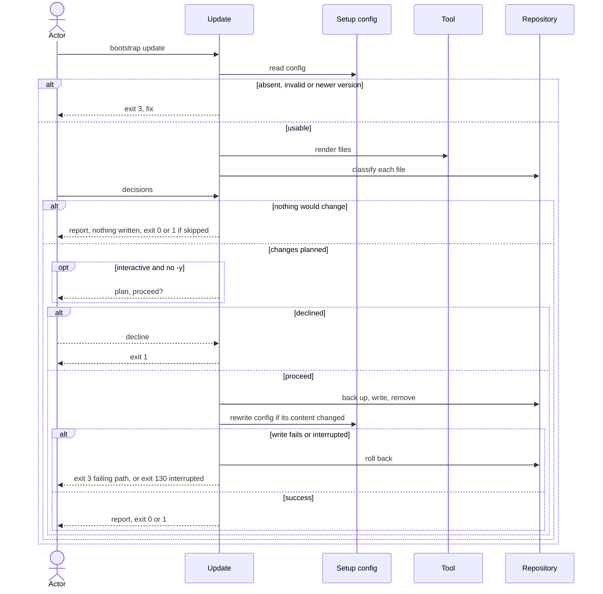

# Flow: Update a repository

## Purpose

`bootstrap update` brings a set-up repository in line with the running release
without losing a hand edit; it validates the assumption that re-applying keeps a
repository's own edits ([risks & assumptions](../../../product.md#risks--assumptions)).

Serves: [Zero setup drift](../../../product.md#goal-zero-drift)

## Trigger & Actors

| Actor | May trigger | Authorization | Audit-recorded |
| ----- | ----------- | ------------- | -------------- |
| Repo owner (interactive terminal) | the command `bootstrap update` | write access to the working directory | no |
| AI agent or CI (non-interactive) | `bootstrap update`, every value and decision by flag | write access to the working directory | no |

Not audit-recorded: the product has no audit foundation.

## Steps

1. Outside a git repository update exits 3 per
   [errors](../../../conventions.md#errors). Update reads `.config/bootstrap.yaml`. Absent → writes nothing, exits 3 "not
   set up — run `bootstrap init`". A file failing
   [Setup config validity](../../../entities/setup-config/index.md#validity) → exits 3. This
   includes a recorded `version` newer than the running cli: "set up with X,
   running Y — upgrade bootstrap"; nothing is written.
2. Actor may change recorded values with the init value flags (`--repo`,
   `--scope`, `--merge-develop`, `--merge-main`), per
   [Set up a repository](../110-setup-repository/index.md) step 3, plus the
   update-only flag `--no-scope`. Each value
   flag replaces that recorded value: `--scope` (repeatable) gives the complete
   new scope list (recorded `[web, cli]` + `--scope api` → `[api]`);
   `--no-scope` clears it to empty; `--no-scope` with `--scope` exits 2 naming
   both flags. A value not flagged is reused silently — no
   prompt, interactive or not. With no value flag nothing is asked.
3. Update renders every file of the core plus selected non-core
   [tools](../../../entities/tool/index.md) with the running cli and the new
   values, and also with the old recorded values, and gives
   each path exactly one status, precedence per
   [check](../120-check-drift/index.md) step 4:

   | Status | Update action |
   | ------ | ------------- |
   | `unchanged` | left alone |
   | `missing` | created |
   | `kept` | untouched unless recreate or `--take <path>` (step 4) |
   | `deleted` | never recreated or asked about, except on `--take <path>` (step 4) |
   | `obsolete` | moved to a backup per [backups](../../../conventions.md#backups), then removed; needs no decision |
   | `updated` | content equals the old-values render (not hand-edited) and differs from the new render only because a value changed; written with the new values without a question, replaced, no backup: its content was bootstrap's own previous render |
   | `modified` | needs a decision (step 4); includes a value-affected path whose content differs from the old-values render |

   Paths the running cli no longer produces: a `kept` one is untouched, stays in
   `kept` and leaves `files`; a `deleted` one stays in `deleted`, leaves `files`,
   and any copy in the repo is ignored; a `files` one already absent from the
   repo is dropped from `files` silently, with no status and no backup.
4. Actor decides per path:

   | Path | Interactive | Flag | No decision |
   | ---- | ----------- | ---- | ----------- |
   | `modified` | diff shown; take source (current → backup, source written), keep mine (path added to `kept`, file untouched) or skip for now | `--take <path>`, `--keep <path>` (adds to `kept`), `--take-all` | skipped (drift) |
   | `kept` | not asked | `--take <path>`: source written, path leaves `kept`; `--keep <path>`: no-op | untouched |
   | `kept`, absent, still produced | asked once: recreate (source written, path leaves `kept`) or leave deleted (path moves `kept` → `deleted`) | `--take <path>`: as recreate; `--keep <path>`: as leave deleted (path moves `kept` → `deleted`) | left as is; reported `kept`, not drift, exit unaffected |
   | `kept`, absent, no longer produced | not asked; stays in `kept` | `--keep <path>`: no-op | stays in `kept` |
   | `deleted` | not asked | `--take <path>`: file recreated, path leaves `deleted` | untouched |

   - `--take`, `--keep` repeatable; `--take-all` never touches `kept` or
     `deleted` paths, and a per-path `--take`/`--keep` overrides it.
   - `--keep` is valid only on a `modified` or `kept` path; `--take` only on a
     `modified`, `kept` or `deleted` path the running cli still produces. Any
     other use, or the same path in both, exits 2 naming the path.
   - Interactive: a flag pre-answers that path's question, so it is not prompted.
5. Interactive only, unless nothing would change (step 6): update shows the
   plan, listing paths under the outcomes (created, updated, taken, kept,
   recreated, left deleted, removed, unchanged, skipped; `left deleted` also
   covers paths already in `deleted`), and asks once to proceed. Answering no at
   the confirm writes nothing and exits 1; Ctrl-C at any prompt or during writes
   exits 130 per [errors](../../../conventions.md#errors). `-y` skips the
   confirm; non-interactive runs never prompt.
6. Update writes the planned changes all-or-nothing, then writes
   `.config/bootstrap.yaml` last with the running cli's version, the current
   format, the values, `kept`, `deleted`, and `files` per
   [setup-config](../../../entities/setup-config/index.md) invariant 7. The
   config is rewritten only when its content differs, per the unchanged rule of
   [backups](../../../conventions.md#backups). A run where no file and no config
   content would change shows no plan confirm, writes nothing, reports, and
   exits 0, or 1 when any file is skipped.
7. Update reports files under the step 5 outcomes, with original → backup for
   taken and removed. Exit 0 when nothing was skipped; 1 when any file was
   skipped, even if nothing was written, or the run was declined; 2, 3 and 130
   per [errors](../../../conventions.md#errors).

Modes: `--dry-run` never prompts (like `--json`), applies the decision flags,
shows any modified file without a decision as `skipped`, writes nothing and
exits with exactly the code the real run would return. `--json` per
[errors](../../../conventions.md#errors). Output rules follow
[Terminal UX](../../../design-system.md#terminal-ux).

## Guarantees

| Step / group | Consistency | On failure | Idempotency | Load & latency |
| ------------ | ----------- | ---------- | ----------- | -------------- |
| 1–5 | atomic — nothing is written | none — nothing written yet; exit 1, 2, 3 or 130 per step | n/a — a re-run starts from the same repo state | n/a — one local command |
| 6 | atomic — all-or-nothing | a write failure or an interrupt triggers full rollback per [baseline](../../../conventions.md#baseline) atomic-multi-write and graceful-shutdown: the repo is byte-identical to before; a write failure exits 3 naming the failing path, an interrupt exits 130 per [errors](../../../conventions.md#errors) | a second run with nothing to do reports every path as unchanged, kept, left deleted or skipped and writes nothing, `.config/bootstrap.yaml` included (step 6) | n/a — one local command |
| 7 | atomic — output only | none — changes no repo state | n/a | n/a — one local command |

A hand edit is never lost: every replaced or removed file goes to a backup,
except an `updated` file (bootstrap's own previous render), and a `kept` file is
never touched except by recreate or `--take <path>`.

## Diagram

## Background Jobs

N/A — runs synchronously in one command invocation.

## Acceptance

- Given a `kept` path absent from the repo that the running cli still produces, when update runs non-interactively with no decision flag for it, then the path stays in `kept`, is reported `kept`, and the exit code is not affected by it.
- Given a repository after a newer release with no local edits, when
  `bootstrap update --take-all -y` runs non-interactively, then every file
  matches the source, the recorded version is the running version and the exit
  code is 0; then `bootstrap check` exits 0.
- Given a modified file, when the owner chooses keep mine interactively, then the
  file is byte-identical, its path is in `kept`, and a later check reports it
  `kept`.
- Given a modified file, when `--take <path>` runs, then the original is
  preserved as a backup and the file equals the source.
- Given a modified file and non-interactive mode with no decision flag, when
  update runs, then the file is untouched, reported skipped and the exit code is
  1.
- Given a path in `kept`, when `--take <path>` runs, then the file equals the
  source and the path is no longer in `kept`.
- Given a file listed in `files` that the running cli no longer produces, when
  update runs, then it is moved to a backup, removed from `files` and reported
  removed.
- Given a missing managed file, when update runs, then it is recreated.
- Given a repository with no hand edits, when `bootstrap update --scope api -y`
  runs, then the recorded scopes are `[api]`, the files affected only by scopes
  are `updated` with no backup, and the exit code is 0.
- Given `--no-scope`, when update runs, then the recorded scopes are empty.
- Given `--no-scope` and `--scope api`, when update runs, then nothing is
  written and the exit code is 2 naming both flags.
- Given a scope-affected file that was also hand-edited, when update runs, then
  it is `modified` and gets the per-file decision.
- Given no `.config/bootstrap.yaml`, when update runs, then the exit code is 3
  and the message names `bootstrap init`.
- Given a recorded version newer than the running cli, when update runs, then the
  exit code is 3 and nothing is written.
- Given a write failure injected mid-run, when update runs, then the repository
  is byte-identical to before and the exit code is 3.
- Given `--dry-run`, when update runs, then nothing is written.
- Given non-interactive `--dry-run` and one modified file with no decision, when
  update runs, then nothing is written, the file is reported skipped and the exit
  code is 1.
- Given a run whose only outcome is a skipped modified file, when update runs,
  then nothing is written and the exit code is 1.
- Given an older-format `.config/bootstrap.yaml`, when update runs, then it is
  rewritten in the current format.
- Given a newer release that changes no rendered file, when update runs, then
  only `.config/bootstrap.yaml` is rewritten, with the new version, and the exit
  code is 0.
- Given an update that just succeeded, when update runs again with nothing to
  do, then no file is written, `.config/bootstrap.yaml` included, and the exit
  code is 0.
- Given a path in `kept` that the running cli no longer produces, when update
  runs, then the file is untouched, the path stays in `kept` and leaves `files`,
  and a later check warns "kept file no longer produced".
- Given a `kept` file deleted from the repo, when update runs interactively and
  the owner chooses leave deleted, then the path moves from `kept` to `deleted`;
  a later update neither recreates nor asks about it, and `--take <path>`
  recreates it and removes the path from `deleted`.
- Given a path in `deleted` that the running cli no longer produces, when update
  runs, then it is not reported `obsolete`, any copy in the repo is untouched,
  the path stays in `deleted` and leaves `files`.
- Given a `kept` file deleted from the repo, when `--keep <path>` runs, then the
  file is not recreated and the path moves from `kept` to `deleted`.
- Given a `kept` path absent from the repo that the running cli no longer
  produces, when update runs interactively, then no question is asked and the
  path stays in `kept`.
- Given `kept` and `deleted` paths, when `--take-all` runs, then neither is
  touched; given the same path in `--take` and `--keep`, or a flag naming a path
  that is not `modified`, `kept` or `deleted`, then the exit code is 2 and
  nothing is written.
- Abuse case: n/a — runs locally with the caller's own permissions on the
  caller's own repository; every input is validated per
  [baseline](../../../conventions.md#baseline) boundary-validation.

## References

- [baseline](../../../conventions.md#baseline),
  [backups](../../../conventions.md#backups),
  [errors](../../../conventions.md#errors),
  [config](../../../conventions.md#config)
- API surface: N/A — no service project; the flow is a local command
- Screens surface: N/A — cli has no screen platform; terminal behaviour per
  [design-system.md#terminal-ux](../../../design-system.md#terminal-ux)
