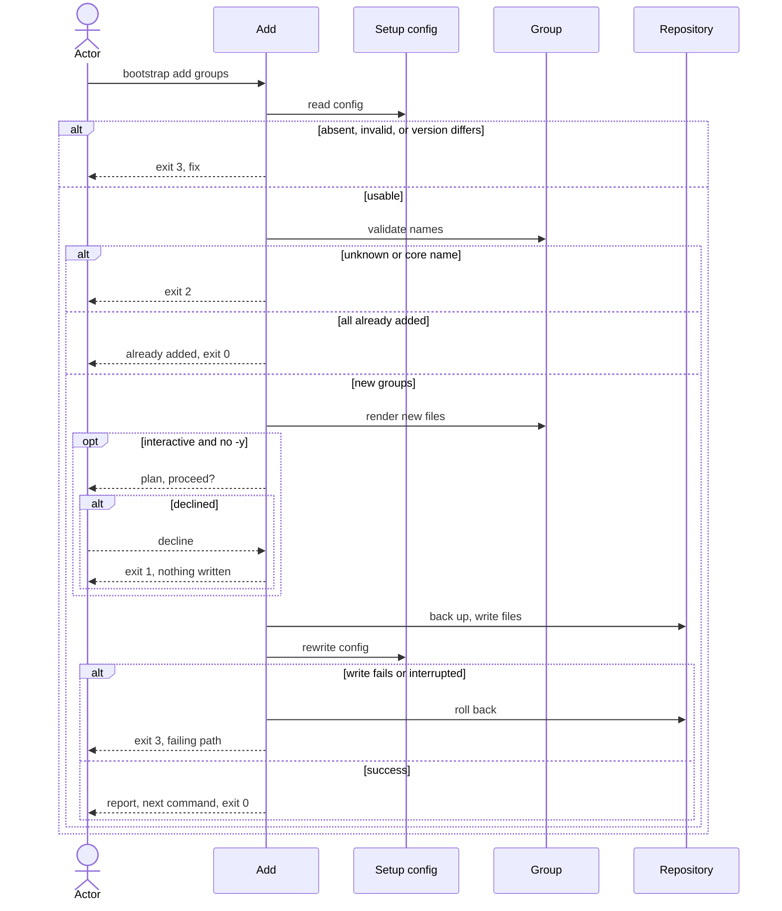

# Flow: Add a group

## Purpose

`bootstrap add <group>...` writes the files of one or more optional groups into
a repository that is already set up and records them in the config, so a group
chosen later costs one command, not a new setup.

Serves: [Fast new-repo setup](../../../product.md#goal-fast-setup)

## Trigger & Actors

| Actor | May trigger | Authorization | Audit-recorded |
| ----- | ----------- | ------------- | -------------- |
| Repo owner (interactive terminal) | the command `bootstrap add <group> [<group>...]` | write access to the working directory | no |
| AI agent or CI (non-interactive) | `bootstrap add <group>...`, `-y` to skip the confirm | write access to the working directory | no |

Not audit-recorded: the product has no audit foundation.

## Steps

1. Add reads `.config/bootstrap.yaml` with the same checks as
   [check](../120-check-drift/index.md) and
   [update](../130-update-repository/index.md).
   Absent → writes nothing, exits 3 "not set up — run `bootstrap init`". Invalid,
   a `format` newer than the running cli understands, a recorded `version` newer
   than the running cli, or a group the cli no longer ships → exits 3 per the
   setup-config invariants.
   [Setup config](../../../entities/setup-config/index.md)
2. Add compares the recorded `version` with the running cli. If they differ
   (the recorded one is older), add writes nothing and exits 3 "set up with X,
   running Y — run `bootstrap update` first". Add never mixes files from two
   versions.
   [Setup config](../../../entities/setup-config/index.md)
3. Add validates each name. A name given more than once is used once, with no
   error. An unknown name exits 2. A core group name exits 2
   (core groups are always included). A name already in setup-config `groups` is
   reported "already added" and changes nothing. If every name is already added,
   add writes nothing and exits 0.
   [Group](../../../entities/group/index.md),
   [Setup config](../../../entities/setup-config/index.md)
4. Add renders only the files of the new groups. A path that exists with
   identical content is `unchanged`. A path that exists with different content is
   backed up, then written, per [backups](../../../conventions.md#backups). No
   per-file question is asked. A path already in setup-config `kept` or `deleted`
   (for example left by an earlier remove) is respected: it is not touched and
   its entry stays. Precedence is `kept`, then `deleted`, then the rules above,
   as in [check](../120-check-drift/index.md).
   [Group](../../../entities/group/index.md)
5. Interactive only: add shows the plan and asks once to proceed, as in
   [Set up a repository](../110-setup-repository/index.md) step 5. Declining, or
   cancelling the prompt, writes nothing and exits 1. `-y` skips the confirm.
   Non-interactive, `--json` and `--dry-run` runs never prompt.
6. Add writes the planned changes all-or-nothing, then rewrites
   `.config/bootstrap.yaml` last: the new groups are appended to `groups` and
   `files` is refreshed to the full set now produced (setup-config invariant 7);
   setup-config stays present.
   [Setup config](../../../entities/setup-config/index.md)
7. Add reports files created, backed up (each original → backup path),
   unchanged, kept and left deleted (both untouched) and already added, and prints the same one next command as init —
   the repo's own setup task. Exit 0 on success.

Modes: `--dry-run` shows the plan, writes nothing and exits with the code the
real run would return. `--json` prints exactly one document on every exit and
implies non-interactive, per [errors](../../../conventions.md#errors). Confirm,
`-y`, `--dry-run` and `--json` behave as in
[Set up a repository](../110-setup-repository/index.md). Output rules follow
[Terminal UX](../../../design-system.md#terminal-ux).

## Guarantees

| Step / group | Consistency | On failure | Idempotency | Load & latency |
| ------------ | ----------- | ---------- | ----------- | -------------- |
| 1–5 | atomic — nothing is written | none — nothing written yet; exit 1, 2 or 3 per step | n/a — a re-run starts from the same repo state | n/a — one local command |
| 6 | atomic — all-or-nothing | a write failure or an interrupt triggers full rollback per [baseline](../../../conventions.md#baseline) atomic-multi-write and graceful-shutdown: the repo is byte-identical to before; exit 3 naming the failing path | a re-run with the same names reports "already added", writes nothing and exits 0 | n/a — one local command |
| 7 | atomic — output only | none — changes no repo state | n/a | n/a — one local command |

## Diagram

## Background Jobs

N/A — runs synchronously in one command invocation.

## Acceptance

- Given a repository at the running version, when `bootstrap add ai -y` runs,
  then the ai group's files exist, `groups` contains ai, `files` includes them
  and the exit code is 0; then `bootstrap check` exits 0.
- Given two group names, when add runs, then both groups are added.
- Given a group already in `groups`, when add runs with its name, then nothing is
  written, it is reported "already added" and the exit code is 0.
- Given an unknown group name, when add runs, then the exit code is 2 and nothing
  is written.
- Given a core group name, when add runs, then the exit code is 2 and nothing is
  written.
- Given a recorded version older than the running cli, when add runs, then the
  exit code is 3, the message names `bootstrap update` and nothing is written.
- Given no `.config/bootstrap.yaml`, when add runs, then the exit code is 3 and
  the message names `bootstrap init`.
- Given a path of a new group listed in `kept` or `deleted`, when add runs, then
  the path is not written or backed up and its entry stays in `kept` or
  `deleted`.
- Given a group name given twice, when add runs, then the group is added once and
  the exit code is 0.
- Given an existing file with different content at a new group's path, when add
  runs, then the original is preserved as a backup, the new file is written and
  the backup is listed.
- Given a write failure injected mid-run, when add runs, then the repository is
  byte-identical to before and the exit code is 3.
- Given an interactive run, when the actor declines at the confirm, then nothing
  is written and the exit code is 1.
- Given `--dry-run`, when add runs, then nothing is written.
- Abuse case: n/a — runs locally with the caller's own permissions on the
  caller's own repository; every input is validated per
  [baseline](../../../conventions.md#baseline) boundary-validation.

## References

- [baseline](../../../conventions.md#baseline),
  [backups](../../../conventions.md#backups),
  [errors](../../../conventions.md#errors),
  [config](../../../conventions.md#config)
- [design-system](../../../design-system.md#terminal-ux) — Terminal UX
- [Set up a repository](../110-setup-repository/index.md) — defines confirm,
  `-y`, `--dry-run` and `--json`
- [Remove a group](../150-remove-group/index.md) — the inverse flow
- API surface: N/A — no service project; the flow is a local command
- Screens surface: N/A — cli has no screen platform; terminal behaviour per
  [design-system.md#terminal-ux](../../../design-system.md#terminal-ux)
