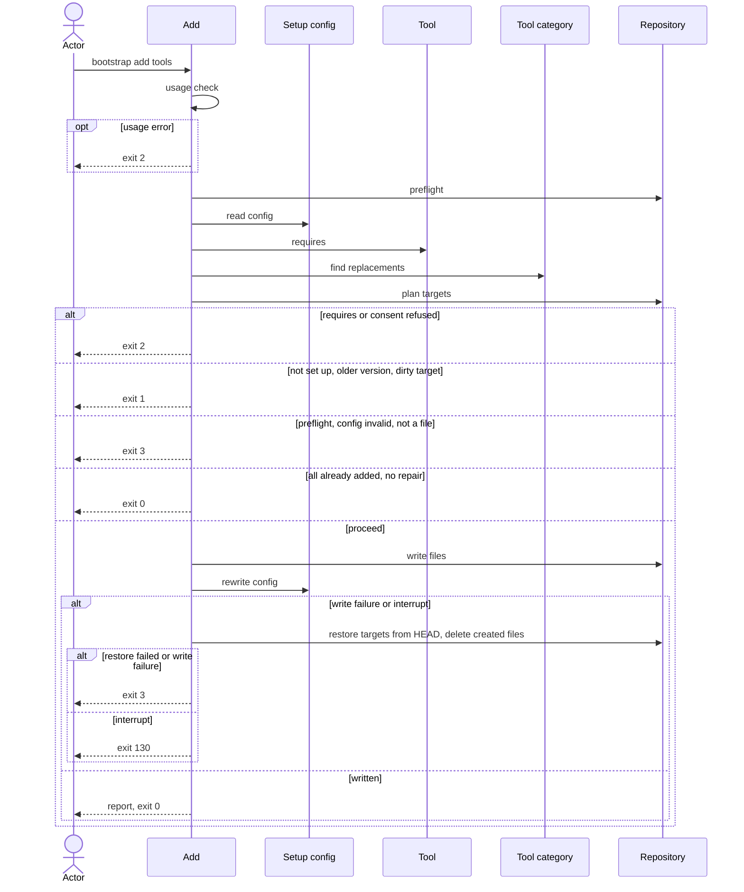

# Flow: Add a tool

## Purpose

`bootstrap add <tool>...` adds one or more tools of the
[Tool](../../../entities/tool/index.md) catalog to a repository that is already
set up, replaces a tool of a `max: one`
[Tool category](../../../entities/tool-category/index.md) only with consent, and
records the new selection in the setup config.

Serves: [Fast new-repo setup](../../../product.md#goal-fast-setup)

## Trigger & Actors

| Actor                            | May trigger                                               | Authorization                         | Audit-recorded                                                  |
| -------------------------------- | --------------------------------------------------------- | ------------------------------------- | --------------------------------------------------------------- |
| Repo owner (any terminal)        | the command `bootstrap add <tool> [<tool>...]` with flags | write access to the working directory | no — no audit foundation; git history keeps every replaced file |
| AI agent or CI (non-interactive) | `bootstrap add <tool>...`                                 | write access to the working directory | no — no audit foundation; git history keeps every replaced file |

## Steps

Usage errors come first: no tool name given, an unknown flag or a bad flag
value, an unknown tool name, or two distinct names of one `max: one` category
(repeated names are merged first) exits 2 with short usage before the preflight
and before `.config/bootstrap.yaml` is read. Nothing is written.

1. Add runs, after the usage check, the preflight of
   [Set up a repository](../110-setup-repository/index.md) step 1.
2. Add reads `.config/bootstrap.yaml` under
   [Setup config](../../../entities/setup-config/index.md): its
   [validity and repair](../../../entities/setup-config/index.md#validity) and
   [version guard](../../../entities/setup-config/index.md#version-guard).
   Absent or an older recorded `version` → writes nothing, exits 1, next command
   `bootstrap init`. A file failing validity, or a newer `version` → exits 3
   naming the fix. A repair (an unremovable tool added back) lets the run
   continue, its warning goes in `warnings`, and it is written back in step 6.
   An older `format` is read, never refused
   ([write format](../../../entities/setup-config/index.md#write-format)).
3. Add merges a name given more than once into one. Add reads the
   [Tool](../../../entities/tool/index.md) `requires` and the
   [Setup config](../../../entities/setup-config/index.md) `values.tools`: a
   named tool whose `requires` tool is not in the selection after the request
   (the held tools minus the replaced ones, plus the named ones) exits 2 naming
   the required tool. A name already in `values.tools` is reported "already
   added" and changes nothing; if every name is and step 2 made no repair, add
   skips to step 7.
4. Add finds the replacements: a tool of the
   [Tool category](../../../entities/tool-category/index.md) `max: one` that
   holds another tool replaces it. A held tool whose `replaceable` is false →
   exit 2. An add that replaces a tool that another selected tool requires exits
   2 naming the dependent tool (checked on the selection after the request,
   before any write). Consent rules, one each:
   - Add never prompts, and terminal state does not change its behaviour.
   - A replacement needs `--replace` in every run; without it add exits 2 and
     writes nothing ([config](../../../conventions.md#config)).
   - No catalog tool has a value of its own, so add needs no value: `-y` is
     accepted and has no effect in add (it is never consent to replace).
   - `--replace` with no replacement to make is ignored.
5. Add renders the full file set of the new selection (the held
   [Tool](../../../entities/tool/index.md)s, minus the replaced ones, plus the
   added ones) with the recorded `values`. Only paths that differ from the
   working copy are targets, shared files included; the files of a replaced tool
   are removed as in [Remove a tool](../150-remove-tool/index.md); the
   replacement consent covers that deletion, and no `-y` is needed. Planning,
   the setup file `.config/bootstrap.yaml` as a target and `orphaned` paths
   follow [safety](../../../conventions.md#safety).
6. Add writes the planned changes, then rewrites `.config/bootstrap.yaml` last:
   `values.tools` gains the added tools and loses the replaced ones, and `files`
   is refreshed per
   [Setup config invariants](../../../entities/setup-config/index.md#invariants).
   Add never commits.
7. Add reports `added`, `already_added`, `replaced` (each `{from, to}`),
   `created`, `changed`, `deleted`, `unchanged`, `kept`, `orphaned`, `warnings`
   and `next_command`, every path list sorted, and prints the same one next
   command as [Set up a repository](../110-setup-repository/index.md) step 9.
   The next command is printed if and only if a tool was added or a repair
   happened; otherwise `next_command` is absent. Every other report key is
   always present.

Modes: `--dry-run` shows the plan, writes nothing and exits with the code the
real run (with `--replace` only if flagged) would return. `--json` prints
exactly one document, the JSON result, on every exit, with the keys of step 7 on
success and `error` per [errors](../../../conventions.md#errors) otherwise.
`--dry-run --json` prints the document the real run would return plus
`"dry_run": true`; on a non-zero exit it is the same error document plus
`"dry_run": true`. `--dry-run` and `--json` otherwise behave as in
[Set up a repository](../110-setup-repository/index.md). Output rules follow
[Terminal UX](../../../design-system.md#terminal-ux).

## Guarantees

| Step / group | Consistency                 | On failure                                                                                                                                                                                                                                                                                         | Idempotency                                                                      | Load & latency          |
| ------------ | --------------------------- | -------------------------------------------------------------------------------------------------------------------------------------------------------------------------------------------------------------------------------------------------------------------------------------------------- | -------------------------------------------------------------------------------- | ----------------------- |
| 1–5          | atomic — nothing is written | none — nothing written yet; exits 0 (the step 7 report when every name is already added), 1, 2, 3 or 130 per step                                                                                                                                                                                  | n/a — a re-run starts from the same repo state                                   | n/a — one local command |
| 6            | atomic — all-or-nothing     | a write failure or an interrupt restores every changed or deleted target from `HEAD` and deletes every created file per [safety](../../../conventions.md#safety); a write failure exits 3 naming the failing path, an interrupt exits 130; a failed restore exits 3 listing the paths not restored | a re-run with the same names reports "already added", writes nothing and exits 0 | n/a — one local command |
| 7            | atomic — output only        | none — changes no repo state                                                                                                                                                                                                                                                                       | n/a                                                                              | n/a — one local command |

## Diagram

## Background Jobs

N/A — runs synchronously in one command invocation.

## Acceptance

- Given a repository at the running version, when `bootstrap add <tool> -y` runs
  for a tool in no occupied `max: one` category, then its files exist,
  `values.tools` contains it, `files` includes them and the exit code is 0; then
  a re-run of `bootstrap init -y` reports every file `unchanged`.
- Given two tool names, when add runs, then both tools are added.
- Given a tool name given twice, when add runs, then the tool is added once and
  the exit code is 0.
- Given a tool already in `values.tools` and no repair to make, when add runs
  with its name, then nothing is written, the full step 7 report is printed with
  the tool in `already_added`, empty path lists, `warnings` and no next command
  (no `next_command` key under `--json`), and the exit code is 0.
- Given `bootstrap add` with no tool name, when add runs, then nothing is
  written, short usage is printed and the exit code is 2.
- Given an unknown tool name, when add runs, then the exit code is 2 and nothing
  is written.
- Given a named tool whose `requires` tool is neither selected nor named (for
  example `taplo` without `dprint`), when add runs, then the exit code is 2, the
  message names the required tool and nothing is written.
- Given `bootstrap add taplo dprint` with neither held, when add runs, then the
  requires check passes on the selection after the request and both are added.
- Given a held tool that another selected tool requires and an add that would
  replace it, when add runs, then the exit code is 2, the message names the
  dependent tool and nothing is written.
- Given `bootstrap add` with no name in a directory that is not a git repository
  or not set up, when add runs, then the exit code is 2, not 3 or 1.
- Given two named tools of one `max: one` category, when add runs, then the exit
  code is 2 and nothing is written.
- Given a held replaceable tool, when add runs with `--replace` in any terminal,
  then the new tool's files are written, the old tool's files are removed except
  `create_only` ones, `values.tools` swaps the two and `replaced` lists
  `{from, to}`, and the exit code is 0.
- Given a run in any terminal that would replace a tool, when add runs without
  `--replace`, then the exit code is 2 and nothing is written.
- Given a run that would replace a tool, when add runs with `-y` but without
  `--replace`, then the exit code is 2 and nothing is written.
- Given an interactive terminal, when add needs a replacement and runs without
  `--replace`, then the exit code is 2, nothing is written and no prompt is
  shown.
- Given `--replace` and no replacement to make, when add runs, then the flag is
  ignored and the run proceeds as without it.
- Given a held tool whose `replaceable` is false, when add names a tool of its
  category, then the exit code is 2 and nothing is written, even with
  `--replace`.
- Given a shared file the render would change (for example
  `.config/mise/conf.d/_base/mise.dev.toml`) that is modified, staged, untracked
  or ignored, when add runs, then nothing is written, the exit code is 1 and the
  path is listed.
- Given a base tool with mise entries is added, when add runs, then the full-set
  render changes `.config/mise/conf.d/_base/mise.dev.toml`, and it is listed in
  `changed`.
- Given a setup file that is modified, staged, untracked or ignored, when add
  runs, then nothing is written, the exit code is 1 and `.config/bootstrap.yaml`
  is listed; on a clean run it is listed `changed` (or `unchanged`).
- Given a recorded `values.tools` that misses an unremovable tool, when add
  runs, even with every named tool already added, then the tool is added again,
  the repair is written back, `.config/bootstrap.yaml` is listed `changed`,
  `warnings` reports "added back unremovable tool `<name>`" and the exit code is
  0.
- Given a setup file recorded with an older `format`, when add runs, then the
  older format is read and not refused, and the next write records the running
  cli's format.
- Given a recorded `values.tools` with two tools of one `max: one` category, a
  tool name the running catalog does not have, or a tool whose `requires` tool
  is not selected, when add runs, then nothing is written and the exit code is 3
  naming the fix.
- Given a path in `files` that the running cli does not render for a selected
  tool, when add runs, then it is left in place, stays in `files` and is listed
  `orphaned`.
- Given a recorded version older than the running cli, when add runs, then the
  exit code is 1, the next command is `bootstrap init` and nothing is written.
- Given a recorded version newer than the running cli, or a setup file failing
  Setup config validity, when add runs, then the exit code is 3 and nothing is
  written.
- Given no `.config/bootstrap.yaml`, when add runs, then the exit code is 1 and
  the message names `bootstrap init`.
- Given a directory outside a git repository, or no `mise` on the `PATH`, when
  add runs, then nothing is written and the exit code is 3.
- Given `mise` found elsewhere than `~/.local/bin/mise`, when add runs, then a
  warning names the path and the run continues.
- Given a target that is a directory or a symlink, when add runs, then nothing
  is written and the exit code is 3 naming that path.
- Given an existing `create_only` file of a new tool, when add runs, then it is
  not changed and is listed in `kept`.
- Given a path whose render equals the working copy, when add runs, then it is
  listed `unchanged` and not rewritten.
- Given a write failure injected mid-run, when add runs, then the tracked tree
  matches `HEAD` for every target, created files are gone and the exit code is
  3.
- Given a write failure whose restore also fails, when add runs, then the exit
  code is 3, the output lists every path not restored and, under `--json`,
  `error.unrestored` lists the same paths.
- Given an interrupt (Ctrl-C) during the write, when add runs, then the targets
  are restored, created files are gone and the exit code is 130.
- Given `--dry-run`, when add runs, then nothing is written, no `-y` is needed
  and the exit code is the one the real run would return, including 2 for a
  replacement without `--replace`.
- Given `--json`, when add runs on any exit, then stdout is exactly one document
  with `exit`; on success it has `added`, `already_added`, `replaced`,
  `created`, `changed`, `deleted`, `unchanged`, `kept`, `orphaned`, `warnings`
  and `next_command` equal to `MISE_ENV=dev mise run setup:all` (absent when
  every named tool is already added and nothing was repaired), with sorted
  paths.
- Given `--dry-run --json`, when add runs, then the document is the one the real
  run would return plus `"dry_run": true`, and on a non-zero exit it is the same
  error document plus `"dry_run": true`; no file changes.
- Abuse case: n/a — runs locally with the caller's own permissions on the
  caller's own repository; every input is validated per
  [baseline](../../../conventions.md#baseline) boundary-validation.

## References

- [baseline](../../../conventions.md#baseline),
  [safety](../../../conventions.md#safety),
  [errors](../../../conventions.md#errors),
  [config](../../../conventions.md#config)
- [design-system](../../../design-system.md#terminal-ux) — Terminal UX
- [Remove a tool](../150-remove-tool/index.md) — the inverse flow
- [Select tools](../160-select-tools/index.md) — the interactive alternative
- API surface: N/A — no service project; the flow is a local command
- Screens surface: N/A — cli has no screen platform
