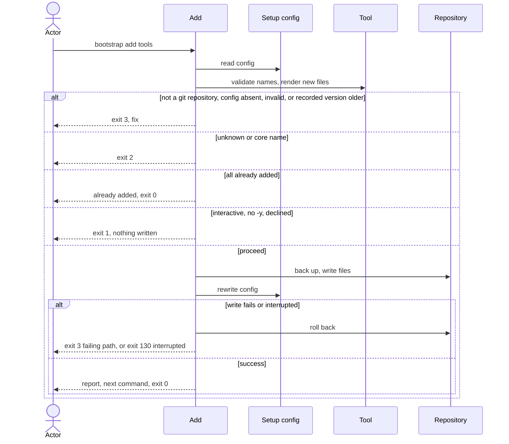

# Flow: Add a tool

## Purpose

`bootstrap add <tool>...` writes the files of one or more non-core tools into
a repository that is already set up and records them in the config.

Serves: [Fast new-repo setup](../../../product.md#goal-fast-setup)

## Trigger & Actors

| Actor | May trigger | Authorization | Audit-recorded |
| ----- | ----------- | ------------- | -------------- |
| Repo owner (interactive terminal) | the command `bootstrap add <tool> [<tool>...]` | write access to the working directory | no |
| AI agent or CI (non-interactive) | `bootstrap add <tool>...`, `-y` skips the interactive confirm | write access to the working directory | no |

## Steps

1. Outside a git repository add exits 3 per
   [errors](../../../conventions.md#errors). Add reads `.config/bootstrap.yaml` with the same checks as
   [check](../120-check-drift/index.md) and
   [update](../130-update-repository/index.md). Absent → writes nothing, exits 3
   "not set up — run `bootstrap init`". A file failing
   [Setup config validity](../../../entities/setup-config/index.md#validity) → exits 3.
2. If the recorded `version` is older than the running cli, add
   writes nothing and exits 3 "set up with X, running Y — run `bootstrap update`
   first". A recorded `version` newer than the running cli exits 3 per
   [Setup config validity](../../../entities/setup-config/index.md#validity).
   [Setup config](../../../entities/setup-config/index.md)
3. Add validates each name. A name given more than once is used once, with no
   error. An unknown or core tool name exits 2. A name already in setup-config
   `values.tools` is reported "already added" and changes nothing; if every name is,
   add writes nothing and exits 0.
   [Tool](../../../entities/tool/index.md),
   [Setup config](../../../entities/setup-config/index.md)
4. Add renders only the files of the new tools, with the recorded `values`; no
   tool needs a value of its own, so add asks for no value. A path that exists with
   identical content is `unchanged`; one with different content is backed up,
   then written, per [backups](../../../conventions.md#backups), with no per-file
   question. A path in setup-config `kept` or `deleted` is not touched and its
   entry stays. Precedence: `kept` > `deleted` > the rules above, per
   [check](../120-check-drift/index.md). [Tool](../../../entities/tool/index.md)
5. Interactive only: add shows the plan and asks once to proceed, per
   [Set up a repository](../110-setup-repository/index.md) step 5. `--dry-run`
   never prompts.
6. Add writes the planned changes all-or-nothing, then rewrites
   `.config/bootstrap.yaml` last: the new tools are appended to `values.tools` and
   `files` is refreshed to the full produced set ([Setup config invariants](../../../entities/setup-config/index.md#invariants)).
   [Setup config](../../../entities/setup-config/index.md)
7. Add reports files created, backed up (each original → backup path),
   unchanged, kept and left deleted (both untouched) and already added, and
   prints the same one next command as
   [Set up a repository](../110-setup-repository/index.md) step 8,
   `MISE_ENV=dev mise run setup:all`. Exit 0 on success.

Modes: `--dry-run` shows the plan, writes nothing and exits with the code the
confirmed real run (with `-y`) would return. `--json` prints exactly one document on every exit, per
[errors](../../../conventions.md#errors). Otherwise confirm, `-y`, `--dry-run`
and `--json` behave as in [Set up a repository](../110-setup-repository/index.md).
Output rules follow [Terminal UX](../../../design-system.md#terminal-ux).

## Guarantees

| Step / group | Consistency | On failure | Idempotency | Load & latency |
| ------------ | ----------- | ---------- | ----------- | -------------- |
| 1–5 | atomic — nothing is written | none — nothing written yet; exits 0 (every name already added), 1 (declined), 2, 3 or 130 (Ctrl-C) per step | n/a — a re-run starts from the same repo state | n/a — one local command |
| 6 | atomic — all-or-nothing | a write failure or an interrupt triggers full rollback per [baseline](../../../conventions.md#baseline) atomic-multi-write and graceful-shutdown: the repo is byte-identical to before; a write failure exits 3 naming the failing path, an interrupt exits 130 per [errors](../../../conventions.md#errors) | a re-run with the same names reports "already added", writes nothing and exits 0 | n/a — one local command |
| 7 | atomic — output only | none — changes no repo state | n/a | n/a — one local command |

## Diagram

## Background Jobs

N/A — runs synchronously in one command invocation.

## Acceptance

- Given a path add would write that is a directory or a symlink, when it runs, then
  nothing is written and the exit code is 3 naming that path
  ([backups](../../../conventions.md#backups)).
- Given a repository at the running version, when `bootstrap add github -y` runs,
  then the github tool's files exist, `values.tools` contains github, `files` includes them
  and the exit code is 0; then `bootstrap check` exits 0.
- Given two tool names, when add runs, then both tools are added.
- Given a tool already in `values.tools`, when add runs with its name, then nothing is
  written, it is reported "already added" and the exit code is 0.
- Given an unknown tool name, when add runs, then the exit code is 2 and nothing
  is written.
- Given a core tool name, when add runs, then the exit code is 2 and nothing is
  written.
- Given a recorded version older than the running cli, when add runs, then the
  exit code is 3, the message names `bootstrap update` and nothing is written.
- Given no `.config/bootstrap.yaml`, when add runs, then the exit code is 3 and
  the message names `bootstrap init`.
- Given a path of a new tool listed in `kept` or `deleted`, when add runs, then
  the path is not written or backed up and its entry stays in `kept` or
  `deleted`.
- Given a tool name given twice, when add runs, then the tool is added once and
  the exit code is 0.
- Given an existing file with different content at a new tool's path, when add
  runs, then the original is preserved as a backup, the new file is written and
  the backup is listed.
- Given a write failure injected mid-run, when add runs, then the repository is
  byte-identical to before and the exit code is 3.
- Given an interactive run, when the actor declines at the confirm, then nothing
  is written and the exit code is 1.
- Given `--dry-run`, when add runs, then nothing is written and the exit code is
  the one the confirmed real run (with `-y`) would return.
- Given a non-interactive run, when `bootstrap add github` runs without `-y`, then the
  files are written and the exit code is 0.
- Given an interrupt (Ctrl-C) during the write, when add runs, then the
  repository is byte-identical to before and the exit code is 130.
- Given a directory outside a git repository, when add runs, then nothing is
  written and the exit code is 3.
- Given a setup file failing Setup config validity, when add runs, then nothing is
  written and the exit code is 3.
- Given a new tool's path already holding identical content, when add runs, then
  the path is reported `unchanged`, no backup is made and the file is not
  rewritten.
- Abuse case: n/a — runs locally with the caller's own permissions on the
  caller's own repository; every input is validated per
  [baseline](../../../conventions.md#baseline) boundary-validation.

## References

- [baseline](../../../conventions.md#baseline),
  [backups](../../../conventions.md#backups),
  [errors](../../../conventions.md#errors),
  [config](../../../conventions.md#config)
- [Remove a tool](../150-remove-tool/index.md) — the inverse flow
- API surface: N/A — no service project; the flow is a local command
- Screens surface: N/A — cli has no screen platform
