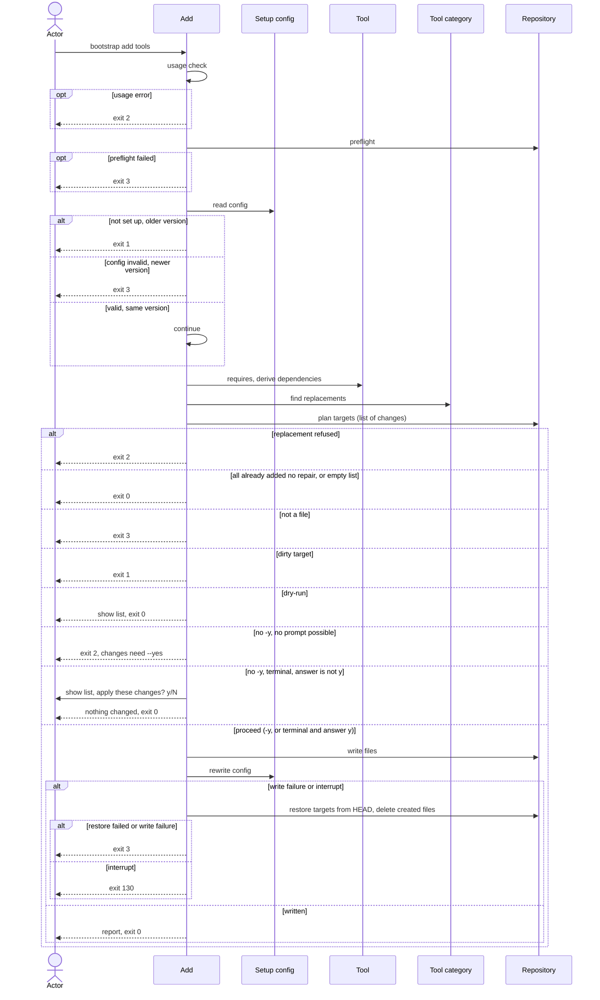

# Flow: Add a tool

## Purpose

`bootstrap add <tool>...` adds one or more tools of the
[Tool](../../../entities/tool/index.md) catalog to a repository that is already
set up, adds the tools they require as dependencies, replaces a tool of a
`max: one` [Tool category](../../../entities/tool-category/index.md) (or an
alternative of a `requires` slot) only with consent, and records the new
selection in the setup config.

Serves: [Fast new-repo setup](../../../product.md#goal-fast-setup)

## Trigger & Actors

| Actor                            | May trigger                                               | Authorization                         | Audit-recorded                                                  |
| -------------------------------- | --------------------------------------------------------- | ------------------------------------- | --------------------------------------------------------------- |
| Repo owner (any terminal)        | the command `bootstrap add <tool> [<tool>...]` with flags | write access to the working directory | no — no audit foundation; git history keeps every replaced file |
| AI agent or CI (non-interactive) | `bootstrap add <tool>...`                                 | write access to the working directory | no — no audit foundation; git history keeps every replaced file |

## Steps

Add accepts `-y`/`--yes`, `--replace`, `--dry-run`, `--json`, `--quiet`,
`--verbose`, `--no-color` and `--help`. It takes none of init's value flags
(step 5 renders with the recorded `values`); any other flag is a usage error.

Usage errors come first: no tool name given, an unknown flag or a bad flag
value, an unknown tool name (`mise` is one: it is never shown as a tool), or two
distinct names of one `max: one` category (repeated names are merged first)
exits 2 with short usage before the preflight and before
`.config/bootstrap.yaml` is read. Nothing is written. The usage errors are
reported together in one error ([errors](../../../conventions.md#errors)).

1. Add runs, after the usage check, the preflight of
   [Set up a repository](../110-setup-repository/index.md) step 1.
2. Add reads `.config/bootstrap.yaml` under
   [Setup config](../../../entities/setup-config/index.md), applying its
   [validity and repair](../../../entities/setup-config/index.md#validity) and
   [version guard](../../../entities/setup-config/index.md#version-guard). A
   repair (an unremovable tool or a dependency added back) lets the run
   continue, its warning goes in `warnings`, and it is written back in step 7.
   Every repair is a change: it is on the list of changes, needs consent (step
   6) and defeats the "already added" shortcut of step 3. A missing dependency
   is repaired only when the selection after the request needs it (the
   replacements of step 4 count): one the request leaves unneeded is never added
   back and never reported (no warning, not in `dependencies_added` or
   `dependencies_pruned`). A `values.dependencies` name the running catalog does
   not have is dropped as such a repair on the step 7 rewrite and reported in
   `warnings` as "dropped unknown dependency `<name>`". Bookkeeping is never a
   change on its own: a recorded path in `files` that the running cli no longer
   renders and that is absent on disk, a stale dependency (one no tool of the
   selection needs, whose loss of parents the request did not cause) and a wrong
   parent list in `values.dependencies`. When the run rewrites the setup file
   for another change, it also drops the stale path, prunes the stale dependency
   (its files deleted and reported as usual, listed in `dependencies_pruned`)
   and corrects the parent lists; when bookkeeping is the only difference,
   nothing is written, no prompt is shown and the exit code is 0.
3. Add reads the [Tool](../../../entities/tool/index.md) `requires` and the
   [Setup config](../../../entities/setup-config/index.md) `values.tools` and
   `values.dependencies`, and derives the dependencies of the selection after
   the request (the held tools minus the replaced ones found in step 4, plus the
   named ones): a missing required tool is not a refusal; each `requires` slot
   with no selected tool gets its first alternative as a dependency, recorded
   with its parents
   ([Requires and dependencies](../../../entities/tool/index.md#requires-and-dependencies)).
   A name already in `values.tools` is reported "already added" and changes
   nothing; a name recorded in `values.dependencies` is not "already added": it
   becomes direct (moves from `values.dependencies` to `values.tools`, no parent
   changes). If every name is already in `values.tools` and step 2 made no
   repair, add renders in memory only to find the `orphaned` paths and skips to
   step 8; that run has nothing to change (bookkeeping alone is not a change),
   shows no prompt and exits 0.
4. Add finds the replacements: a tool of the
   [Tool category](../../../entities/tool-category/index.md) `max: one` that
   holds another tool replaces it; so does an alternative of a `requires` slot
   named with `--replace` while another alternative of the slot is selected (the
   parents of the replaced alternative for that slot move to the named one). A
   held alternative selected directly stays in `values.tools`, and one still
   needed by another parent through a different requirement stays as a
   dependency like it: it keeps its files and makes no `replaced` entry, and
   only its parents for that slot move. The replaced ones are the held tools
   that leave the selection, and only they get a `replaced` `{from, to}` entry.
   A dependency that no parent needs after the request is pruned, a replaced
   alternative of a `requires` slot included, unless it is selected directly. A
   repair from step 2 holds an unremovable tool (`git` or `pre-commit`) again,
   so a named tool of its `max: one` category is a replacement of it and needs
   `--replace` like any replacement
   ([Tool category](../../../entities/tool-category/index.md)). A replacement
   without `--replace` exits 2 with nothing written, before consent: no prompt
   is shown in any terminal, with or without `-y`. The next command is the same
   command plus `--replace`. A replacement whose replaced tool fills a
   `requires` slot of a selected tool, while the incoming tool is not an
   alternative of that slot and no other alternative of it is selected, exits 2
   naming the dependent tool (checked on the selection after the request, before
   any write). `--replace` with nothing to replace is ignored. All the refusals
   of step 4 are reported together in one error
   ([errors](../../../conventions.md#errors)).
5. Add renders the full file set of the new selection (the held
   [Tool](../../../entities/tool/index.md)s, minus the replaced ones, plus the
   added ones and the dependencies added, minus the dependencies pruned) with
   the recorded `values`, and so prepares the full list of changes: each file to
   create, change, delete or replace (a dependency's files are created like any
   added tool's, a pruned dependency's are removed). Shared files are targets
   too; the files of a replaced tool or a pruned dependency are removed as in
   [Remove a tool](../150-remove-tool/index.md). Planning, the setup file
   `.config/bootstrap.yaml` as a target and `orphaned` paths follow
   [safety](../../../conventions.md#safety), with the refusals of step 4 first
   ([precedence](../../../conventions.md#safety)).
6. Consent, as in [config](../../../conventions.md#config) steps 2 to 4 (and
   [errors](../../../conventions.md#errors) for "changes need --yes").
7. Add writes the planned changes, then rewrites `.config/bootstrap.yaml` last:
   `values.tools` gains the added tools (including a dependency made direct) and
   loses the replaced ones, `values.dependencies` is re-derived (dependencies
   added with their parents, parents moved, unneeded ones pruned), and `files`
   is refreshed per
   [Setup config invariants](../../../entities/setup-config/index.md#invariants).
   Add never commits.
8. Add reports `added`, `already_added`, `replaced` (each `{from, to}`),
   `dependencies_added`, `dependencies_pruned`, `created`, `changed`, `deleted`,
   `unchanged`, `kept`, `orphaned`, `warnings` and `next_command`, in human
   output and under `--json`. `added`, `already_added` and `replaced` hold only
   the tools the actor named; `dependencies_added` lists the tools add added as
   dependencies in this run and `dependencies_pruned` every dependency it pruned
   (step 4); both are tool names sorted by name, like the other name lists. The
   next command is printed per [errors](../../../conventions.md#errors);
   otherwise `next_command` is absent. Every other report key is always present.

Modes: `--json` follows [errors](../../../conventions.md#errors), with the keys
of step 8 on success. `--dry-run` exits with the code the real run (with
`--replace` only if flagged, and as if `-y` were given) would return.
`--dry-run --json` adds `"dry_run": true` to the document the real run would
return, an error document included. Both otherwise behave as in
[Set up a repository](../110-setup-repository/index.md). Output rules follow
[Terminal UX](../../../design-system.md#terminal-ux).

## Guarantees

| Step / group | Consistency                 | On failure                                                                                                                                                                                                                                                                                         | Idempotency                                                                      | Load & latency          |
| ------------ | --------------------------- | -------------------------------------------------------------------------------------------------------------------------------------------------------------------------------------------------------------------------------------------------------------------------------------------------- | -------------------------------------------------------------------------------- | ----------------------- |
| 1–6          | atomic — nothing is written | none — nothing written yet; exits 0, 1, 2, 3 or 130 per step                                                                                                                                                                                                                                       | n/a — a re-run starts from the same repo state                                   | n/a — one local command |
| 7            | atomic — all-or-nothing     | a write failure or an interrupt restores every changed or deleted target from `HEAD` and deletes every created file per [safety](../../../conventions.md#safety); a write failure exits 3 naming the failing path, an interrupt exits 130; a failed restore exits 3 listing the paths not restored | a re-run with the same names reports "already added", writes nothing and exits 0 | n/a — one local command |
| 8            | atomic — output only        | none — changes no repo state                                                                                                                                                                                                                                                                       | n/a                                                                              | n/a — one local command |

## Diagram

## Background Jobs

N/A — runs synchronously in one command invocation.

## Acceptance

- Given a repository at the running version, when `bootstrap add <tool> -y` runs
  for a tool in no occupied `max: one` category, then its files exist,
  `values.tools` contains it, `files` includes them and the exit code is 0; then
  a re-run of `bootstrap init -y` reports every file `unchanged`.
- Given a repository at the running version and stdin and stdout that are
  terminals, when `bootstrap add <tool>` for a new tool runs without `-y` and
  without `--json`, then the list of changes is shown and "apply these changes?
  y/N" is asked; "y" or "yes" applies it and the exit code is 0; Enter, "n" or
  "no" writes nothing, prints "nothing changed" and exits 0.
- Given a repository at the running version and no terminal on stdin or stdout,
  or `--json`, when `bootstrap add <tool>` for a new tool runs without `-y`,
  then nothing is written, no prompt is shown, the exit code is 2, the message
  is "changes need --yes" and the next command is the same command plus `--yes`.
- Given a held tool and a terminal, when add runs with `--replace` but without
  `-y`, then the list is shown and the prompt is asked; "y" replaces the tool
  and any other answer writes nothing and exits 0.
- Given a held tool and no terminal, when add runs with `--replace` but without
  `-y`, then nothing is written and the exit code is 2 with the message "changes
  need --yes".
- Given two tool names, when add runs with `-y`, then both tools are added.
- Given a tool name given twice, when add runs with `-y`, then the tool is added
  once and the exit code is 0.
- Given a tool already in `values.tools` and no repair to make, when add runs
  with its name and without `-y`, then nothing is written, no prompt is shown,
  the full step 8 report is printed with the tool in `already_added`, empty path
  lists except `orphaned`, `warnings` and no next command (no `next_command` key
  under `--json`), and the exit code is 0.
- Given `bootstrap add` with no tool name, when add runs, then nothing is
  written, short usage is printed and the exit code is 2.
- Given an unknown tool name, or `mise`, when add runs, then the exit code is 2
  and nothing is written.
- Given `bootstrap add dprint -y` with `node` and `pnpm` absent, when add runs,
  then dprint is added to `values.tools`, `node` and `pnpm` are added to
  `values.dependencies` (`node` with parents `[dprint, pnpm]`, `pnpm` with
  parents `[dprint]`), their files are created and listed in `created`, `added`
  lists `dprint` alone and `dependencies_added` lists `node` and `pnpm`, and the
  exit code is 0 (a missing required tool is never a refusal).
- Given `bootstrap add taplo dprint` with neither held, when add runs with `-y`,
  then both are direct, `dprint` is not recorded as a dependency of `taplo`, and
  `node` and `pnpm` are added as dependencies of `dprint` and listed in
  `dependencies_added` (`added` lists `dprint` and `taplo`).
- Given a tool recorded in `values.dependencies`, when add runs with its name
  and `-y`, then it moves from `values.dependencies` to `values.tools` (it
  becomes direct), its parents change nothing, it is not reported "already
  added" and the exit code is 0.
- Given a tool that is an alternative of a `requires` slot and another
  alternative of the slot selected, when add runs with the tool's name,
  `--replace` and `-y`, then the parents of the held alternative move to the new
  one, the held one is pruned unless it is selected directly or another parent
  needs it (its files are removed and it is listed in `dependencies_pruned`),
  and `replaced` lists `{from, to}` only when the held alternative leaves the
  selection; when it is selected directly, or another parent still needs it
  through a different requirement, it stays (in `values.tools` or as a
  dependency), keeps its files, only its parents for that slot move and
  `replaced` has no entry for it.
- Given a replacement whose replaced tool fills a `requires` slot of a selected
  tool, with an incoming tool that is not an alternative of that slot and no
  other alternative of it selected, when add runs, then the exit code is 2, the
  message names the dependent tool and nothing is written.
- Given an add whose named tools would replace held tools (in two `max: one`
  categories, or in one), when add runs without `--replace` in any terminal,
  interactive or not, with or without `-y`, then the exit code is 2, nothing is
  written, the refusal comes before consent so no prompt is shown, the one error
  names every refusal, and the next command is the same command plus
  `--replace`.
- Given an unknown tool name and two names of one `max: one` category, when add
  runs, then the exit code is 2 before the preflight, nothing is written and the
  one error names both usage errors; with only the two names of one category,
  the exit code is 2 and nothing is written.
- Given `bootstrap add` with no name in a directory that is not a git repository
  or not set up, when add runs, then the exit code is 2, not 3 or 1.
- Given a held tool, when add runs with `--replace` and `-y` in any terminal,
  then the new tool's files are written, the old tool's files are removed except
  `create_only` ones, `values.tools` swaps the two and `replaced` lists
  `{from, to}`, and the exit code is 0.
- Given an interactive terminal and a dirty target, when add runs without `-y`,
  then the exit code is 1, the path is listed, nothing is written and no prompt
  is shown.
- Given `--replace` and no replacement to make, when add runs with `-y`, then
  the flag is ignored and the run proceeds as without it.
- Given a recorded `values.tools` that misses `git` (or `pre-commit`) and no
  other tool of its `max: one` category is recorded, when add names a tool of
  that category with `--replace` and `-y`, then the repair adds it back and the
  named tool replaces it (`replaced` lists `{from, to}`); without `--replace`
  the exit code is 2 and nothing is written.
- Given a shared file the render would change (for example `dprint.json` when
  `taplo` is added) that is modified, staged, untracked or ignored, when add
  runs, then nothing is written, the exit code is 1 and the path is listed.
- Given a tool with mise entries is added, when add runs with `-y`, then the
  full-set render creates that tool's own `.config/mise/conf.d/<tool>/` file(s),
  and they are listed in `created`.
- Given a setup file that is modified, staged, untracked or ignored, when add
  runs, then nothing is written, the exit code is 1 and `.config/bootstrap.yaml`
  is listed; on a clean run with `-y` it is listed `changed`.
- Given a recorded `values.tools` that misses an unremovable tool and no other
  tool of its `max: one` category is recorded, when add runs with `-y`, even
  with every named tool already added, then the tool is added again, the repair
  is written back, `.config/bootstrap.yaml` is listed `changed`, `warnings`
  reports "added back unremovable tool `<name>`" and the exit code is 0.
- Given the same repair and every named tool already added, when add runs
  without `-y` and with no terminal, then nothing is written, the exit code is
  2, the message is "changes need --yes" and the next command is the same
  command plus `--yes`; in a terminal the list is shown and the prompt is asked
  (the repair is a change and needs consent).
- Given a recorded selection that misses a dependency a selected tool needs,
  when add runs with `-y`, even with every named tool already added, then the
  dependency is added back with its files, the repair is written back,
  `.config/bootstrap.yaml` is listed `changed`, `warnings` reports "added back
  dependency `<name>`", `dependencies_added` lists it and the exit code is 0;
  without `-y` and with no terminal, nothing is written and the exit code is 2
  "changes need --yes" (the repair is a change and needs consent).
- Given a recorded selection that misses a dependency which only the selection
  before the request needed (the request replaces or leaves unneeded the tool
  that required it), when add runs with `-y`, then the dependency is not added
  back, there is no warning and it is in neither `dependencies_added` nor
  `dependencies_pruned`.
- Given a recorded stale dependency, a wrong parent list in
  `values.dependencies` or a recorded path in `files` that the running cli no
  longer renders and that is absent on disk, when add runs with `-y` for another
  change, then the setup file rewrite prunes the dependency (its files deleted
  and listed in `dependencies_pruned`), corrects the parent list and drops the
  path; when that is the only difference, nothing is written, no prompt is shown
  and the exit code is 0.
- Given a setup file recorded with an older `format`, when add runs with `-y`,
  then the older format is read and not refused, and the next write records the
  running cli's format.
- Given a recorded `values.tools` with two tools of one `max: one` category,
  when add runs, then nothing is written and the exit code is 3 naming the fix.
- Given a recorded `values.tools` with a tool name the running catalog does not
  have, when add runs, then nothing is written and the exit code is 3 naming the
  fix.
- Given a path in `files` that the running cli does not render for a selected
  tool and that is present on disk, when add runs, then it is left in place,
  stays in `files` and is listed `orphaned`, and it is never a change.
- Given a recorded version older than the running cli, when add runs, then the
  exit code is 1, the next command is `bootstrap init` and nothing is written.
- Given a recorded version newer than the running cli, or a setup file failing
  Setup config validity, when add runs, then the exit code is 3 and nothing is
  written.
- Given no `.config/bootstrap.yaml`, when add runs, then the exit code is 1 and
  the message names `bootstrap init`.
- Given a directory outside a git repository, or no `mise` on the `PATH`, when
  add runs, then nothing is written and the exit code is 3.
- Given `mise` found elsewhere than `~/.local/bin/mise`, when add runs, then a
  warning names the path and the run continues.
- Given a target that is a directory or a symlink, when add runs, then nothing
  is written and the exit code is 3 naming that path.
- Given an existing `create_only` file of a new tool, when add runs with `-y`,
  then it is not changed and is listed in `kept`.
- Given a path whose render equals the working copy, when add runs with `-y`,
  then it is listed `unchanged` and not rewritten.
- Given a write failure injected mid-run, when add runs with `-y`, then the
  tracked tree matches `HEAD` for every target, created files are gone and the
  exit code is 3.
- Given a write failure whose restore also fails, when add runs with `-y`, then
  the exit code is 3, the output lists every path not restored and, under
  `--json`, `error.unrestored` lists the same paths.
- Given an interrupt (Ctrl-C) during the write, when add runs with `-y`, then
  the targets are restored, created files are gone and the exit code is 130.
- Given `--dry-run`, when add runs, then the list is shown, nothing is written,
  no prompt is shown, no `-y` is needed and the exit code is the one the real
  run would return, including 2 for a replacement without `--replace`.
- Given an interrupt (Ctrl-C) at the prompt, when add runs in a terminal, then
  nothing is written, the message is "interrupted — nothing written" and the
  exit code is 130.
- Given `--json` and `-y`, when add runs on any exit, then stdout is exactly one
  document with `exit`; on success it has `added`, `already_added`, `replaced`,
  `dependencies_added`, `dependencies_pruned`, `created`, `changed`, `deleted`,
  `unchanged`, `kept`, `orphaned`, `warnings` and `next_command` equal to
  `MISE_ENV=dev mise run setup:all` when the run added a tool, direct or
  dependency, or changed a `mise` config file, else absent
  ([errors](../../../conventions.md#errors)), with sorted paths.
- Given `--dry-run --json`, when add runs, then the document is the one the real
  run would return plus `"dry_run": true`, and on a non-zero exit it is the same
  error document plus `"dry_run": true`; no file changes.
- Given a recorded `values.tools` that names `mise`, when add runs, then nothing
  is written and the exit code is 3 naming the fix "remove `mise` from
  values.tools" ([Validity](../../../entities/setup-config/index.md#validity)).
- Given a recorded `values.dependencies` that names a tool the running catalog
  does not have, when add runs with `-y`, then the name is dropped on the
  `.config/bootstrap.yaml` rewrite, `warnings` reports "dropped unknown
  dependency `<name>`" and the exit code is 0.
- Abuse case: n/a — runs locally with the caller's own permissions on the
  caller's own repository; every input is validated per
  [baseline](../../../conventions.md#baseline) boundary-validation.

## References

- [baseline](../../../conventions.md#baseline),
  [safety](../../../conventions.md#safety),
  [errors](../../../conventions.md#errors),
  [config](../../../conventions.md#config)
- [design-system](../../../design-system.md#terminal-ux) — Terminal UX
- [Remove a tool](../150-remove-tool/index.md) — the inverse flow
- [Select tools](../160-select-tools/index.md) — the interactive alternative
- API surface: N/A — no service project; the flow is a local command
- Screens surface: N/A — cli has no screen platform
