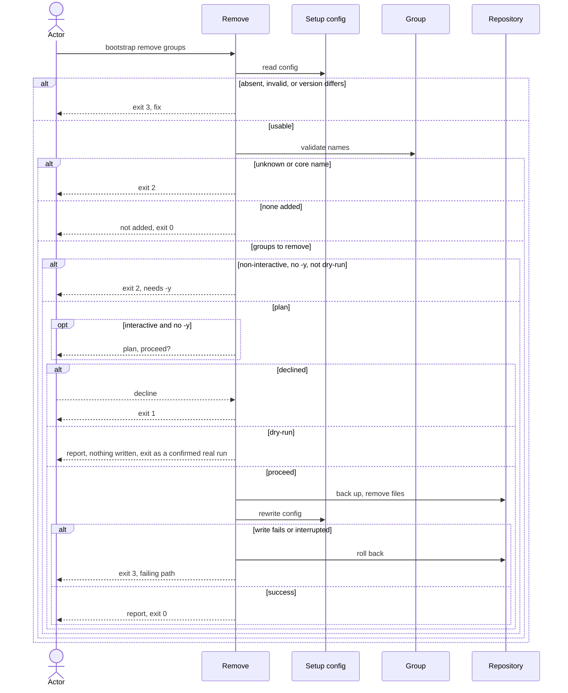

# Flow: Remove a group

## Purpose

`bootstrap remove <group>...` removes the files of one or more optional groups
from a repository that is already set up and drops them from the config, so a
group no longer wanted costs one command and no file is lost.

Serves: [Zero setup drift](../../../product.md#goal-zero-drift)

## Trigger & Actors

| Actor | May trigger | Authorization | Audit-recorded |
| ----- | ----------- | ------------- | -------------- |
| Repo owner (interactive terminal) | the command `bootstrap remove <group> [<group>...]` | write access to the working directory | no |
| AI agent or CI (non-interactive) | `bootstrap remove <group>...`, `-y` is necessary | write access to the working directory | no |

Not audit-recorded: the product has no audit foundation.

## Steps

1. Remove reads `.config/bootstrap.yaml`. Absent → writes nothing, exits 3 "not
   set up — run `bootstrap init`". An invalid setup file is refused per the
   validity guard of [Setup config](../../../entities/setup-config/index.md):
   writes nothing and exits 3. A recorded `version` newer than the running cli
   fails that guard (exit 3 "upgrade bootstrap"). A recorded `version` older than
   the running cli → exits 3 "run `bootstrap update` first".
2. Remove validates each name. An unknown name exits 2. A core group name exits 2
   (core groups are always included). A name not in setup-config `groups` is
   reported "not added" and changes nothing. If no named group is in `groups`,
   remove writes nothing and exits 0.
   [Group](../../../entities/group/index.md),
   [Setup config](../../../entities/setup-config/index.md)
3. A non-interactive run (`--json` included) without `-y` exits 2 "removing files
   needs -y". `--dry-run` does not need `-y`.
4. Remove plans each path of the removed groups listed in setup-config `files`;
   step 6 applies the plan. A path present in the repo will be backed up, then
   removed, per [backups](../../../conventions.md#backups). A path already absent
   will be dropped from `files` silently. A path in `kept` is left untouched and
   stays in `kept`; [Check for drift](../120-check-drift/index.md) then warns
   "kept file no longer produced". A path in `deleted` is left untouched and
   stays in `deleted`; check shows no warning for it. Steps 1–5 write nothing.
   [Group](../../../entities/group/index.md),
   [Setup config](../../../entities/setup-config/index.md)
5. Interactive only: remove shows the plan and asks once to proceed, as in
   [Set up a repository](../110-setup-repository/index.md) step 5. Declining, or
   cancelling the prompt, writes nothing and exits 1. `-y` skips the confirm.
6. Remove writes the planned changes all-or-nothing, then rewrites
   `.config/bootstrap.yaml` last: `groups` without the removed names and `files`
   refreshed to the full set now produced; setup-config stays present.
   [Setup config](../../../entities/setup-config/index.md)
7. Remove reports files removed (each original → backup path), kept or left
   deleted (untouched) and not added. Exit 0 on success.

Removing the name from `groups` by hand and running `bootstrap update` (see
[Update a repository](../130-update-repository/index.md)) gives the same result,
because update treats those files as obsolete.

Modes: `--dry-run` shows the plan, writes nothing and exits with the code the
confirmed real run (with `-y`) would return. `--json` prints exactly one document on every exit and
implies non-interactive, per [errors](../../../conventions.md#errors). Confirm,
`-y`, `--dry-run` and `--json` behave as in
[Set up a repository](../110-setup-repository/index.md). Output rules follow
[Terminal UX](../../../design-system.md#terminal-ux).

## Guarantees

| Step / group | Consistency | On failure | Idempotency | Load & latency |
| ------------ | ----------- | ---------- | ----------- | -------------- |
| 1–5 | atomic — nothing is written | none — nothing written yet; exit 1, 2 or 3 per step | n/a — a re-run starts from the same repo state | n/a — one local command |
| 6 | atomic — all-or-nothing | a write failure or an interrupt triggers full rollback per [baseline](../../../conventions.md#baseline) atomic-multi-write and graceful-shutdown: the repo is byte-identical to before; exit 3 naming the failing path | a re-run with the same names reports "not added", writes nothing and exits 0 | n/a — one local command |
| 7 | atomic — output only | none — changes no repo state | n/a | n/a — one local command |

No content is lost: every removed file is backed up first.

## Diagram

## Background Jobs

N/A — runs synchronously in one command invocation.

## Acceptance

- Given a repository with ai added, when `bootstrap remove ai -y` runs, then ai's
  files are moved to backups, `groups` no longer contains ai, `files` no longer
  lists them and the exit code is 0; then `bootstrap check` exits 0.
- Given a group not in `groups`, when remove runs with its name, then nothing is
  written, it is reported "not added" and the exit code is 0.
- Given a core group name, when remove runs, then the exit code is 2.
- Given an unknown group name, when remove runs, then the exit code is 2.
- Given a non-interactive run without `-y`, when remove runs, then the exit code
  is 2 and nothing is written.
- Given a non-interactive `--dry-run` without `-y`, when remove runs, then the
  plan is shown, nothing is written and the exit code is 0.
- Given a file of the group that is in `kept`, when remove runs, then the file is
  untouched, its path stays in `kept` and a later check warns "kept file no
  longer produced".
- Given a path of the group that is in `deleted`, when remove runs, then the path
  stays in `deleted`, nothing is written for it and a later check shows no
  warning for it.
- Given a recorded version older than the running cli, when remove runs, then the
  exit code is 3 and the message names `bootstrap update`.
- Given a write failure injected mid-run, when remove runs, then the repository is
  byte-identical to before and the exit code is 3.
- Given an interactive run, when the actor declines at the confirm, then nothing
  is written and the exit code is 1.
- Given the name removed from `groups` by hand, when
  `bootstrap update --take-all -y` runs, then the resulting files equal those of
  the first criterion.
- Abuse case: n/a — runs locally with the caller's own permissions on the
  caller's own repository; every input is validated per
  [baseline](../../../conventions.md#baseline) boundary-validation.

## References

- [baseline](../../../conventions.md#baseline),
  [backups](../../../conventions.md#backups),
  [errors](../../../conventions.md#errors),
  [config](../../../conventions.md#config)
- [design-system](../../../design-system.md#terminal-ux) — Terminal UX
- [Set up a repository](../110-setup-repository/index.md) — defines confirm,
  `-y`, `--dry-run` and `--json`
- [Update a repository](../130-update-repository/index.md) — the equivalent
  by-hand route
- [Add a group](../140-add-group/index.md) — the inverse flow
- API surface: N/A — no service project; the flow is a local command
- Screens surface: N/A — cli has no screen platform; terminal behaviour per
  [design-system.md#terminal-ux](../../../design-system.md#terminal-ux)
