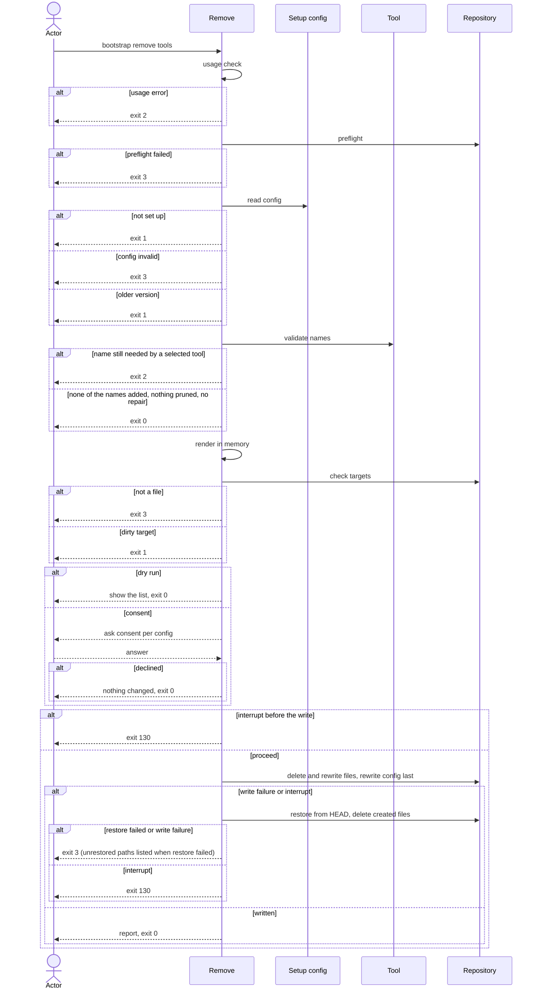

# Flow: Remove a tool

## Purpose

`bootstrap remove <tool>...` removes one or more removable tools from a
repository that is already set up: it deletes their files, and prunes each
dependency that no remaining tool needs
([Tool](../../../entities/tool/index.md#requires-and-dependencies)). It never
commits.

Serves: [Zero setup drift](../../../product.md#goal-zero-drift)

## Trigger & Actors

| Actor                            | May trigger                                                                                                                                                 | Authorization                         | Audit-recorded                                                                 |
| -------------------------------- | ----------------------------------------------------------------------------------------------------------------------------------------------------------- | ------------------------------------- | ------------------------------------------------------------------------------ |
| Repo owner (any terminal)        | the command `bootstrap remove <tool> [<tool>...]` with flags; the interactive alternative is `bootstrap tui` ([Select tools](../160-select-tools/index.md)) | write access to the working directory | no — the product has no audit foundation; git history keeps every deleted file |
| AI agent or CI (non-interactive) | `bootstrap remove <tool>...`; `-y` is necessary for a run that changes anything, since no prompt is possible without terminals or with `--json`             | write access to the working directory | no — the product has no audit foundation; git history keeps every deleted file |

## Steps

Usage errors come first: no tool name given, an unknown tool name, a tool whose
`removable` value in the [Tool](../../../entities/tool/index.md) catalog is
false, or an unknown flag or a bad flag value, exits 2 with short usage before
the preflight and before `.config/bootstrap.yaml` is read, all reported together
([errors](../../../conventions.md#errors)). Nothing is written.

1. Remove runs, after the usage check, the preflight of
   [Set up a repository](../110-setup-repository/index.md) step 1.
2. Remove reads `.config/bootstrap.yaml`
   ([Setup config](../../../entities/setup-config/index.md)). Absent → writes
   nothing, exits 1, next command `bootstrap init`. Invalid → writes nothing,
   exits 3 per [Validity](../../../entities/setup-config/index.md#validity).
   Else an older `version` → writes nothing, exits 1, next command
   `bootstrap init` per
   [Version guard](../../../entities/setup-config/index.md#version-guard). A
   missing unremovable tool, or a missing dependency that a selected tool needs,
   is repaired with a warning per
   [Repair on read](../../../entities/setup-config/index.md#repair).
3. Remove validates each name. A name given more than once is used once, with no
   error. A name is selected when it is in `values.tools` (direct) or in
   `values.dependencies` (a dependency). The selection after the request is the
   direct tools without the named ones, plus the dependencies they need (derived
   per the requires check of
   [Tool](../../../entities/tool/index.md#requires-and-dependencies)). Each name
   falls in one case:

   | Case                                                                                      | Result                                                                                                                                                             |
   | ----------------------------------------------------------------------------------------- | ------------------------------------------------------------------------------------------------------------------------------------------------------------------ |
   | Selected directly and required by no tool of the selection after the request              | `removed`                                                                                                                                                          |
   | Selected (direct or dependency) and required by a tool of the selection after the request | exit 2 naming that parent tool (`pre-commit` for `python`), unless another alternative of the slot is in that selection or the parent is named in the same request |
   | Selected only as a dependency and needed by no tool of the selection after the request    | `not_added`, like an unselected name; pruned at the write                                                                                                          |
   | Selected neither way                                                                      | `not_added`, changes nothing                                                                                                                                       |

   Every dependency of the recorded selection that no tool of the selection
   after the request needs is pruned: it is on the list of changes, like a
   removed tool. If no named tool is selected, nothing is pruned and step 2 made
   no repair, the list of changes is empty: remove writes nothing, shows no
   prompt, reports the `orphaned` paths of the recorded render and exits 0.
4. Remove renders in memory the full file set for the new selection with the
   recorded values and compares each file with the working copy: the
   new-selection render judges the files to keep, create or change. Remove also
   renders the recorded selection: that render tells a removed tool's file
   (`deleted` or `kept`) from a path the running cli no longer renders
   (`orphaned`, per [Files no longer rendered](../../../conventions.md#safety)).
   In this table a removed tool is a named tool or a dependency step 3 prunes:
   the files of a pruned dependency follow the removed-tool rows, and the files
   of a dependency that stays (its parents updated) follow the still-selected
   rows. Each recorded or rendered path falls in one case. A shared file is one
   of the files listed in
   [Selection-dependent files](../../../entities/tool/index.md#selection-dependent-files)
   of the [Tool](../../../entities/tool/index.md) entity. A shared file that the
   new selection still renders is a file of a still-selected tool, never of a
   removed tool.

   | Case                                                                                                                                                                                                                | Target?                           | Report key                            | Stays in `files`?             |
   | ------------------------------------------------------------------------------------------------------------------------------------------------------------------------------------------------------------------- | --------------------------------- | ------------------------------------- | ----------------------------- |
   | Recorded file (not `create_only`) of a removed tool, present on disk                                                                                                                                                | yes — deleted                     | `deleted`                             | no                            |
   | Recorded `create_only` file of a removed tool, present on disk                                                                                                                                                      | no — never deleted, stays on disk | `kept`                                | no                            |
   | Recorded path of a removed tool, absent on disk, absence committed                                                                                                                                                  | no                                | none — dropped silently               | no                            |
   | Recorded path of a removed tool, absent on disk, deletion not committed                                                                                                                                             | yes — dirty, step 5               | none                                  | n/a — nothing written, exit 1 |
   | Recorded file (not `create_only`) of a still-selected tool, present on disk, render differs from the working copy (content or mode, including a committed hand edit, overwritten as at a re-run of init)            | yes                               | `changed`                             | yes                           |
   | Recorded `create_only` file of a still-selected tool, present on disk                                                                                                                                               | no — never changed                | `kept`                                | yes                           |
   | Recorded shared file of a still-selected tool, absent on disk, absence committed                                                                                                                                    | yes — created again               | `created`                             | yes                           |
   | Recorded file (not shared) of a still-selected tool, absent on disk, absence committed or not                                                                                                                       | no — left alone                   | none                                  | yes                           |
   | Recorded shared file of a still-selected tool, absent on disk, deletion not committed                                                                                                                               | yes — dirty, step 5               | none                                  | n/a — nothing written, exit 1 |
   | File of a tool or dependency added back by the step 2 [Repair on read](../../../entities/setup-config/index.md#repair) (even when none of the named tools is selected), except a `create_only` file present on disk | yes                               | `created`, `changed` or `unchanged`   | yes                           |
   | `create_only` file of a tool or dependency added back by the step 2 [Repair on read](../../../entities/setup-config/index.md#repair), present on disk                                                               | no — never changed                | `kept`                                | yes                           |
   | Recorded file (not `create_only`) of a still-selected tool, render equals the working copy                                                                                                                          | no                                | `unchanged`                           | yes                           |
   | Path the running cli renders for a tool that stays selected, not recorded in `files` (absent on disk, or present in any git state)                                                                                  | no — left alone                   | none — not reported                   | no                            |
   | Path of a removed tool, not recorded in `files`, present on disk                                                                                                                                                    | no — left alone                   | none — not reported                   | no                            |
   | Recorded path the running cli does not render, whichever tool it belonged to, present on disk                                                                                                                       | no — never deleted, left in place | `orphaned`                            | yes                           |
   | Recorded path the running cli does not render, whichever tool it belonged to, absent on disk                                                                                                                        | no                                | none — dropped silently, not reported | no                            |
   | `.config/bootstrap.yaml`                                                                                                                                                                                            | yes, like any other file          | `changed`                             | no, never listed in `files`   |

   [Tool](../../../entities/tool/index.md),
   [Setup config](../../../entities/setup-config/index.md)
5. Remove checks the targets per [safety](../../../conventions.md#safety). Steps
   1–5 find every refusal, so a refusal never follows a prompt.
6. Consent, per [config](../../../conventions.md#config) step 4, for the list of
   changes of steps 3–5.
7. Ctrl-C during the run exits per [errors](../../../conventions.md#errors).
8. Remove writes every step 4 target: it deletes the `deleted` files, applies
   [Empty directories](../../../conventions.md#safety) after the deletions,
   writes the `created` and `changed` files, then rewrites
   `.config/bootstrap.yaml` last: `values.tools` without the named names and
   with any tool step 2 repaired, `values.dependencies` without the pruned
   dependencies, with the parents of the others recomputed and with any
   dependency step 2 repaired, and `files` per
   [invariant 2](../../../entities/setup-config/index.md#invariants). It never
   commits. [Setup config](../../../entities/setup-config/index.md)
9. Remove reports, in human output and under `--json`: `removed`, `not_added`,
   `dependencies_added`, `dependencies_pruned`, `deleted`, `created`, `changed`,
   `unchanged`, `kept`, `orphaned` and `warnings`. `removed` lists only the
   named tools that were selected; `dependencies_pruned` lists the dependencies
   step 3 pruned, and `dependencies_added` the dependencies a step 2 repair
   added back. `warnings` are listed in the order they were found; the path
   lists are sorted by path; `removed`, `not_added`, `dependencies_added` and
   `dependencies_pruned` are sorted by name. Each path appears under the key its
   case gives in step 4. A directory step 8 removed is not reported, in human
   output, `--json` or the `--dry-run` list. The next command follows
   [errors](../../../conventions.md#errors). Exit 0 on success.

Modes: `--dry-run` shows the list of changes, writes nothing, never prompts (in
any terminal, with or without `-y`) and exits with the code the real run (with
`-y`) would return. `--dry-run --json` prints the JSON result the real run would
return plus `"dry_run": true`; on a non-zero exit it prints the same error
document plus `"dry_run": true`.

## Guarantees

| Step / group | Consistency                 | On failure                                                                                                                         | Idempotency                                                                  | Load & latency          |
| ------------ | --------------------------- | ---------------------------------------------------------------------------------------------------------------------------------- | ---------------------------------------------------------------------------- | ----------------------- |
| 1–7          | atomic — nothing is written | none — nothing written yet; exit 0 (none of the names added, no repair, or the consent declined), 1, 2, 3 or 130 (Ctrl-C) per step | n/a — a re-run starts from the same repo state                               | n/a — one local command |
| 8            | atomic — all-or-nothing     | per [safety](../../../conventions.md#safety) and [errors](../../../conventions.md#errors)                                          | a re-run with the same names reports "not added", writes nothing and exits 0 | n/a — one local command |
| 9            | atomic — output only        | none — changes no repo state                                                                                                       | n/a                                                                          | n/a — one local command |

## Diagram

## Background Jobs

N/A — runs synchronously in one command invocation.

## Acceptance

A criterion that says only "when remove runs" runs with `-y`; a criterion that
names its flags (no `-y`, `--dry-run`) runs with those only.

- Given a repository with github added, when `bootstrap remove github -y` runs,
  then github's files are deleted, `values.tools` no longer contains github,
  `files` no longer lists them, nothing is committed and the exit code is 0.
- Given `dprint` is selected and `taplo` is not, when
  `bootstrap remove dprint -y` runs, then
  `.config/mise/conf.d/dprint/mise.dev.toml` and the tool's other files,
  `dprint.json` included, are deleted, the next command is
  `MISE_ENV=dev mise run setup:all` and the exit code is 0.
- Given a removed tool whose deletions empty `.config/mise/conf.d/<tool>/`, when
  remove runs with `-y`, then that directory no longer exists and is not
  reported; a directory that still holds another entry stays.
- Given `mempalace` is selected, when `bootstrap remove mempalace -y` runs, then
  `mempalace.yaml` (`create_only`) stays on disk, is reported `kept` and is no
  longer in `files`, the tool's other files are deleted and the exit code is 0.
- Given a recorded shared file missing from disk whose tool stays selected, when
  remove runs and its absence is committed, then the file is created again,
  reported `created` and the exit code is 0.
- Given a recorded shared file of a still-selected tool that is deleted in the
  working tree with the deletion not committed, when remove runs, then nothing
  is written, the path is listed and the exit code is 1.
- Given a recorded path of a removed tool that is deleted in the working tree
  with the deletion not committed, when remove runs, then nothing is written,
  the path is listed and the exit code is 1.
- Given a committed hand edit to a file of a still-selected tool, when remove
  runs with `-y`, then the file is overwritten with its render, reported
  `changed` and the exit code is 0.
- Given a tool whose `removable` is false (e.g. `mise`), when remove runs, then
  nothing is written and the exit code is 2.
- Given an unknown tool name, when remove runs, then the exit code is 2.
- Given a tool not in `values.tools`, when remove runs with its name, then
  nothing is written, it is reported `not_added` and the exit code is 0.
- Given `bootstrap remove` with no names, when it runs, then nothing is written,
  a short usage is shown and the exit code is 2.
- Given `taplo` is selected, when `bootstrap remove dprint -y` runs, then
  nothing is written and the exit code is 2 naming `taplo`.
- Given `taplo` and `dprint` are selected, when
  `bootstrap remove taplo dprint -y` runs, then the requires check passes on the
  selection after the request, both are removed and the exit code is 0.
- Given `dprint` and `virajp-linter` are selected with `node` and `pnpm`
  dependencies needed only by them, when
  `bootstrap remove dprint virajp-linter -y` runs, then `node` and `pnpm` are
  pruned: they are on the list of changes before consent, their files are
  deleted (`create_only` files kept), they leave `values.dependencies`,
  `dependencies_pruned` lists `node` and `pnpm`, `removed` lists `dprint` and
  `virajp-linter` alone and the exit code is 0.
- Given `dprint` and `virajp-linter` are selected with `node` and `pnpm`
  dependencies of both, when `bootstrap remove dprint -y` runs, then `node` and
  `pnpm` stay with their files, their parents in `values.dependencies` become
  `virajp-linter` alone and the exit code is 0.
- Given a pruned dependency whose deletions empty its `conf.d/` directory, when
  remove runs with `-y`, then the directory no longer exists and is not reported
  ([safety](../../../conventions.md#safety)).
- Given a direct tool that a selected tool still needs (for example `node`
  selected directly and needed by `dprint`), when `bootstrap remove node -y`
  runs, then nothing is written and the exit code is 2 naming `dprint`; given
  another alternative of that slot is selected, the removal passes.
- Given `pnpm` is only a dependency of `dprint`, when `bootstrap remove pnpm -y`
  runs, then nothing is written and the exit code is 2 naming `dprint`.
- Given `pre-commit` is selected (unremovable) with `python` and `uv` as its
  dependencies, when `bootstrap remove python -y` runs, then nothing is written
  and the exit code is 2 naming `pre-commit`.
- Given a selected tool whose dependency is missing from `values.dependencies`,
  when remove runs, then the dependency is added back with the warning "added
  back dependency `<name>`", it is listed in `dependencies_added`, its files are
  `created` (a `create_only` file present on disk is `kept`), the config is
  `changed` and the exit code is 0.
- Given `bootstrap remove` with no names in a directory that is not a git
  repository or not set up, when it runs, then the exit code is 2, not 3 or 1.
- Given a recorded path the running cli no longer renders that is present on
  disk, when remove runs, then the path is not deleted, stays in `files` and is
  reported `orphaned`.
- Given a recorded path the running cli no longer renders that is absent on
  disk, when remove runs, then the path is dropped from `files`, is not reported
  and the exit code is 0.
- Given a tool name given twice, when `bootstrap remove github github -y` runs,
  then the tool is removed once and the exit code is 0.
- Given a recorded path of the removed tool already absent from the repository,
  with the absence committed, when remove runs, then the path is dropped from
  `files` without a report entry and the exit code is 0.
- Given a file of the tool that is modified or staged, when remove runs, then
  nothing is written, the path is listed and the exit code is 1.
- Given a target that is untracked or ignored in git, when remove runs, then
  nothing is written, the path is listed and the exit code is 1.
- Given a target that is a directory or a symlink, when remove runs, then
  nothing is written and the exit code is 3 naming that path.
- Given one target that is a directory and another that is modified, when remove
  runs, then nothing is written, the exit code is 3 and the message lists both
  paths.
- Given `.config/bootstrap.yaml` has an uncommitted change, when remove runs,
  then nothing is written and the exit code is 1 listing it.
- Given a recorded `values.tools` missing an unremovable tool and no other tool
  of its `max: one` category is recorded, when remove runs, even with none of
  the named tools selected, then the repair is written: the tool is in
  `values.tools`, its files are rendered and reported `created` or `changed`,
  `.config/bootstrap.yaml` is listed `changed`, the warning "added back
  unremovable tool `<name>`" is in `warnings` and the exit code is 0.
- Given a setup file recorded with an older `format`, when remove runs, then the
  older format is read and not refused, and the next write records the running
  cli's format.
- Given a recorded `values.tools` with a tool name the running catalog does not
  have, when remove runs, then nothing is written and the exit code is 3 naming
  the fix.
- Given stdin and stdout are terminals and no `--json`, when remove runs without
  `-y` with a named tool selected (or a repair), then the list of changes and
  "apply these changes? y/N" are shown; on "n", "no" or Enter nothing is
  written, "nothing changed" is shown and the exit code is 0; on "y" or "yes"
  the changes are applied and the exit code is 0.
- Given no terminal (stdin or stdout is not a terminal) or `--json`, when remove
  runs without `-y` with a named tool selected (or a repair), then no prompt is
  shown, nothing is written, the exit code is 2, the message is "changes need
  --yes" and the next command is the same command plus `--yes`.
- Given a dirty target, when remove runs without `-y` in a terminal, then the
  exit code is 1 and no prompt is shown (every refusal comes before the
  consent).
- Given none of the named tools is selected and no repair happened, when remove
  runs without `-y`, then nothing is written, no prompt is shown, `not_added` is
  reported and the exit code is 0.
- Given a `--dry-run` without `-y`, in any terminal, when remove runs, then the
  plan is shown, no prompt is shown, nothing is written and the exit code is 0.
- Given `--json`, when remove exits on any code, then exactly one JSON result is
  printed, with `removed`, `not_added`, `dependencies_added`,
  `dependencies_pruned`, `deleted`, `created`, `changed`, `unchanged`, `kept`,
  `orphaned` and `warnings` on success; a successful JSON result has a top-level
  `next_command` key only per [errors](../../../conventions.md#errors), and an
  error document still carries `error.next_command`.
- Given `--dry-run --json`, when remove runs, then nothing is written and the
  JSON result the real run would return is printed plus `"dry_run": true`; on a
  non-zero exit it is the same error document plus `"dry_run": true`.
- Given no `.config/bootstrap.yaml`, when remove runs, then the exit code is 1
  and the message names `bootstrap init`.
- Given a recorded version older than the running cli, when remove runs, then
  the exit code is 1 and the next command is `bootstrap init`.
- Given an invalid setup file or a newer recorded version, when remove runs,
  then the exit code is 3 and nothing is written.
- Given a directory outside a git repository, or no `mise` on the `PATH`, when
  remove runs, then nothing is written and the exit code is 3.
- Given `mise` found at a path other than `~/.local/bin/mise`, when remove runs,
  then one warning names the path, it is listed in `warnings` and the run
  continues.
- Given a write failure injected mid-run, when remove runs, then every changed
  or deleted target is restored from `HEAD`, every created file is deleted and
  the exit code is 3.
- Given a run, when the actor presses Ctrl-C during the write, then the
  repository is as it was before and the exit code is 130.
- Given a write failure or an interrupt during the writes whose restore also
  fails, when remove runs, then the exit code is 3 and the output lists every
  path not restored (`--json`: `unrestored`).
- Given a path the cli renders for a tool that stays selected but that is not in
  `files` and is absent on disk, when remove runs, then that path is not created
  and not reported.
- Given a recorded `values.tools` that misses `mise` while another tool of its
  `max: one` category is recorded, when remove runs, then nothing is written and
  the exit code is 3 naming the fix
  ([Validity](../../../entities/setup-config/index.md#validity)); for `git` or
  `pre-commit` the other tool is a valid replacement, so there is no exit 3 and
  no repair.
- Abuse case: n/a — runs locally with the caller's own permissions on the
  caller's own repository; every input is validated per
  [baseline](../../../conventions.md#baseline) boundary-validation.

## References

- [baseline](../../../conventions.md#baseline),
  [safety](../../../conventions.md#safety),
  [errors](../../../conventions.md#errors),
  [config](../../../conventions.md#config),
  [Terminal UX](../../../design-system.md#terminal-ux)
- [Set up a repository](../110-setup-repository/index.md),
  [Add a tool](../140-add-tool/index.md) (inverse)
- API surface: N/A — no service project. Screens surface: N/A — cli has no
  screen platform.
