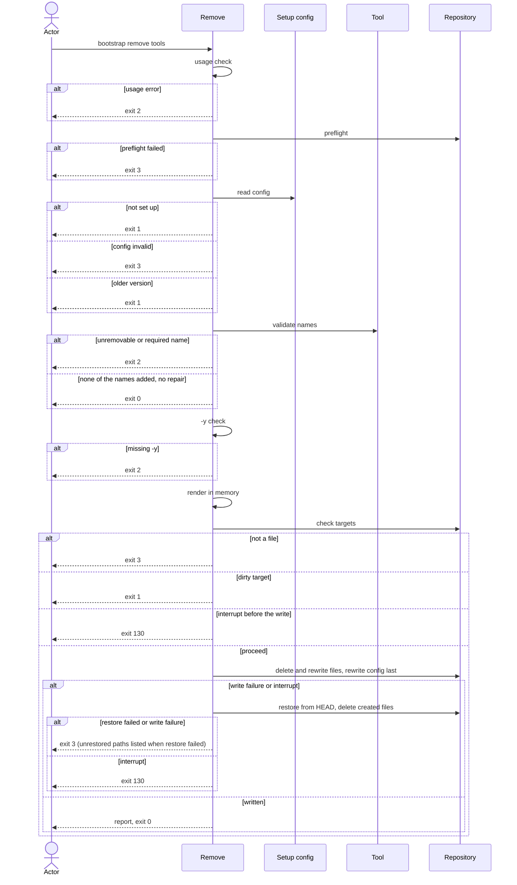

# Flow: Remove a tool

## Purpose

`bootstrap remove <tool>...` removes one or more removable tools from a
repository that is already set up: it deletes their files, writes the step 5
targets of the tools that stay and drops the removed tools from the setup
config. It never commits.

Serves: [Zero setup drift](../../../product.md#goal-zero-drift)

## Trigger & Actors

| Actor                            | May trigger                                                                                                                                                 | Authorization                         | Audit-recorded                                                                 |
| -------------------------------- | ----------------------------------------------------------------------------------------------------------------------------------------------------------- | ------------------------------------- | ------------------------------------------------------------------------------ |
| Repo owner (any terminal)        | the command `bootstrap remove <tool> [<tool>...]` with flags; the interactive alternative is `bootstrap tui` ([Select tools](../160-select-tools/index.md)) | write access to the working directory | no — the product has no audit foundation; git history keeps every deleted file |
| AI agent or CI (non-interactive) | `bootstrap remove <tool>...`; `-y` is necessary except with `--dry-run`                                                                                     | write access to the working directory | no — the product has no audit foundation; git history keeps every deleted file |

## Steps

Usage errors come first: no tool name given, an unknown tool name, or an unknown
flag or a bad flag value, exits 2 with short usage before the preflight and
before `.config/bootstrap.yaml` is read. Nothing is written.

1. Remove runs, after the usage check, the preflight of
   [Set up a repository](../110-setup-repository/index.md) step 1.
2. Remove reads `.config/bootstrap.yaml`
   ([Setup config](../../../entities/setup-config/index.md)). Absent → writes
   nothing, exits 1, next command `bootstrap init`. Invalid → writes nothing,
   exits 3 per [Validity](../../../entities/setup-config/index.md#validity).
   Else an older `version` → writes nothing, exits 1, next command
   `bootstrap init` per
   [Version guard](../../../entities/setup-config/index.md#version-guard). A
   missing unremovable tool is repaired with a warning per
   [Repair on read](../../../entities/setup-config/index.md#repair).
3. Remove validates each name. A name given more than once is used once, with no
   error. A tool is removable when its `removable` value in the
   [Tool](../../../entities/tool/index.md) catalog is true; a tool whose
   `removable` is false exits 2. A tool that a tool still selected after the
   request `requires` exits 2 naming the dependent tool. A name not in
   `values.tools` is reported "not added" and changes nothing. If no named tool
   is in `values.tools` and step 2 made no repair, remove writes nothing,
   reports the `orphaned` paths of the recorded render and exits 0. A repair is
   a change: when step 2 repaired, the run continues to step 4 even though no
   named tool is selected, and exits 0 with the warning.
4. A run without `-y`, in any terminal (`--json` included), exits 2 "removing
   files needs -y" and shows no prompt. `--dry-run` does not need `-y`.
5. Remove renders in memory the full file set for the new selection with the
   recorded values and compares each file with the working copy. Each recorded
   or rendered path falls in one case. A shared file is one of the files listed
   in the "Selection-dependent files" section of the
   [Tool](../../../entities/tool/index.md) entity. A shared file that the new
   selection still renders is a file of a still-selected tool, never of a
   removed tool.

   | Case                                                                                                                                                                                                     | Target?                           | Report key                            | Stays in `files`?             |
   | -------------------------------------------------------------------------------------------------------------------------------------------------------------------------------------------------------- | --------------------------------- | ------------------------------------- | ----------------------------- |
   | Recorded file (not `create_only`) of a removed tool, present on disk                                                                                                                                     | yes — deleted                     | `deleted`                             | no                            |
   | Recorded `create_only` file of a removed tool, present on disk                                                                                                                                           | no — never deleted, stays on disk | `kept`                                | no                            |
   | Recorded path of a removed tool, absent on disk, absence committed                                                                                                                                       | no                                | none — dropped silently               | no                            |
   | Recorded path of a removed tool, absent on disk, deletion not committed                                                                                                                                  | yes — dirty, step 6               | none                                  | n/a — nothing written, exit 1 |
   | Recorded file (not `create_only`) of a still-selected tool, present on disk, render differs from the working copy (content or mode, including a committed hand edit, overwritten as at a re-run of init) | yes                               | `changed`                             | yes                           |
   | Recorded `create_only` file of a still-selected tool, present on disk                                                                                                                                    | no — never changed                | `kept`                                | yes                           |
   | Recorded shared file of a still-selected tool, absent on disk, absence committed                                                                                                                         | yes — created again               | `created`                             | yes                           |
   | Recorded file (not shared) of a still-selected tool, absent on disk, absence committed or not                                                                                                            | no — left alone                   | none                                  | yes                           |
   | Recorded shared file of a still-selected tool, absent on disk, deletion not committed                                                                                                                    | yes — dirty, step 6               | none                                  | n/a — nothing written, exit 1 |
   | File of a tool added back by the step 2 [Repair on read](../../../entities/setup-config/index.md#repair) (even when none of the named tools is selected)                                                 | yes                               | `created` or `changed`                | yes                           |
   | Recorded file (not `create_only`) of a still-selected tool, render equals the working copy                                                                                                               | no                                | `unchanged`                           | yes                           |
   | Path the running cli renders for a tool that stays selected, not recorded in `files` (absent on disk, or present in any git state)                                                                       | no — left alone                   | none — not reported                   | no                            |
   | Path of a removed tool, not recorded in `files`, present on disk                                                                                                                                         | no — left alone                   | none — not reported                   | no                            |
   | Recorded path the running cli does not render, whichever tool it belonged to, present on disk                                                                                                            | no — never deleted, left in place | `orphaned`                            | yes                           |
   | Recorded path the running cli does not render, whichever tool it belonged to, absent on disk                                                                                                             | no                                | none — dropped silently, not reported | no                            |
   | `.config/bootstrap.yaml`                                                                                                                                                                                 | yes, like any other file          | `changed`                             | no, never listed in `files`   |

   [Tool](../../../entities/tool/index.md),
   [Setup config](../../../entities/setup-config/index.md)
6. Remove checks the targets per [safety](../../../conventions.md#safety); exits
   1 if any target is modified, staged, untracked, ignored or uncommitted
   deleted; exits 3 if any is not a regular file (3 takes precedence).
7. Ctrl-C during the run exits 130 per [errors](../../../conventions.md#errors).
8. Remove writes every step 5 target: it deletes the `deleted` files, writes the
   `created` and `changed` files, then rewrites `.config/bootstrap.yaml` last:
   `values.tools` without the removed names and `files` refreshed. It never
   commits. [Setup config](../../../entities/setup-config/index.md)
9. Remove reports, in human output and under `--json`: `removed`, `not_added`,
   `deleted`, `created`, `changed`, `unchanged`, `kept`, `orphaned` and
   `warnings`. `warnings` are listed in the order they were found; the path
   lists are sorted by path; `removed` and `not_added` are sorted by name. Each
   path appears under the key its case gives in step 5. Remove prints the next
   command per [errors](../../../conventions.md#errors) (a step 2 repair, or a
   created, changed or deleted `mise` config file); otherwise it prints none and
   a successful JSON result has no top-level `next_command` key (an error
   document still carries `error.next_command`). Exit 0 on success.

Modes: `--dry-run` shows the plan, writes nothing and exits with the code the
real run (with `-y`) would return. `--dry-run --json` prints the JSON result the
real run would return plus `"dry_run": true`; on a non-zero exit it prints the
same error document plus `"dry_run": true`.

## Guarantees

| Step / group | Consistency                 | On failure                                                                                                                                                                                                                                               | Idempotency                                                                  | Load & latency          |
| ------------ | --------------------------- | -------------------------------------------------------------------------------------------------------------------------------------------------------------------------------------------------------------------------------------------------------- | ---------------------------------------------------------------------------- | ----------------------- |
| 1–7          | atomic — nothing is written | none — nothing written yet; exit 0 (none of the names added, no repair), 1, 2, 3 or 130 (Ctrl-C) per step                                                                                                                                                | n/a — a re-run starts from the same repo state                               | n/a — one local command |
| 8            | atomic — all-or-nothing     | per [safety](../../../conventions.md#safety): a write failure exits 3 naming the failing path; an interrupt exits 130 per [errors](../../../conventions.md#errors); if restore also fails, exit 3 lists every path not restored (`--json`: `unrestored`) | a re-run with the same names reports "not added", writes nothing and exits 0 | n/a — one local command |
| 9            | atomic — output only        | none — changes no repo state                                                                                                                                                                                                                             | n/a                                                                          | n/a — one local command |

## Diagram

## Background Jobs

N/A — runs synchronously in one command invocation.

## Acceptance

A criterion that says only "when remove runs" runs with `-y`; a criterion that
names its flags (no `-y`, `--dry-run`) runs with those only.

- Given a repository with github added, when `bootstrap remove github -y` runs,
  then github's files are deleted, `values.tools` no longer contains github,
  `files` no longer lists them, nothing is committed and the exit code is 0.
- Given a removable base tool such as `dprint`, with `taplo` not selected, when
  `bootstrap remove dprint -y` runs, then its files are deleted,
  `.config/mise/conf.d/_base/mise.dev.toml` is reported `changed` without its
  entries, the next command is `MISE_ENV=dev mise run setup:all` and the exit
  code is 0.
- Given `mempalace` is selected, when `bootstrap remove mempalace -y` runs, then
  `mempalace.yaml` (`create_only`) stays on disk, is reported `kept` and is no
  longer in `files`, the tool's other files are deleted and the exit code is 0.
- Given a recorded shared file missing from disk whose tool stays selected, when
  remove runs and its absence is committed, then the file is created again,
  reported `created` and the exit code is 0.
- Given a recorded shared file of a still-selected tool that is deleted in the
  working tree with the deletion not committed, when remove runs, then nothing
  is written, the path is listed and the exit code is 1.
- Given a recorded path of a removed tool that is deleted in the working tree
  with the deletion not committed, when remove runs, then nothing is written,
  the path is listed and the exit code is 1.
- Given a committed hand edit to a file of a still-selected tool, when remove
  runs with `-y`, then the file is overwritten with its render, reported
  `changed` and the exit code is 0.
- Given a tool whose `removable` is false (e.g. `mise`), when remove runs, then
  nothing is written and the exit code is 2.
- Given an unknown tool name, when remove runs, then the exit code is 2.
- Given a tool not in `values.tools`, when remove runs with its name, then
  nothing is written, it is reported `not_added` and the exit code is 0.
- Given `bootstrap remove` with no names, when it runs, then nothing is written,
  a short usage is shown and the exit code is 2.
- Given `taplo` is selected, when `bootstrap remove dprint -y` runs, then
  nothing is written and the exit code is 2 naming `taplo`.
- Given `taplo` and `dprint` are selected, when
  `bootstrap remove taplo dprint -y` runs, then the requires check passes on the
  selection after the request, both are removed and the exit code is 0.
- Given `bootstrap remove` with no names in a directory that is not a git
  repository or not set up, when it runs, then the exit code is 2, not 3 or 1.
- Given a recorded path the running cli no longer renders that is present on
  disk, when remove runs, then the path is not deleted, stays in `files` and is
  reported `orphaned`.
- Given a recorded path the running cli no longer renders that is absent on
  disk, when remove runs, then the path is dropped from `files`, is not reported
  and the exit code is 0.
- Given a tool name given twice, when `bootstrap remove github github -y` runs,
  then the tool is removed once and the exit code is 0.
- Given a recorded path of the removed tool already absent from the repository,
  with the absence committed, when remove runs, then the path is dropped from
  `files` without a report entry and the exit code is 0.
- Given a file of the tool that is modified or staged, when remove runs, then
  nothing is written, the path is listed and the exit code is 1.
- Given a target that is untracked or ignored in git, when remove runs, then
  nothing is written, the path is listed and the exit code is 1.
- Given a target that is a directory or a symlink, when remove runs, then
  nothing is written and the exit code is 3 naming that path.
- Given one target that is a directory and another that is modified, when remove
  runs, then nothing is written, the exit code is 3 and the message lists both
  paths.
- Given `.config/bootstrap.yaml` has an uncommitted change, when remove runs,
  then nothing is written and the exit code is 1 listing it.
- Given a recorded `values.tools` missing an unremovable tool and no other tool
  of its `max: one` category is recorded, when remove runs, even with none of
  the named tools selected, then the repair is written: the tool is in
  `values.tools`, its files are rendered and reported `created` or `changed`,
  `.config/bootstrap.yaml` is listed `changed`, the warning "added back
  unremovable tool `<name>`" is in `warnings` and the exit code is 0.
- Given a setup file recorded with an older `format`, when remove runs, then the
  older format is read and not refused, and the next write records the running
  cli's format.
- Given a recorded `values.tools` with a tool name the running catalog does not
  have, when remove runs, then nothing is written and the exit code is 3 naming
  the fix.
- Given a run in any terminal that reaches step 4 (a named tool is selected, or
  a repair happened) without `-y`, when remove runs, then the exit code is 2 and
  nothing is written.
- Given an interactive terminal, when remove runs without `-y`, then the exit
  code is 2 with "removing files needs -y", nothing is written and no prompt is
  shown.
- Given a `--dry-run` without `-y`, in any terminal, when remove runs, then the
  plan is shown, nothing is written and the exit code is 0.
- Given `--json`, when remove exits on any code, then exactly one JSON result is
  printed, with `removed`, `not_added`, `deleted`, `created`, `changed`,
  `unchanged`, `kept`, `orphaned` and `warnings` on success; a successful JSON
  result has a top-level `next_command` key only per
  [errors](../../../conventions.md#errors), and an error document still carries
  `error.next_command`.
- Given `--dry-run --json`, when remove runs, then nothing is written and the
  JSON result the real run would return is printed plus `"dry_run": true`; on a
  non-zero exit it is the same error document plus `"dry_run": true`.
- Given no `.config/bootstrap.yaml`, when remove runs, then the exit code is 1
  and the message names `bootstrap init`.
- Given a recorded version older than the running cli, when remove runs, then
  the exit code is 1 and the next command is `bootstrap init`.
- Given an invalid setup file or a newer recorded version, when remove runs,
  then the exit code is 3 and nothing is written.
- Given a directory outside a git repository, or no `mise` on the `PATH`, when
  remove runs, then nothing is written and the exit code is 3.
- Given `mise` found at a path other than `~/.local/bin/mise`, when remove runs,
  then one warning names the path, it is listed in `warnings` and the run
  continues.
- Given a write failure injected mid-run, when remove runs, then every changed
  or deleted target is restored from `HEAD`, every created file is deleted and
  the exit code is 3.
- Given a run, when the actor presses Ctrl-C during the write, then the
  repository is as it was before and the exit code is 130.
- Given a write failure or an interrupt during the writes whose restore also
  fails, when remove runs, then the exit code is 3 and the output lists every
  path not restored (`--json`: `unrestored`).
- Given a path the cli renders for a tool that stays selected but that is not in
  `files` and is absent on disk, when remove runs, then that path is not created
  and not reported.
- Given a recorded `values.tools` that misses an unremovable tool while another
  tool of its `max: one` category is recorded, when remove runs, then nothing is
  written and the exit code is 3 naming the fix
  ([Validity](../../../entities/setup-config/index.md#validity)).
- Abuse case: n/a — runs locally with the caller's own permissions on the
  caller's own repository; every input is validated per
  [baseline](../../../conventions.md#baseline) boundary-validation.

## References

- [baseline](../../../conventions.md#baseline),
  [safety](../../../conventions.md#safety),
  [errors](../../../conventions.md#errors),
  [config](../../../conventions.md#config),
  [Terminal UX](../../../design-system.md#terminal-ux)
- [Set up a repository](../110-setup-repository/index.md),
  [Add a tool](../140-add-tool/index.md) (inverse)
- API surface: N/A — no service project. Screens surface: N/A — cli has no
  screen platform.
