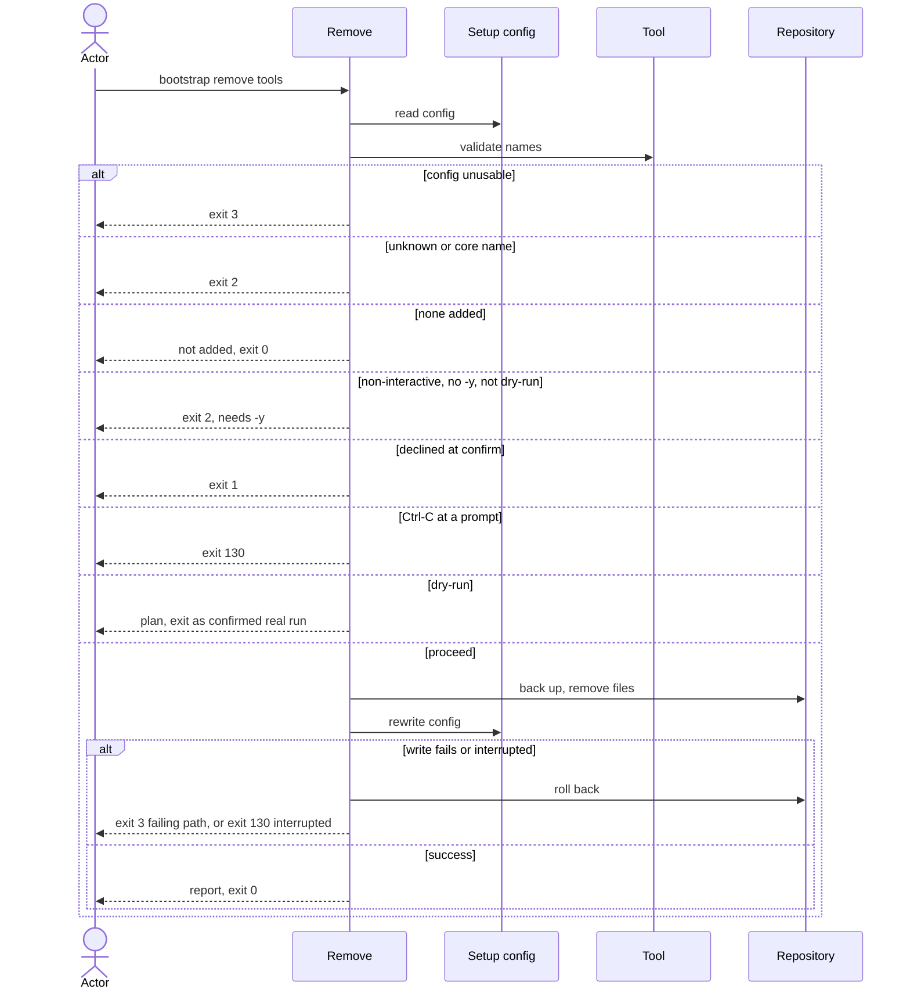

# Flow: Remove a tool

## Purpose

`bootstrap remove <tool>...` removes the files of one or more non-core tools
from a repository that is already set up and drops them from the config.

Serves: [Zero setup drift](../../../product.md#goal-zero-drift)

## Trigger & Actors

| Actor | May trigger | Authorization | Audit-recorded |
| ----- | ----------- | ------------- | -------------- |
| Repo owner (interactive terminal) | the command `bootstrap remove <tool> [<tool>...]` | write access to the working directory | no — the product has no audit foundation; every removed file is kept as a backup ([backups](../../../conventions.md#backups)) |
| AI agent or CI (non-interactive) | `bootstrap remove <tool>...`; `-y` is necessary except with `--dry-run` | write access to the working directory | no — the product has no audit foundation; every removed file is kept as a backup ([backups](../../../conventions.md#backups)) |

## Steps

1. Outside a git repository remove exits 3 per
   [errors](../../../conventions.md#errors). Remove reads `.config/bootstrap.yaml`. Absent → writes nothing, exits 3 "not
   set up — run `bootstrap init`". A file failing
   [Setup config validity](../../../entities/setup-config/index.md#validity) writes nothing and exits 3. A recorded
   `version` older than the running cli → exits 3 "run `bootstrap update` first";
   a newer one fails Validity ("upgrade bootstrap").
2. Remove validates each name. A name given more than once is used once, with no
   error. An unknown name exits 2. A core tool name exits 2 (core, the fixed set
   of 13 tools always applied, cannot be removed).
   A name not in setup-config `values.tools` is reported "not added" and changes
   nothing. If no named tool is in `values.tools`, remove writes nothing and exits 0.
   [Tool](../../../entities/tool/index.md),
   [Setup config](../../../entities/setup-config/index.md)
3. A non-interactive run (`--json` included) without `-y` exits 2 "removing files
   needs -y". `--dry-run` does not need `-y`.
4. Remove plans each path of the removed tools listed in setup-config `files`. A
   path present in the repo will be backed up, then removed, per
   [backups](../../../conventions.md#backups). A path already absent will be
   dropped from `files` silently. A path in `kept` or `deleted` is left untouched
   and stays in its list. No path is shared with a tool that stays added ([Tool](../../../entities/tool/index.md) invariant 1). Precedence: `kept` > `deleted` > the rules above, per
   [check](../120-check-drift/index.md), so a kept or deleted path is never backed
   up or removed.
   [Tool](../../../entities/tool/index.md),
   [Setup config](../../../entities/setup-config/index.md)
5. Interactive only: remove shows the plan and asks once to proceed, as in
   [Set up a repository](../110-setup-repository/index.md) step 5. Declining
   writes nothing and exits 1. Ctrl-C at any prompt writes nothing and exits 130
   per [errors](../../../conventions.md#errors).
6. Remove applies the plan all-or-nothing, then rewrites `.config/bootstrap.yaml`
   last: `values.tools` without the removed names and `files` refreshed to the full set
   now produced. [Setup config](../../../entities/setup-config/index.md)
7. Remove reports files removed (each original → backup path), kept or left
   deleted (untouched) and not added. Exit 0 on success.

Modes: `--dry-run` shows the plan, writes nothing and exits with the code the
confirmed real run (with `-y`) would return. The interactive confirm behaves as in
[Set up a repository](../110-setup-repository/index.md); `-y` is required as in step 3; `--json` per
[errors](../../../conventions.md#errors); output per
[Terminal UX](../../../design-system.md#terminal-ux).

## Guarantees

| Step / group | Consistency | On failure | Idempotency | Load & latency |
| ------------ | ----------- | ---------- | ----------- | -------------- |
| 1–5 | atomic — nothing is written | none — nothing written yet; exit 1, 2, 3 or 130 (Ctrl-C at a prompt) per step | n/a — a re-run starts from the same repo state | n/a — one local command |
| 6 | atomic — all-or-nothing | a write failure or an interrupt triggers full rollback per [baseline](../../../conventions.md#baseline) atomic-multi-write and graceful-shutdown: the repo is byte-identical to before; a write failure exits 3 naming the failing path, an interrupt exits 130 per [errors](../../../conventions.md#errors) | a re-run with the same names reports "not added", writes nothing and exits 0 | n/a — one local command |
| 7 | atomic — output only | none — changes no repo state | n/a | n/a — one local command |

## Diagram

## Background Jobs

N/A — runs synchronously in one command invocation.

## Acceptance

- Given a repository with github added, when `bootstrap remove github -y` runs, then github's
  files are moved to backups, `values.tools` no longer contains github, `files` no longer
  lists them and the exit code is 0; then `bootstrap check` exits 0.
- Given a tool not in `values.tools`, when remove runs with its name, then nothing is
  written, it is reported "not added" and the exit code is 0.
- Given a core tool name, when remove runs, then the exit code is 2.
- Given an unknown tool name, when remove runs, then the exit code is 2.
- Given a non-interactive run without `-y`, when remove runs, then the exit code
  is 2 and nothing is written.
- Given a non-interactive `--dry-run` without `-y`, when remove runs, then the
  plan is shown, nothing is written and the exit code is 0.
- Given a file of the tool that is in `kept`, when remove runs, then the file is
  untouched, its path stays in `kept` and a later check warns "kept file no
  longer produced".
- Given a path of the tool that is in `deleted`, when remove runs, then the path
  stays in `deleted`, nothing is written for it and a later check shows no
  warning for it.
- Given a recorded version older than the running cli, when remove runs, then the
  exit code is 3 and the message names `bootstrap update`.
- Given a write failure injected mid-run, when remove runs, then the repository is
  byte-identical to before and the exit code is 3.
- Given an interactive run, when the actor declines at the confirm, then nothing
  is written and the exit code is 1.
- Given a tool name given twice, when `bootstrap remove github github -y` runs, then the
  tool is removed once and the exit code is 0.
- Given no `.config/bootstrap.yaml`, when remove runs, then the exit code is 3 and
  the message names `bootstrap init`.
- Given an interactive run, when the actor presses Ctrl-C at a prompt or during
  the write, then nothing is written (the repository is byte-identical to before)
  and the exit code is 130.
- Given the name removed from `values.tools` by hand, when
  `bootstrap update --take-all -y` runs, then the resulting files equal those of
  the first criterion.
- Abuse case: n/a — runs locally with the caller's own permissions on the
  caller's own repository; every input is validated per
  [baseline](../../../conventions.md#baseline) boundary-validation.

## References

- [baseline](../../../conventions.md#baseline),
  [backups](../../../conventions.md#backups),
  [errors](../../../conventions.md#errors),
  [config](../../../conventions.md#config),
  [Terminal UX](../../../design-system.md#terminal-ux)
- [Set up a repository](../110-setup-repository/index.md),
  [Update a repository](../130-update-repository/index.md) (by-hand route),
  [Add a tool](../140-add-tool/index.md) (inverse)
- API surface: N/A — no service project. Screens surface: N/A — cli has no
  screen platform.
