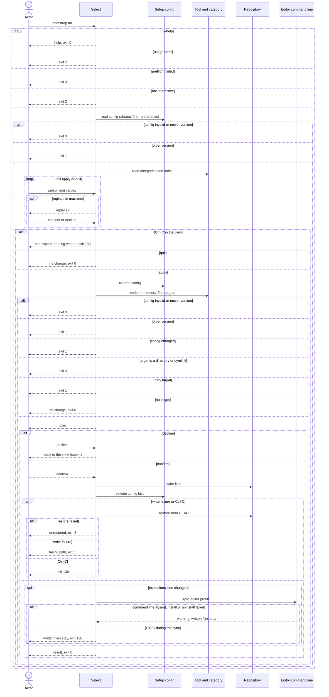

# Flow: Select tools

## Purpose

`bootstrap tui` opens one view of every tool category with its tools and the
recorded values of a repository. Serves:
[Fast new-repo setup](../../../product.md#goal-fast-setup)

## Trigger & Actors

| Actor                                  | May trigger                 | Authorization                         | Audit-recorded                          |
| -------------------------------------- | --------------------------- | ------------------------------------- | --------------------------------------- |
| Repo owner (interactive terminal only) | the command `bootstrap tui` | write access to the working directory | no, the product has no audit foundation |

## Steps

### Exits

Every refusal below writes nothing. Checked in this order; the first that fails
decides the exit code.

| Condition                                                                                                                                                                                                   | Exit | Message / next command                                                                                                                                                                |
| ----------------------------------------------------------------------------------------------------------------------------------------------------------------------------------------------------------- | ---- | ------------------------------------------------------------------------------------------------------------------------------------------------------------------------------------- |
| `--help`, also with other flags or arguments (help wins)                                                                                                                                                    | 0    | the tui help, which states that tui takes no flags or arguments besides `--help`                                                                                                      |
| A usage error: any argument, or any flag other than `--help` (for example `-h`, `--json`, `--quiet`, `--version`, `--no-color`, `-y`, `--tool`); all usage errors are found together                        | 2    | the short usage naming every usage error found; no JSON result is printed                                                                                                             |
| No git repository, or `mise` not on the `PATH` (preflight, as [Set up a repository](../110-setup-repository/index.md) step 1)                                                                               | 3    | the preflight message of [errors](../../../conventions.md#errors)                                                                                                                     |
| Not interactive (stdin or stdout not a terminal)                                                                                                                                                            | 2    | "tui needs an interactive terminal — use `bootstrap init`/`add`/`remove`"                                                                                                             |
| Setup file fails [Setup config validity](../../../entities/setup-config/index.md#validity)                                                                                                                  | 3    | newer: "upgrade bootstrap"; schema failure: the failing field and "fix the file, then run again"; selection failure: names the fix (for example "remove `oldtool` from values.tools") |
| Recorded `version` older than the running cli                                                                                                                                                               | 1    | next command `bootstrap init`                                                                                                                                                         |
| Setup file changed since the view opened (checked at apply): the content differs from the bytes read when the view opened, or the file appeared or vanished; a touch with identical content is not a change | 1    | the view closes; "setup file changed — run `bootstrap tui` again" (result per step 9)                                                                                                 |
| A target is a directory or symlink (checked before dirty targets, also when both are found)                                                                                                                 | 3    | names every such path, per [safety](../../../conventions.md#safety) precedence                                                                                                        |
| A target is not clean per [safety](../../../conventions.md#safety)                                                                                                                                          | 1    | the view closes; lists the paths                                                                                                                                                      |
| The actor quits without applying, or no target (selection and values unchanged, the render matches the working copy, and no repair; bookkeeping alone is not a change)                                      | 0    | "no change", then the `orphaned` paths of the recorded render ([safety](../../../conventions.md#safety))                                                                              |

1. Tui takes no argument and no flag except `--help` ([exits](#exits)). Color
   follows [Terminal UX](../../../design-system.md#terminal-ux).
2. The warning for `mise` not at `~/.local/bin/mise` is printed once on stderr
   before the view opens and is repeated in the result `warnings`.
3. Tui reads `.config/bootstrap.yaml`. With the file absent, tui opens in
   first-run mode, not an exit: the view is pre-filled with the first-run
   defaults, per [Terminal UX](../../../design-system.md#terminal-ux). A
   recorded `format` older than the running cli's is read per
   [write format](../../../entities/setup-config/index.md#write-format). A
   `values.tools` that misses an unremovable tool, or a dependency that a
   selected tool needs and `values.dependencies` lacks, is handled per
   [repair on read](../../../entities/setup-config/index.md#repair); the warning
   goes in `warnings`. A recorded tool name that the catalog lists in a tool's
   `renamed_from` is read as the new name and rewritten under it, with the
   warning "renamed tool `<old>` to `<new>`" in `warnings`; the rename is a
   repair, listed in the plan, and needs consent even when it is the only
   change. The warning for a missing dependency is reported only when the
   selection after the request needs it (the condition of step 7).
   [Setup config](../../../entities/setup-config/index.md)
4. Tui opens the view: every
   [Tool category](../../../entities/tool-category/index.md) as a group with its
   tools from the [Tool](../../../entities/tool/index.md) catalog, the tools in
   `values.tools` checked (on a first run, the default tools of step 3). Hidden
   tools and categories whose every tool is hidden are not shown, and a hidden
   tool is never listed in the view, the plan or the result tool lists;
   unremovable tools are selected with no `none` choice and are replaced in
   place (step 5), per [Tool](../../../entities/tool/index.md). Each tool row
   shows the tool's `purpose` after its name, in the muted role, for example
   `[x] dprint  Formats code and documents`; a category row keeps its purpose. A
   tool with several `categories` appears in each of its category groups, with
   the same state in all of them. Suggestions: a tool detected from a manifest
   in the repository (for example `pubspec.yaml` → `flutter`,
   `settings.gradle.kts` → `kotlin`, `Package.swift` → `swift`, `pyproject.toml`
   → `ruff`) that is not selected is shown with the word `suggested` after its
   purpose, in the muted role, like the `dependency` mark and never by color
   alone. A suggestion is never selected automatically and writes nothing until
   the actor checks it. A dependency (a tool a selected tool needs that the
   actor did not select) appears, marked `dependency`, in the tree of each
   selected tool that needs it. Every dependency (a runtime, a package manager,
   or a plain requirement such as `dprint` for `taplo` or `jq` and `yq` for
   `claude`) is also shown as its own row, checked, with the word `dependency`
   after its purpose in the muted role, so the actor can uncheck it (step 5). A
   dependency held in a `max: one` category is out of scope: the 1.0 catalog
   cannot reach it. Groups, keys, marks and the terminal-size rule follow
   [Terminal UX](../../../design-system.md#terminal-ux). Ctrl-C at any moment in
   the view writes nothing, exits 130 and prints no result, per
   [errors](../../../conventions.md#errors).

   Dependency tree. Under each selected (checked) tool the view shows the full
   tree of its required tools, nested by `requires`, one child per requirement:
   the required tool, or for an engine requirement the runtime linked to it (the
   engine's default runtime when none is selected yet)
   ([Requires and dependencies](../../../entities/tool/index.md#requires-and-dependencies)).
   The mark `dependency` never carries meaning by color alone. A direct tool
   appears unmarked and does not expand. Repeats of dependencies are shown (the
   tree is not deduplicated). Unselected rows and dependency rows show no tree
   of their own. The exact form (pinned):

   ```text
   formatter  Formats the repository's files
     [x] dprint  Formats code and documents
     [x] taplo  Formats TOML files, run by dprint
         └─ dprint
   linter  Finds errors in code
     [x] virajp-linter  Lints code with the house rules
         └─ node  dependency
   runtime  Language runtimes and command-line helpers that other tools run on
     [x] node  JavaScript runtime  dependency
   ```

   Tree lines are not selectable: focus moves over tool rows only, under the
   existing focus rules of [Terminal UX](../../../design-system.md#terminal-ux).
5. Actor changes the selection per this table. The consent prompt is the one of
   [Terminal UX](../../../design-system.md#terminal-ux); declining keeps the old
   choice. A "none" choice is listed in the apply plan and its single confirm
   covers it.

   | Case                                     | Replace another tool?                                             | Choose "none"?           | Consent prompt?                       |
   | ---------------------------------------- | ----------------------------------------------------------------- | ------------------------ | ------------------------------------- |
   | `max: one`, held tool `removable: true`  | yes                                                               | yes, a removal           | yes, on a replacement; none on "none" |
   | `max: one`, held tool `removable: false` | yes, in place: `git` and `pre-commit` are replaced, never removed | not offered              | yes, on a replacement                 |
   | `max: many`                              | n/a, a tool is unchecked                                          | n/a, a tool is unchecked | none                                  |

   [Tool category](../../../entities/tool-category/index.md)

   Checking or unchecking a tool of several categories does it in all its
   category groups. Selecting a tool whose `host_os` is not the running host's
   is refused in place with "`<tool>` needs macOS" (the OS named by `host_os`);
   the view stays open and the selection is unchanged. A recorded tool of such a
   `host_os` stays checked, and may be unchecked.

   Dependencies. The requires check uses the selection as it stands after the
   change ([Tool](../../../entities/tool/index.md#requires-and-dependencies)):
   - Selecting a tool whose requirements are not met is not refused: each unmet
     tool requirement adds that tool, and each unmet engine requirement the
     engine's default runtime, as a dependency of it, shown marked `dependency`
     in the tool's tree.
   - Making a checked dependency direct is out of scope in the tui (`add` does
     it, [Add a tool](../140-add-tool/index.md) step 3).
   - Unchecking a tool (direct or dependency) that other selected tools would
     dangle without follows the
     [Dangling rule](../../../entities/tool/index.md#requires-and-dependencies):
     the tui asks in place "remove `<parents>` too? y/N" (`<parents>` every
     direct tool that would dangle, transitively, in Catalog order, joined by
     `,`; for `node`, also `pnpm` and `yarn` when selected). Yes unchecks them
     all, and every dependency that would dangle leaves with them; no (the
     default) restores the selection as it was, the tool checked again. When one
     of the parents is unremovable (`pre-commit` for `python`), no prompt is
     asked: the change is refused in place with "cannot deselect `<tool>`:
     needed by `<parents>`" and the selection is unchanged.
   - Unchecking a runtime while another runtime of the same engine stays
     selected for each of its parents is allowed with no prompt; at apply their
     links move to that runtime.
   - Deselecting the last parent of a dependency leaves the dependency without a
     parent; it is pruned at apply and listed in the plan (step 7), not in the
     view.
   - Checking another runtime of a `max: one` engine
     ([Engines](../../../entities/tool/index.md#engines)) while one is held (for
     example `temurin` while `openjdk` is held) is a replacement: the tui asks
     "replace `<old>` with `<new>`?" in place, as in a `max: one` category; yes
     moves the engine links to the new runtime and the held one leaves as with
     `add --replace` below, no keeps the old one.
   - Checking another runtime of a `max: many` engine that a held runtime meets
     (for example `bun` while `node` meets `effect`'s `javascript` engine) keeps
     both: the held one keeps its links and the checked one is direct; nothing
     is pruned and there is no replacement.
   - A `max: many` engine runtime replacement has no prompt of its own: the
     actor checks the new runtime (both kept), then unchecks the held one, which
     is allowed because another runtime of the engine is selected. At apply the
     engine links move to the new runtime and the held one leaves the selection
     as with `add --replace` ([Add a tool](../140-add-tool/index.md) step 4):
     pruned if only a dependency, out of `values.tools` if direct, its files
     removed (`create_only` kept), and `replaced` lists `{from, to}`. When
     another selected tool requires the held runtime itself (for example `pnpm`
     requiring `node`), unchecking it asks the dangling prompt above instead.
   - A change to a dependency held in a `max: one` category (its replacement, or
     `none` in its radio group) is out of scope: the 1.0 catalog cannot reach
     it.
   - A replacement in a `max: one` category that would leave a selected tool
     dangling is refused in place with the message "cannot replace `<tool>`:
     needed by `<parents>`"; no consent prompt is shown and the selection is
     unchanged.
6. Actor shows and edits the recorded values (repo, `values.scopes`,
   `values.members`, merge model for develop and main) in the values section,
   with the validation rules of
   [Set up a repository](../110-setup-repository/index.md) step 3; an invalid
   value is refused in place with the rule. A scope has a kebab-case `name` and
   a required `description`; the actor adds a scope, edits a scope's
   description, or removes a scope. A member is a `path`; its slug is derived
   (the folder name lowercased, other characters → `-`); the actor adds or
   removes a member, and a path whose slug another member already has is refused
   in place. When `origin` is not readable on a first run the repo value is
   empty, and apply is refused in place until a valid repo value is entered.
   [Setup config](../../../entities/setup-config/index.md)
7. Actor applies. Tui first re-reads `.config/bootstrap.yaml`, then computes the
   full render for the new selection and values in memory and finds the targets
   per [safety](../../../conventions.md#safety); the setup file is a target
   ([Setup config](../../../entities/setup-config/index.md)). The re-read
   applies the [exits](#exits) in table order from the Validity row (exit 3) and
   the version guard (exit 1) on, and the view closes on any of them, as the
   diagram shows. If none of the [exits](#exits) applies, it shows the plan
   (create, change, delete, unchanged, kept, orphaned, replacements, value
   changes, and the dependencies added or pruned) and asks once to confirm.
   Bookkeeping alone is never a change: a recorded path the running cli no
   longer renders and that is absent on disk, a stale recorded dependency (a
   name the running catalog has) that no tool of the selection needs (its
   parents not lost by this request), and a wrong parent list in
   `values.dependencies` make no target and no plan on their own, so with
   nothing else different tui writes nothing, asks no consent and exits 0 "no
   change". When apply writes for another change (a tool, a value, a repair or a
   file change), it also drops the stale path, prunes the stale dependency (its
   files deleted and reported as usual, listed in `dependencies_pruned`) and
   corrects the parent lists. A dependency left without a parent by the request
   itself is a real change, pruned and planned as before. Repairs apply only to
   the dependencies the selection after the request needs: a missing dependency
   the request leaves unneeded is never added back and never reported. A
   `values.dependencies` name the running catalog does not have is not
   bookkeeping: dropping it is a repair, a change in the plan that needs consent
   even alone, with the warning "dropped unknown dependency `<name>`". Declining
   returns to the view (step 4). [Tool](../../../entities/tool/index.md)
8. On confirm, tui writes per [safety](../../../conventions.md#safety). It
   rewrites `.config/bootstrap.yaml` last (values, `values.tools`,
   `values.dependencies` with each dependency's parents, and `files`) and never
   commits. The dependencies are derived from the selection, each with its
   sorted parents, and a dependency no parent needs is pruned (its files deleted
   as for a removed tool). On a first run it renders and writes exactly as a
   first run of [Set up a repository](../110-setup-repository/index.md) does
   (the same targets, safety rules and file modes), and `.config/bootstrap.yaml`
   is created last and listed `created`. A `values.dependencies` name the
   running catalog does not have is dropped on this rewrite as a repair (a
   change in the plan, so apply is not a no-change run) and reported in
   `warnings` as "dropped unknown dependency `<name>`". The drop alone creates
   or changes no `mise` config file, so it does not trigger the next command
   `MISE_ENV=dev mise run setup:all` (per
   [errors](../../../conventions.md#errors)).
   [Setup config](../../../entities/setup-config/index.md)

   After the write, when the apply created or changed `.vscode/extensions.json`,
   tui runs the editor's command line once to sync the `REPO_NAME` profile (the
   editor profile named by the repository's `REPO_NAME` value) to it (every
   listed extension installed, every extension no selected tool lists
   uninstalled), per [errors](../../../conventions.md#errors). The editor's
   command line absent from the `PATH`, or a failed install or uninstall, is a
   warning in `warnings`; the apply still exits 0.
9. On every exit after the view closes except an interrupt (quit, no change, a
   refused apply, a failure, success), tui prints its human result, warnings
   included, in the result layout of
   [Terminal UX](../../../design-system.md#terminal-ux). A successful apply
   prints the result groups in this order: `added`, `removed`,
   `dependencies_added`, `dependencies_pruned`, `replaced` (a list of
   `{from, to}`), `values_changed` (`{name, from, to}` sorted by name),
   `created`, `changed`, `deleted`, `unchanged`, `kept`, `orphaned` and
   `warnings`, with the meanings of [Add a tool](../140-add-tool/index.md) and
   [Remove a tool](../150-remove-tool/index.md); `added` and `removed` list only
   the tools the actor selected or deselected directly, while
   `dependencies_added` and `dependencies_pruned` list the dependencies that
   entered or left `values.dependencies`. The next command
   `MISE_ENV=dev mise run setup:all` is printed per
   [errors](../../../conventions.md#errors) (a tool added, direct or dependency,
   a replacement, a repair that adds a tool or a first run included, or a
   created, changed or deleted `mise` config file), so an apply that only adds
   dependencies prints it; the drop of an unknown dependency alone does not;
   otherwise no next command is printed and the human result has none. On a
   first run `added` lists the direct tools only, `dependencies_added` lists the
   dependencies and `values_changed` lists every value (repo, scopes, members,
   merge_model.develop, merge_model.main) as `{name, from: null, to}` sorted by
   name. A successful apply exits 0. The result ends with its closing hint per
   [errors](../../../conventions.md#errors). The result is human text only; tui
   never prints a JSON result.

## Guarantees

| Step / group                                                 | Consistency                                                         | On failure                                                                                                                                                                                                                                                                                                 | Idempotency                                                             | Load & latency          |
| ------------------------------------------------------------ | ------------------------------------------------------------------- | ---------------------------------------------------------------------------------------------------------------------------------------------------------------------------------------------------------------------------------------------------------------------------------------------------------- | ----------------------------------------------------------------------- | ----------------------- |
| 1–7 (the view, the re-read, the render and the target check) | atomic, nothing is written                                          | none, nothing written yet; exit 0, 1, 2, 3 or 130 per step                                                                                                                                                                                                                                                 | n/a, a re-run starts from the same repo state                           | n/a, one local command  |
| 8 (apply)                                                    | atomic, all-or-nothing per [safety](../../../conventions.md#safety) | a write failure or an interrupt restores every target from `HEAD` and deletes every created file per [baseline](../../../conventions.md#baseline) atomic-multi-write and graceful-shutdown; exit 3 naming the failing path, or 130; a failed restore exits 3 listing the paths not restored (`unrestored`) | a re-run with the same selection and values finds no change and exits 0 | n/a, one local command  |
| editor profile sync (after step 8)                           | best effort , outside the repository, not atomic                    | a failed editor command line, install or uninstall is a warning, the written files stay, exit 0; an interrupt stops the sync, the written files stay, exit 130 ([errors](../../../conventions.md#errors))                                                                                                  | n/a , runs only after a write that changed `.vscode/extensions.json`    | n/a , one local command |
| 9                                                            | atomic, output only                                                 | none, changes no repo state                                                                                                                                                                                                                                                                                | n/a                                                                     | n/a, one local command  |

## Diagram



## Background Jobs

N/A, runs synchronously in one command invocation.

## Acceptance

- Given a git repository with `mise` on the `PATH` and stdin or stdout not a
  terminal, when `bootstrap tui` runs, then nothing is written and the exit code
  is 2.
- Given any argument (for example `bootstrap tui foo`) or any flag other than
  `--help` (for example `-h`, `--json`, `--quiet`, `--version`, `--no-color`,
  `--verbose`, `-y`, `--dry-run`, `--tool` or `--repo`), when `bootstrap tui`
  runs, then nothing is written, the short usage names every usage error found,
  no JSON result is printed and the exit code is 2.
- Given `bootstrap tui --help --json` or `bootstrap tui --help foo`, when it
  runs, then it prints the tui help and exits 0.
- Given `bootstrap tui --help` in any terminal, when it runs, then it prints the
  tui help stating that tui takes no flags or arguments besides `--help`, writes
  nothing and exits 0, even outside a git repository.
- Given a flag tui does not accept in a directory that is not a git repository,
  when `bootstrap tui` runs, then the exit code is 2, not 3.
- Given a terminal under 80x24, when the view would open, then "make the
  terminal larger" is shown and tui waits for a resize; Ctrl-C exits 130.
- Given a successful apply, when tui finishes, then the result is human text
  only and no JSON result is printed.
- Given a repository that is not set up and a non-interactive run, when tui
  runs, then the exit code is 2.
- Given `mise` at a path other than `~/.local/bin/mise`, when tui runs and
  applies, then one warning is printed on stderr before the view opens and the
  result `warnings` repeats it.
- Given a recorded `values.tools` that misses an unremovable tool and no other
  tool of its `max: one` category is recorded, when tui runs, then the tool
  shows selected, and the result `warnings` reports "added back unremovable tool
  `<name>`". Given two tools of one `max: one` category or an unknown tool name,
  then nothing is written and the exit code is 3 naming the fix. Given a
  selected tool whose required tool is in neither `values.tools` nor
  `values.dependencies`, then it is not a failure: the dependency is added back,
  "added back dependency `<name>`" is reported in `warnings`, and the view shows
  it marked `dependency` in the tool's tree.
- Given no `.config/bootstrap.yaml` in an interactive terminal, when tui runs,
  then the view opens with the default tools and the origin-derived repo
  pre-filled, the dependencies marked `dependency` in the trees under the
  default tools that need them (for example under `(•) pre-commit` the lines
  `├─ python  dependency`, `└─ uv  dependency` and, nested under `uv`,
  `└─ python  dependency`), with no `needs` or `also needed by` note; every
  dependency (`python`, `uv`, `node`, `jq`, `yq`) also shows as a checked row
  marked `dependency`; when the actor applies and confirms, then the files of
  the selected tools and `.config/bootstrap.yaml` are written, the exit code is
  0, the next command is `MISE_ENV=dev mise run setup:all`, `added` lists the
  direct tools only, `dependencies_added` lists the dependencies, and
  `values_changed` lists repo, scopes, members, merge_model.develop and
  merge_model.main as `{name, from: null, to}` sorted by name.
- Given no `.config/bootstrap.yaml` and no readable origin, when the actor
  applies, then apply is refused in place until a valid repo value is entered.
- Given no `.config/bootstrap.yaml`, when the actor quits without applying, then
  nothing is written, no setup file is created and the exit code is 0 with "no
  change".
- Given a recorded version older than the running cli, when tui runs, then the
  exit code is 1 and the next command is `bootstrap init`.
- Given a setup file failing Setup config validity, or a newer recorded version,
  when tui runs, then nothing is written and the exit code is 3.
- Given the catalog holds the hidden tool `mise` and the `tool-manager`
  category, when the view opens, then neither is shown, and no tool list of the
  plan or the result names `mise`; the paths of its files are listed like any
  path.
- Given tool rows in the view, when it opens, then each tool row shows the
  tool's `purpose` after its name in the muted role (for example
  `[x] dprint  Formats code and documents`), and a category row keeps its
  purpose.
- Given `git` or `pre-commit` (`removable: false`), when the view opens, then it
  shows selected, its category offers no "none", and choosing another tool of
  the category asks "replace <old> with <new>?"; declining keeps the old tool.
- Given a `max: one` category holding a tool, when the actor chooses another,
  then tui asks "replace <old> with <new>?"; declining keeps the old tool.
- Given a `max: one` category holding a removable tool, when the actor chooses
  "none", then no consent prompt is asked, the apply plan lists the removal, the
  single confirm covers it, and on success the tool is in `removed`, not in
  `replaced`.
- Given a `values.dependencies` name the running catalog does not have, when the
  actor applies, then the drop is a repair listed in the plan that needs the
  confirm even alone; on confirm the name is dropped from `values.dependencies`
  on the rewrite, `warnings` reports "dropped unknown dependency `<name>`", and
  with no other change the result prints no next command.
- Given a selection change, when the actor quits without applying, then nothing
  is written and the exit code is 0 with "no change".
- Given a selection change, when the actor applies and declines the plan, then
  the view returns with the selection intact and nothing is written.
- Given `effect` unchecked and no `javascript` runtime selected, when the actor
  selects `effect`, then it is not refused, the row shows the tree
  `└─ node  dependency`, the `node` row shows checked and marked `dependency`,
  and after apply `values.tools` lists `effect`, `values.dependencies` records
  `node` with parents `[effect]`, `added` lists `effect` and
  `dependencies_added` lists `node`.
- Given `taplo` selected with `dprint` a dependency, when the view opens, then
  the `dprint` row is checked and marked `dependency`; when the actor unchecks
  it, then "remove `taplo` too? y/N" is asked; y unchecks both and after apply
  `removed` lists `taplo` and `dependencies_pruned` lists `dprint`.
- Given `kotlin` selected with `openjdk` its dependency, when the actor checks
  `temurin`, then "replace `openjdk` with `temurin`?" is asked; y moves
  `kotlin`'s link to `temurin` and after apply `replaced` lists
  `{from: openjdk, to: temurin}`; n keeps `openjdk` and leaves `temurin`
  unchecked.
- Given the pinned example view, when the actor moves focus, then it moves over
  the tool rows only and never lands on a tree line.
- Given `effect` selected and `node` meeting its `javascript` engine, when the
  actor checks `bun` and applies, then both are kept: `bun` is in
  `values.tools`, `node` keeps its parents and files, nothing is pruned and
  `replaced` is empty. Given the actor then unchecks `node`, then no prompt is
  asked and the change is allowed; on apply `effect`'s link moves to `bun`,
  `node` leaves the selection and `replaced` lists `{from: node, to: bun}`.
- Given `effect` and `pnpm` selected and `node` their only `javascript` runtime,
  when the actor unchecks `node`, then "remove `pnpm`, `effect` too? y/N" is
  asked in place (Catalog order); answering y unchecks all three and after apply
  `removed` (or `dependencies_pruned` for `node` when it was a dependency) lists
  them; answering n (or Enter) leaves `node`, `effect` and `pnpm` checked as
  before.
- Given `effect`, `pnpm` and `bun` selected and `node` selected directly, when
  the actor unchecks `node`, then the prompt names `pnpm` only.
- Given `pre-commit` selected with `python` its dependency, when the actor
  unchecks `python`, then no prompt is asked, the change is refused in place
  with "cannot deselect `python`: needed by `pre-commit`" (an unremovable
  parent) and the view stays open.
- Given `taplo` and `dprint` selected, when the actor unchecks `dprint`, then
  "remove `taplo` too? y/N" is asked; when the actor instead unchecks `taplo`
  and then `dprint`, then no prompt is asked for either, because the check uses
  the selection after each change.
- Given a dependency whose last parent is deselected, when the actor applies,
  then the plan lists the dependency as pruned, its files are deleted,
  `values.dependencies` no longer records it, and the result lists it in
  `dependencies_pruned`, not in `removed`.
- Given a target that is modified, staged, untracked or ignored (the setup file
  included), when the actor applies, then the view closes, nothing is written
  and the exit code is 1 listing the paths.
- Given a target that is a directory or symlink, when the actor applies, then
  nothing is written and the exit code is 3 naming the path, also when dirty
  targets are found together.
- Given `.config/bootstrap.yaml` changed after the view opened (its content
  differs from the bytes read when the view opened, or it appeared or vanished),
  when the actor applies, then nothing is written and the exit code is 1 "setup
  file changed — run `bootstrap tui` again". Given a touch with identical
  content, then it is not a change and apply proceeds.
- Given the selection and values are unchanged, when the actor applies, then
  nothing is written and the exit code is 0 "no change". Given an unchanged
  selection but a render that differs from the working copy, then the differing
  paths are targets and the plan is shown.
- Given a removable tool deselected, when apply succeeds, then its files that
  are not `create_only` are deleted, shared files are reported `changed` and
  `values.tools` drops it.
- Given a replacement consented in a `max: one` category, when apply succeeds,
  then the files are swapped and `replaced` lists `{from, to}`.
- Given a recorded path the running cli does not render and that is present on
  disk, when apply succeeds, then it is not deleted, it stays in `files` and the
  result lists it `orphaned`.
- Given only bookkeeping (a recorded path not rendered and absent on disk, a
  stale dependency the catalog has that no selected tool needs, or a wrong
  parent list), when the actor applies, then nothing is written, no prompt is
  asked, "no change" is printed and the exit code is 0. Given the same
  bookkeeping and another change, when apply succeeds, then the stale path is
  dropped, the stale dependency is pruned (listed in `dependencies_pruned`) and
  the parent lists are corrected.
- Given a missing dependency that the selection after the request leaves
  unneeded, when apply succeeds, then it is not added back and not reported.
- Given only a repo or merge-model value changed, when apply succeeds, then the
  exit code is 0 and `values_changed` lists `{name, from, to}` sorted by name.
- Given a set-up repository and an apply with no tool added, no repair and no
  `mise` config file created, changed or deleted, when the apply succeeds, then
  the result prints no next command and the exit code is 0.
- Given a set-up repository, when the actor applies a change whose only addition
  is one or more dependencies (no direct tool added, no replacement, no repair),
  then `dependencies_added` lists them, the result prints the next command
  `MISE_ENV=dev mise run setup:all` per [errors](../../../conventions.md#errors)
  and the exit code is 0.
- Given a failed restore after a write failure, when tui runs, then the exit
  code is 3 listing the paths not restored.
- Given an edited repo or merge-model value, when the actor applies and
  confirms, then every rendered file that uses the value shows the new value and
  the setup file records it.
- Given an invalid value (for example a merge model `squash`), when the actor
  enters it, then it is refused in place with the rule and the view stays open.
- Given a deselected tool with a `create_only` file, when the actor applies,
  then the file stays, it is reported `kept` and it is not deleted.
- Given a tool added in the view, when apply succeeds, then its files exist,
  `values.tools` lists it, the result prints `added` and the next command
  `MISE_ENV=dev mise run setup:all`, and a re-run of `bootstrap init -y` reports
  every file `unchanged`.
- Given a write failure injected mid-apply, when the actor confirms, then the
  repository is byte-identical to before and the exit code is 3 naming the
  failing path.
- Given an interrupt (Ctrl-C) in the view or during the write, when tui is
  running, then the repository is byte-identical to before and the exit code
  is 130.
- Given `mise` not on the `PATH`, or no git repository, when tui runs, then
  nothing is written and the exit code is 3.
- Given a `max: one` category whose direct held tool a selected tool still
  needs, with no other way to meet that requirement, when the actor chooses
  another tool of the category, then no consent prompt is shown, "cannot replace
  `<tool>`: needed by `<parents>`" is shown, and the selection is unchanged (no
  1.0 catalog tool reaches this case).
- Given a `pubspec.yaml` in the repository and `flutter` unselected, when the
  view opens, then `flutter` shows the muted word `suggested` and is unchecked;
  when the actor applies without checking it, then `flutter` is not recorded.
- Given a tool with several categories, when the actor checks it in one group,
  then it is checked in every group it appears in; unchecking it in one group
  unchecks it in all.
- Given a tool whose `host_os` is `macos` on a host that is not macOS, when the
  actor selects it, then "`<tool>` needs macOS" is shown in place, the selection
  is unchanged and the view stays open; given the tool already recorded, then it
  shows checked.
- Given a scope with a name that is not kebab-case or an empty description, when
  the actor enters it in the values section, then it is refused in place with
  the rule; given a valid scope, then it is added, its description can be edited
  and it can be removed.
- Given a member path whose slug another member already has, when the actor adds
  it, then it is refused in place and the view stays open.
- Given a recorded tool name that the catalog lists in `renamed_from`, when tui
  runs and the actor applies, then the view shows the new name checked, the file
  is rewritten under the new name and `warnings` reports "renamed tool `<old>`
  to `<new>`".
- Given a recorded old tool name and no other change, when the actor applies,
  then the rename is a repair listed in the plan that needs the confirm; on
  confirm the setup file is rewritten under the new name and the exit code is 0;
  declining returns to the view and nothing is written.
- Given a successful apply that overwrote files, when tui finishes, then the
  result ends with the closing line, then the hint "review `git diff`; restore
  your own lines with `git restore -p <file>`".
- Given an apply that created or changed `.vscode/extensions.json`, when it
  succeeds, then tui runs the editor's command line once to sync the `REPO_NAME`
  profile; given that command line is absent, then `warnings` reports it and the
  exit code is 0.
- Given an apply that created or changed `.vscode/extensions.json` and an editor
  command line whose extension install fails, when the apply succeeds, then
  `warnings` has one entry for it, the written files stay and the exit code is
  0.
- Abuse case: n/a, runs locally with the caller's own permissions on the
  caller's own repository; every value is validated per
  [baseline](../../../conventions.md#baseline) boundary-validation.

## References

- [baseline](../../../conventions.md#baseline),
  [safety](../../../conventions.md#safety),
  [errors](../../../conventions.md#errors),
  [config](../../../conventions.md#config)
- [design-system](../../../design-system.md#terminal-ux), Terminal UX
- API surface: N/A, no service project; the flow is a local command
- Screens surface: N/A, cli has no screen platform
