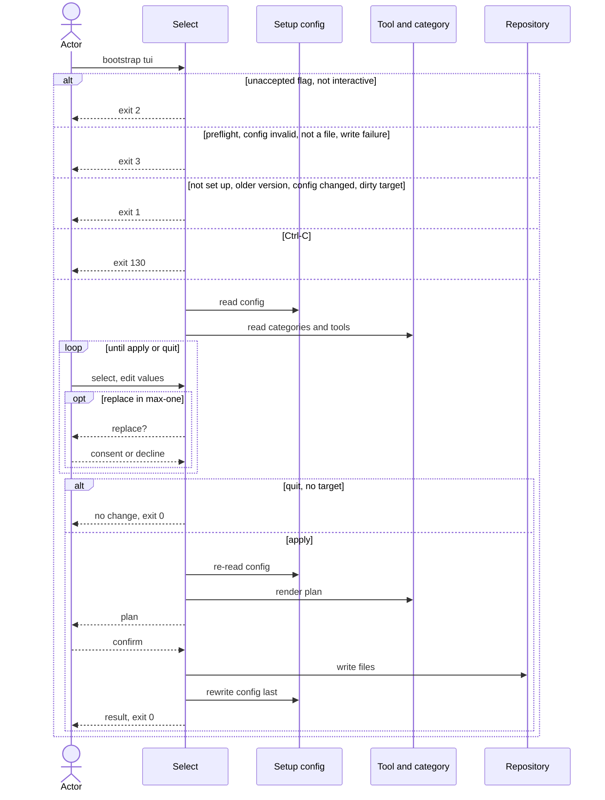

# Flow: Select tools

## Purpose

`bootstrap tui` opens one view of every tool category with its tools and the
recorded values of a repository that is already set up. The owner changes the
selection and the values, reviews one plan and confirms once; the files and the
config then change together, or not at all.

Serves: [Fast new-repo setup](../../../product.md#goal-fast-setup)

## Trigger & Actors

| Actor | May trigger | Authorization | Audit-recorded |
| ----- | ----------- | ------------- | -------------- |
| Repo owner (interactive terminal only) | the command `bootstrap tui` | write access to the working directory | no, the product has no audit foundation |

## Steps

The checks run in this order: usage errors (a flag tui does not accept, `--quiet`
and `--json`, all found together, step 2), then preflight (step 1), then
interactivity (step 2), then the setup file (step 3). The first that fails decides
the exit code. The setup file is checked in this order: validity first (a schema
failure, a newer version or format, two tools of one `max: one` category, an
unknown tool name or an unmet `requires` → exit 3), then the version guard (an
older recorded version → exit 1), then the repair of a missing unremovable tool.

### Exits

Every refusal below writes nothing.

| Condition | Exit | Message / next command |
| --------- | ---- | ---------------------- |
| `--quiet` (a usage error) | 2 | none |
| `--json` (a usage error) | 2 | one JSON result carrying an `error` (what, why, next command `bootstrap add`/`remove`) and `exit` 2 |
| A flag tui does not accept (`-y`, `--dry-run`, `--replace`, `--tool`, `--repo`, `--scope`, `--merge-develop`, `--merge-main`) | 2 | usage error with short usage |
| No git repository, or `mise` not on the `PATH` (preflight, as [Set up a repository](../110-setup-repository/index.md) step 1) | 3 | the preflight message of [errors](../../../conventions.md#errors) |
| Not interactive (stdin or stdout not a terminal) | 2 | "tui needs an interactive terminal — use `bootstrap add`/`remove`" |
| Setup file absent | 1 | "not set up — run `bootstrap init`" |
| Recorded `version` older than the running cli | 1 | next command `bootstrap init` |
| Setup file fails [Setup config validity](../../../entities/setup-config/index.md#validity), or recorded `version` newer than the running cli | 3 | newer: "upgrade bootstrap"; schema failure: names the failing field and "fix the file, then run again" (as [Set up a repository](../110-setup-repository/index.md) step 2) |
| Validity failure of the selection: two tools of one `max: one` category (including an unremovable tool missing while another tool of its `max: one` category is recorded), a tool name the running catalog does not have, or a tool whose `requires` is not selected | 3 | names the fix (for example "remove `fnox` from values.tools") |
| Setup file changed since the view opened (checked at apply) | 1 | the view closes; "setup file changed — run `bootstrap tui` again" (result per step 10) |
| A target is a directory or symlink (checked before dirty targets, also when both are found) | 3 | names every such path, per [safety](../../../conventions.md#safety) precedence |
| A target is not clean per [safety](../../../conventions.md#safety) | 1 | the view closes; lists the paths |
| No target (selection and values unchanged and the render matches the working copy) | 0 | "no change" |

1. Tui runs the preflight as [Set up a repository](../110-setup-repository/index.md) step 1 and
   [errors](../../../conventions.md#errors); the warning for `mise` not at
   `~/.local/bin/mise` also goes in the result `warnings` (step 10).
2. Tui takes no flag besides the global display flags of
   [Terminal UX](../../../design-system.md#terminal-ux). `--no-color` is honored in the view.
   `--verbose` shows each per-file decision in the plan. Refusals exit per
   [exits](#exits).
3. Tui reads `.config/bootstrap.yaml`; refusals exit per [exits](#exits). A recorded
   `format` older than the running cli's is read, never refused, and upgraded on the
   next write. Repair: a recorded `values.tools` that misses an unremovable tool → the
   tool is added again and the warning "added back unremovable tool `<name>`" is
   reported (`warnings`), only when no other tool of its `max: one` category is
   recorded.
   [Setup config](../../../entities/setup-config/index.md)
4. Tui opens the view: every [Tool category](../../../entities/tool-category/index.md)
   as a group with its tools from the [Tool](../../../entities/tool/index.md) catalog,
   the tools in `values.tools` checked. A `max: one` category
   is a radio group with a "none" choice; a `max: many` category is a checkbox group.
   A tool with `removable: false` shows selected and locked, and "none" is not offered
   in a category whose selected tool is unremovable. Layout, keys and marks follow
   [Terminal UX](../../../design-system.md#terminal-ux). A terminal under 80x24
   shows "make the terminal larger" instead of the view and waits for a resize
   (Ctrl-C exits 130). Ctrl-C at any moment in the view writes nothing, prints
   "interrupted — nothing written", exits 130 and prints no result.
5. Actor changes the selection per this table. The consent prompt is "replace <old>
   with <new>?" at that moment; declining keeps the old choice. A "none" choice is
   listed in the apply plan and its single confirm covers it.

   | Case | Replace another tool? | Choose "none"? | Consent prompt? |
   | ---- | --------------------- | -------------- | --------------- |
   | `max: one`, held tool `replaceable: true` | yes | per `removable` | yes, on a replacement |
   | `max: one`, held tool `replaceable: false` | no, the other tools of the category are locked | per `removable` | none |
   | `max: one`, held tool `removable: true` | per `replaceable` | yes, a removal | no, on "none" |
   | `max: one`, held tool `removable: false` | no, locked (an unremovable tool is never replaceable, [Tool](../../../entities/tool/index.md) invariant 7) | not offered | none |
   | `max: many` | n/a, `replaceable` has no effect | n/a, a tool is unchecked | none |

   The requires check uses the selection as it stands after the change: selecting a
   tool whose `requires` tool is not selected, or deselecting a tool that another
   selected tool still requires, is refused in place with a message naming the
   dependency.
   [Tool category](../../../entities/tool-category/index.md)
6. Actor shows and edits the recorded values (repo, commit scopes, merge model for
   develop and main) in the values section, with the validation rules of
   [Set up a repository](../110-setup-repository/index.md) step 3; an invalid value is
   refused in place with the rule. [Setup config](../../../entities/setup-config/index.md)
7. Actor applies. Tui first re-reads `.config/bootstrap.yaml`, then computes the full
   render for the new selection and values in memory and finds the targets per
   [safety](../../../conventions.md#safety); the setup file is a target. Refusals and no target exit per
   [exits](#exits). Otherwise it shows the plan (create, change,
   delete, unchanged, kept, orphaned, replacements, value changes) and asks once to
   confirm. Declining returns to the view (step 4).
   [Tool](../../../entities/tool/index.md)
8. Actor quits without applying → nothing is written, exit 0, the result is "no change"
   (step 10).
9. On confirm, tui writes per [safety](../../../conventions.md#safety), as
   [Add a tool](../140-add-tool/index.md) and [Remove a tool](../150-remove-tool/index.md)
   do. It rewrites `.config/bootstrap.yaml` last (values, `values.tools` and `files`)
   and never commits. [Setup config](../../../entities/setup-config/index.md)
10. On every exit after the view closes except an interrupt (quit, no change, a refused
    apply, a failure, success), tui prints its result with `warnings`; a quit or no target prints "no
    change". A successful apply prints the result with the keys of add and remove, `added`,
    `removed`, `replaced` (a list of `{from, to}`), `created`, `changed`, `deleted`,
    `unchanged`, `kept`, `orphaned` and `warnings`, plus `values_changed`, a list of
    `{name, from, to}` sorted by name. The one next command is
    `MISE_ENV=dev mise run setup:all` when a tool was added, a repair included. A successful apply exits 0.
    The result is human text only; there is no `--json` result on a successful run.

## Guarantees

| Step / group | Consistency | On failure | Idempotency | Load & latency |
| ------------ | ----------- | ---------- | ----------- | -------------- |
| 1–8 (the view, the re-read, the render and the target check) | atomic, nothing is written | none, nothing written yet; exit 0, 1, 2, 3 or 130 per step | n/a, a re-run starts from the same repo state | n/a, one local command |
| 9 (apply) | atomic, all-or-nothing per [safety](../../../conventions.md#safety) | a write failure or an interrupt restores every target from `HEAD` and deletes every created file per [baseline](../../../conventions.md#baseline) atomic-multi-write and graceful-shutdown; exit 3 naming the failing path, or 130; a failed restore exits 3 listing the paths not restored (`unrestored`) | a re-run with the same selection and values finds no change and exits 0 | n/a, one local command |
| 10 | atomic, output only | none, changes no repo state | n/a | n/a, one local command |

## Diagram

## Background Jobs

N/A, runs synchronously in one command invocation.

## Acceptance

- Given stdin or stdout is not a terminal, when `bootstrap tui` runs, then nothing is
  written and the exit code is 2.
- Given `--json`, when `bootstrap tui` runs, then nothing is written, stdout holds one
  JSON result with `exit` 2 and an `error` with `what`, `why` and `next_command`, and
  the exit code is 2.
- Given `--dry-run`, `-y`, `--replace`, `--tool`, `--repo`, `--scope`,
  `--merge-develop` or `--merge-main`, when `bootstrap tui` runs, then nothing is
  written and the exit code is 2 with usage.
- Given `--quiet`, when `bootstrap tui` runs, then nothing is written and the exit
  code is 2.
- Given `--no-color`, when the view opens, then it shows without color. Given
  `--verbose`, when the plan is shown, then it lists each per-file decision.
- Given a flag tui does not accept in a directory that is not a git repository,
  when `bootstrap tui` runs, then the exit code is 2, not 3.
- Given a terminal under 80x24, when the view would open, then "make the terminal
  larger" is shown and tui waits for a resize; Ctrl-C exits 130.
- Given a successful apply, when tui finishes, then the result is human text only
  and no JSON result is printed.
- Given a repository that is not set up and a non-interactive run, when tui runs, then
  the exit code is 2, not 1.
- Given `mise` at a path other than `~/.local/bin/mise`, when tui runs and applies, then
  one warning is printed on stderr before the view opens and the result `warnings`
  repeats it.
- Given a recorded `values.tools` that misses an unremovable tool, when tui runs, then
  the tool shows selected, and the result `warnings` reports "added back unremovable
  tool `<name>`". Given a setup file recorded with an older `format`, then it is read
  and not refused, and the next write records the running cli's format. Given two tools
  of one `max: one` category, an unknown tool name, or a tool whose `requires` is not
  selected, then nothing is written and the exit code is 3 naming the fix.
- Given no `.config/bootstrap.yaml`, when tui runs, then the exit code is 1 and the
  message names `bootstrap init`.
- Given a recorded version older than the running cli, when tui runs, then the exit
  code is 1 and the next command is `bootstrap init`.
- Given a setup file failing Setup config validity, or a newer recorded version, when
  tui runs, then nothing is written and the exit code is 3.
- Given a tool with `removable: false`, when the view opens, then it shows selected and
  locked, its category offers no "none", and the actor cannot deselect it.
- Given a `max: one` category holding a tool with `replaceable: true`, when the actor chooses another, then tui
  asks "replace <old> with <new>?"; declining keeps the old tool.
- Given a `max: one` category holding a removable tool, when the actor chooses "none",
  then no consent prompt is asked, the apply plan lists the removal, the single confirm
  covers it, and on success the tool is in `removed`, not in `replaced`.
- Given a held tool with `replaceable: false` and `removable: true` in a `max: one`
  category, when the actor tries to choose another tool of that category, then the
  other tools are locked and nothing changes; when the actor chooses "none", then it
  is allowed as a removal. Given a `max: many` category, then `replaceable` has no
  effect.
- Given a selection change, when the actor quits without applying, then nothing is
  written and the exit code is 0 with "no change".
- Given a selection change, when the actor applies and declines the plan, then the view
  returns with the selection intact and nothing is written.
- Given a tool whose `requires` tool is not selected, or a selected tool that another
  selected tool requires, when the actor selects or deselects it, then the change is
  refused in place with a message naming the dependency and the view stays open.
- Given `taplo` and `dprint` selected, when the actor deselects `taplo` and then
  `dprint`, then both changes are accepted, because the check uses the selection
  after each change.
- Given a target that is modified, staged, untracked or ignored (the setup file
  included), when the actor applies, then the view closes, nothing is written and the
  exit code is 1 listing the paths.
- Given a target that is a directory or symlink, when the actor applies, then nothing
  is written and the exit code is 3 naming the path, also when dirty targets are found
  together.
- Given `.config/bootstrap.yaml` changed after the view opened, when the actor applies,
  then nothing is written and the exit code is 1 "setup file changed — run
  `bootstrap tui` again".
- Given the selection and values are unchanged, when the actor applies, then nothing is
  written and the exit code is 0 "no change". Given an unchanged selection but a render
  that differs from the working copy, then the differing paths are targets and the plan
  is shown.
- Given a removable tool deselected, when apply succeeds, then its files that are not
  `create_only` are deleted, shared files are reported `changed` and `values.tools`
  drops it.
- Given a replacement consented in a `max: one` category, when apply succeeds, then the
  files are swapped and `replaced` lists `{from, to}`.
- Given a recorded path the running cli does not render, when apply succeeds, then it is
  not deleted, it stays in `files` and the result lists it `orphaned`.
- Given only a repo or merge-model value changed, when apply succeeds, then the exit
  code is 0 and `values_changed` lists `{name, from, to}` sorted by name.
- Given a failed restore after a write failure, when tui runs, then the exit code is 3
  listing the paths not restored.
- Given an edited repo or merge-model value, when the actor applies and confirms, then
  every rendered file that uses the value shows the new value and the setup file
  records it.
- Given an invalid value (for example a merge model `squash`), when the actor enters it,
  then it is refused in place with the rule and the view stays open.
- Given a deselected tool with a `create_only` file, when the actor applies, then the
  file stays, it is reported `kept` and it is not deleted.
- Given a tool added in the view, when apply succeeds, then its files exist, `values.tools`
  lists it, the result prints `added` and the next command `MISE_ENV=dev mise run setup:all`,
  and a re-run of `bootstrap init -y` reports every file `unchanged`.
- Given a write failure injected mid-apply, when the actor confirms, then the repository
  is byte-identical to before and the exit code is 3 naming the failing path.
- Given an interrupt (Ctrl-C) in the view or during the write, when tui is running, then
  the repository is byte-identical to before and the exit code is 130.
- Given `mise` not on the `PATH`, or no git repository, when tui runs, then nothing is
  written and the exit code is 3.
- Abuse case: n/a, runs locally with the caller's own permissions on the caller's own
  repository; every value is validated per [baseline](../../../conventions.md#baseline)
  boundary-validation.

## References

- [baseline](../../../conventions.md#baseline),
  [safety](../../../conventions.md#safety),
  [errors](../../../conventions.md#errors),
  [config](../../../conventions.md#config)
- [design-system](../../../design-system.md#terminal-ux), Terminal UX
- API surface: N/A, no service project; the flow is a local command
- Screens surface: N/A, cli has no screen platform
