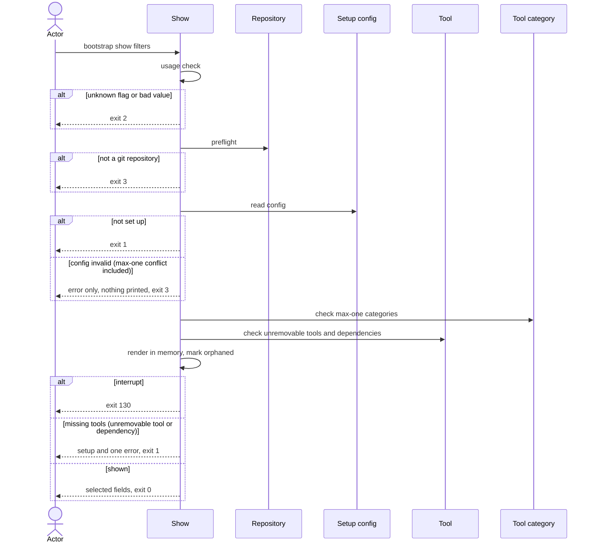

# Flow: Show the setup

## Purpose

`bootstrap show` reads `.config/bootstrap.yaml` and prints the recorded setup.

Serves: [Zero setup drift](../../../product.md#goal-zero-drift)

## Trigger & Actors

| Actor                            | May trigger                                                         | Authorization                        | Audit-recorded                                                       |
| -------------------------------- | ------------------------------------------------------------------- | ------------------------------------ | -------------------------------------------------------------------- |
| Repo owner (any terminal)        | the command `bootstrap show` with optional filters and global flags | read access to the working directory | no — the product has no audit foundation; the command writes nothing |
| AI agent or CI (non-interactive) | `bootstrap show`, usually with `--json`                             | read access to the working directory | no — the product has no audit foundation; the command writes nothing |

## Steps

Flags: one filter per recorded field, several may be given together, none given
means every field.

| Filter              | Field shown                                             |
| ------------------- | ------------------------------------------------------- |
| `--list-scope`      | `values.commit_scopes`                                  |
| `--list-tool`       | `values.tools` (direct tools only, never dependencies)  |
| `--list-dependency` | `values.dependencies`, each dependency with its parents |
| `--list-file`       | `files`                                                 |
| `--repo`            | `values.repo`                                           |
| `--merge-model`     | `values.merge_model` (develop and main)                 |

Global flags per [Terminal UX](../../../design-system.md#terminal-ux): `--json`,
`--quiet` (`-q`), `--verbose` (`-v`), `--no-color`, `--help`. Any other flag is
a usage error.

1. Show checks usage: an unknown flag or a bad flag value exits 2 with short
   usage, before the preflight and before `.config/bootstrap.yaml` is read.
   `--help` is handled here too: `bootstrap show --help` prints the help and
   exits 0 anywhere, before the preflight and without a setup file, per
   [errors](../../../conventions.md#errors).
2. Show runs the preflight: inside a git repository only, else exit 3 "not a git
   repository — run `git init` first". It works at the repository root from a
   subdirectory. `show` is exempt from the `mise` on `PATH` requirement of
   [Set up a repository](../110-setup-repository/index.md) step 1.
3. Show reads `.config/bootstrap.yaml`
   ([Setup config](../../../entities/setup-config/index.md)). Absent → exits 1
   "not set up — run `bootstrap init`". Present → it must satisfy
   [Validity](../../../entities/setup-config/index.md#validity), a `max: one`
   [Tool category](../../../entities/tool-category/index.md) conflict included;
   a failure exits 3 with the error only and nothing printed. The
   [Version guard](../../../entities/setup-config/index.md#version-guard) does
   not apply: an older recorded `version` or `format` is shown as recorded, exit
   0; a newer one fails Validity, exit 3.
4. Show selects the fields: with no filter, `format`, `version`, `values` and
   `files`; with one or more filters, those fields only, in schema order.
5. Show checks the recorded `values.tools` against the
   [Tool](../../../entities/tool/index.md) catalog and derives the needed
   dependencies from the recorded `values.tools` plus every unremovable tool it
   finds missing
   ([Repair on read](../../../entities/setup-config/index.md#repair)) and the
   catalog
   ([Requires and dependencies](../../../entities/tool/index.md#requires-and-dependencies),
   [invariant 8](../../../entities/setup-config/index.md#invariants)). Show
   never repairs: an unremovable tool (`git` or `pre-commit`; never the hidden
   `mise`) missing from `values.tools`, unless another tool of its `max: one`
   category is recorded, or a needed tool missing from `values.dependencies`,
   still prints, and step 7 ends with exit 1. A name in `values.dependencies`
   the running catalog does not have, a dependency no parent needs, a wrong
   parent list, or a name recorded in both `values.tools` and
   `values.dependencies` is printed as recorded, exit 0, no warning.
6. On every run, whatever the filters, show computes in memory the render of the
   recorded `values.tools`, the dependencies derived in step 5 (not the recorded
   `values.dependencies`), every unremovable tool (a tool that step 5 finds
   missing included) and the always-applied hidden tool `mise`, with the
   recorded values, and marks each recorded path in `files` that the running cli
   no longer renders as orphaned
   ([Setup config invariant 4](../../../entities/setup-config/index.md#invariants);
   [safety](../../../conventions.md#safety)). It writes nothing.
7. Show prints the selected fields. It never lists the hidden tool `mise` or the
   `tool-manager` category as a tool or category, in any field or output mode;
   the paths of the `mise` files are listed like any other path in `files`.
   - Human output per [Terminal UX](../../../design-system.md#terminal-ux): one
     group per field; lists one item per line, sorted; `values.dependencies`
     shown one dependency per line as `<name> (<parent>, <parent>)`, e.g.
     `node (dprint, pnpm)`, parents in the recorded (sorted) order;
     `merge_model` as `develop: <v>` and `main: <v>`; zero scopes shows `none`;
     an orphaned path is shown as Terminal UX gives it (in the `files` group,
     else in an `orphaned` group after the other fields).
   - `--json`: one document with `exit`, `warnings` and the requested fields
     under their schema keys (`format`, `version`, `values` with only the
     requested sub-keys, `files`; `--list-dependency` gives the
     `values.dependencies` map of dependency to parents); zero scopes is `[]`;
     always a top-level `orphaned` list (sorted, `[]` when none) of the orphaned
     paths. `warnings` is always `[]`: an orphaned path is listed only in
     `orphaned`.
   - `--quiet` prints nothing on success; the exit code is the answer. On an
     error exit it prints the error only, per Terminal UX (with a missing
     unremovable tool or dependency: no recorded setup, the error, exit 1).
   - On success show prints no next command. Exit 0.
   - When step 5 found a miss, show prints the selected fields, then one error
     per [errors](../../../conventions.md#errors): one clause per kind, "missing
     unremovable tool `<name>`" then "missing dependency `<name>`", each naming
     its names comma-separated in catalog order, the clauses joined by "; ",
     then " — run `bootstrap init`" (for example "missing unremovable tool
     `git`; missing dependency `node`, `pnpm` — run `bootstrap init`"). It exits
     1 with the next command `bootstrap init`; `--json` carries the selected
     fields and `error` with `what` the same clauses, `why` "the setup file
     misses tools that bootstrap needs" and `next_command` `bootstrap init`,
     with `exit` 1.
8. Ctrl-C during the run exits 130 "interrupted — nothing written" per
   [errors](../../../conventions.md#errors).

## Guarantees

| Step / group | Consistency                                        | On failure                                                                                                                                                                           | Idempotency                                                         | Load & latency          |
| ------------ | -------------------------------------------------- | ------------------------------------------------------------------------------------------------------------------------------------------------------------------------------------ | ------------------------------------------------------------------- | ----------------------- |
| all          | atomic — read-only; nothing is written on any exit | none — nothing written, working tree unchanged; exit 1, 2, 3 or 130 (Ctrl-C) per step, per [safety](../../../conventions.md#safety) and [baseline](../../../conventions.md#baseline) | idempotent — a re-run on the same repo state prints the same output | n/a — one local command |

## Diagram

## Background Jobs

N/A — runs synchronously in one command invocation.

## Acceptance

- Given a set-up repository, when `bootstrap show` runs with no filter, then
  `format`, `version`, `values` and `files` are printed, nothing is written and
  the exit code is 0.
- Given a set-up repository, when `bootstrap show --list-scope` runs, then only
  the commit scopes are printed, one per line, sorted, and the exit code is 0.
- Given a set-up repository, when `bootstrap show --list-tool` runs, then only
  the recorded direct tools are printed, one per line, sorted, none of the
  dependencies, and the exit code is 0.
- Given a recorded `values.dependencies` of `node` needed by `dprint` and
  `pnpm`, when `bootstrap show --list-dependency` runs, then only the
  dependencies are printed, one per line, sorted, as `node (dprint, pnpm)`
  (parents in the recorded order), and the exit code is 0; under `--json` the
  document has `values.dependencies` as the map of dependency to parents and no
  other `values` key.
- Given a set-up repository, when `bootstrap show --list-file` runs, then only
  the recorded files are printed, one per line, sorted, and the exit code is 0.
- Given a set-up repository, when `bootstrap show --repo` runs, then only
  `values.repo` is printed and the exit code is 0.
- Given a set-up repository, when `bootstrap show --merge-model` runs, then only
  `develop: <v>` and `main: <v>` are printed and the exit code is 0.
- Given a set-up repository, when `bootstrap show --list-tool --repo` runs, then
  only those two fields are printed, in schema order whatever the flag order,
  and the exit code is 0.
- Given a set-up repository, when `bootstrap show --json` runs, then exactly one
  JSON document is printed with `exit`, `warnings`, `format`, `version`,
  `values`, `files` and `orphaned`, and the exit code is 0.
- Given a set-up repository, when `bootstrap show --json --list-scope` runs,
  then the document has `exit`, `warnings`, `orphaned` and `values` holding only
  `commit_scopes`, and no `format`, `version` or `files`.
- Given a recorded setup with zero commit scopes, when `bootstrap show` or
  `bootstrap show --list-scope` runs, then the scopes show `none`; under
  `--json` `commit_scopes` is `[]`; the exit code is 0.
- Given a recorded path in `files` that the running cli no longer renders, when
  `bootstrap show` or `bootstrap show --list-file` runs, then the path is shown
  tagged `orphaned` in the warning role, nothing is written and the exit code
  is 0.
- Given the same recorded path, when `bootstrap show --list-tool` runs, then the
  tools are printed, then an `orphaned` group with `! <path> orphaned` in the
  warning role, and the exit code is 0.
- Given the same recorded path, when `bootstrap show --json` runs with or
  without filters, then the top-level `orphaned` list (sorted) contains it,
  nothing is written and the exit code is 0.
- Given a set-up repository, when `bootstrap show --quiet` runs, then nothing is
  printed and the exit code is 0.
- Given a recorded selection that misses an unremovable tool (no other tool of
  its `max: one` category recorded), when `bootstrap show --quiet` runs, then
  only the error is printed (no recorded setup) and the exit code is 1.
- Given a run from a subdirectory of the repository, when `bootstrap show` runs,
  then the setup file at the repository root is read and the exit code is 0.
- Given no `.config/bootstrap.yaml`, when show runs, then "not set up — run
  `bootstrap init`" is shown and the exit code is 1.
- Given a directory that is not a git repository, when show runs, then "not a
  git repository — run `git init` first" is shown and the exit code is 3.
- Given `mise` is not on the `PATH`, when show runs in a set-up repository, then
  the setup is printed and the exit code is 0.
- Given a setup file recorded with an older `version` or `format`, when show
  runs, then the recorded values are printed as recorded and the exit code is 0.
- Given a newer recorded `version` or `format`, or a setup file that fails
  validity, when show runs, then nothing is written and the exit code is 3.
- Given a recorded `values.tools` missing an unremovable tool (no other tool of
  its `max: one` category recorded), when show runs, then the selected fields
  are printed, then "missing unremovable tool `<name>` — run `bootstrap init`",
  the file is not repaired and the exit code is 1.
- Given the same recorded `values.tools`, when `bootstrap show --json` runs,
  then the document carries the selected fields and `error` (what, why,
  next_command `bootstrap init`) with `exit` 1.
- Given a recorded `values.dependencies` that lacks a dependency a recorded tool
  needs, when show runs, then the selected fields are printed, then "missing
  dependency `<name>` — run `bootstrap init`", the file is not repaired and the
  exit code is 1.
- Given the same recorded `values.dependencies`, when `bootstrap show --json`
  runs, then the document carries the selected fields and `error` (what, why,
  next_command `bootstrap init`) with `exit` 1.
- Given a recorded `values.tools` missing `pre-commit` and a recorded
  `values.dependencies` missing `python` and `uv`, when show runs, then the
  selected fields are printed, then one error "missing unremovable tool
  `pre-commit`; missing dependency `python`, `uv` — run `bootstrap init`", the
  file is not repaired, the recorded `python` and `uv` paths in `files` are not
  tagged `orphaned` and the exit code is 1.
- Given a recorded setup missing several names (unremovable tools and/or
  dependencies), when show runs, then the selected fields are printed, then one
  error such as "missing unremovable tool `git`; missing dependency `node`,
  `pnpm` — run `bootstrap init`", the file is not repaired and the exit code is
  1.
- Given a recorded `values.dependencies` with a name the running catalog does
  not have, when show runs, then the name is printed as recorded, `warnings` is
  `[]`, nothing is written and the exit code is 0.
- Given an unknown flag, when show runs, then nothing is written, a short usage
  is shown and the exit code is 2, even outside a git repository or without a
  setup file.
- Given any run and any exit code, when it finishes, then the working tree and
  `.config/bootstrap.yaml` are unchanged.
- Given a run, when the actor presses Ctrl-C, then "interrupted — nothing
  written" is shown and the exit code is 130.
- Given `--help`, when show runs, also outside a git repository or with no setup
  file, then the help is printed and the exit code is 0; given `--version`, then
  it is an unknown flag and the exit code is 2.
- Given a recorded `values.tools` that names `mise`, when show runs, then
  nothing is printed but the error and the exit code is 3 naming the fix "remove
  `mise` from values.tools"
  ([Validity](../../../entities/setup-config/index.md#validity)).
- Given a valid set-up repository whose `files` lists `mise` config paths, when
  `bootstrap show` runs with or without `--list-tool` or `--json`, then `mise`
  and the `tool-manager` category appear in no list, those paths are listed in
  `files` and not tagged `orphaned`, and the exit code is 0.
- Abuse case: n/a — runs locally with the caller's own permissions on the
  caller's own repository, reads one file and writes nothing; every input is
  validated per [baseline](../../../conventions.md#baseline)
  boundary-validation.

## References

- [baseline](../../../conventions.md#baseline),
  [safety](../../../conventions.md#safety),
  [errors](../../../conventions.md#errors),
  [config](../../../conventions.md#config),
  [Terminal UX](../../../design-system.md#terminal-ux)
- [Set up a repository](../110-setup-repository/index.md) (preflight),
  [Add a tool](../140-add-tool/index.md),
  [Remove a tool](../150-remove-tool/index.md)
- API surface: N/A — no service project. Screens surface: N/A — cli has no
  screen platform.
