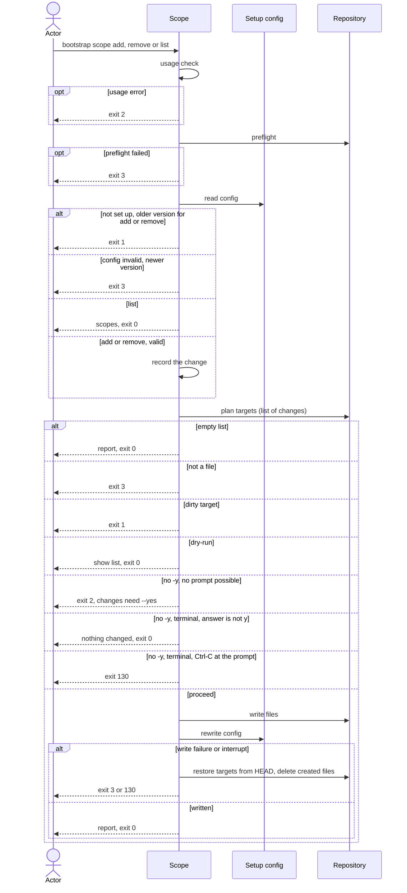

# Flow: Manage scopes

## Purpose

`bootstrap scope add|remove|list` manages `values.scopes` of a repository that
is already set up: the projects of the repository, each with the description an
LLM reads as the commit-scope comment. `add` and `remove` record the change in
the [Setup config](../../../entities/setup-config/index.md) and render again
`.config/git-conventional-commits.yaml` (the scopes, each description as a
comment). `list` is read-only. It never commits.

Serves: [Zero setup drift](../../../product.md#goal-zero-drift) — every scope in
the commit convention is the one recorded, never a hand-kept copy.

## Trigger & Actors

| Actor                            | May trigger                                                                                                                                                                       | Authorization                                               | Audit-recorded                                                                  |
| -------------------------------- | --------------------------------------------------------------------------------------------------------------------------------------------------------------------------------- | ----------------------------------------------------------- | ------------------------------------------------------------------------------- |
| Repo owner (any terminal)        | `bootstrap scope add <name> --description <text>`, `scope remove <name>...`, `scope list`; the tui values section edits scopes too ([Select tools](../160-select-tools/index.md)) | write access to the working directory (`list`: read access) | no — the product has no audit foundation; git history keeps every replaced file |
| AI agent or CI (non-interactive) | the same commands; `-y` is necessary for an `add` or `remove` that changes anything, since no prompt is possible without terminals or with `--json`                               | write access to the working directory (`list`: read access) | no — the product has no audit foundation; git history keeps every replaced file |

## Steps

Flags: `add` and `remove` accept `-y`/`--yes`, `--dry-run`, `--json`, `--quiet`,
`--verbose`, `--no-color` and `--help`; `add` also requires
`--description <text>`. `list` accepts `--json`, `--quiet`, `--verbose`,
`--no-color` and `--help`. Any other flag is a usage error.

`scope add` takes exactly one name; `scope remove` takes one or more names in
one run, with one consent, and a name repeated in it counts once; `scope list`
takes no argument.

Usage errors come first: no subcommand or an unknown one, a missing name, more
than one name on `scope add`, any argument on `scope list`, a `name` that is not
kebab-case (`^[a-z0-9]+(-[a-z0-9]+)*$`: no leading, trailing or double `-`), a
missing or empty `--description` or one with a newline or another control
character (it is one line, with no maximum length), an unknown flag or a bad
flag value exits 2 with short usage before the preflight and before
`.config/bootstrap.yaml` is read. They are reported together in one error
([errors](../../../conventions.md#errors)). Nothing is written. `--help` prints
the help and exits 0 anywhere, before the preflight.

1. The command runs, after the usage check, the preflight of
   [Set up a repository](../110-setup-repository/index.md) step 1. `scope list`
   is exempt from the `mise` on `PATH` requirement, as
   [Show the setup](../170-show-setup/index.md) step 2 is.
2. The command reads `.config/bootstrap.yaml` under
   [Setup config](../../../entities/setup-config/index.md): absent → exit 1,
   next command `bootstrap init`; invalid (a newer `version` or `format`
   included) → exit 3 per
   [Validity](../../../entities/setup-config/index.md#validity); for `add` and
   `remove`, an older `version` → exit 1 per
   [Version guard](../../../entities/setup-config/index.md#version-guard), next
   command `bootstrap init`. `list` takes no version guard: an older recorded
   `version` is read as recorded. A repair the read finds
   ([Repair on read](../../../entities/setup-config/index.md#repair)) is a
   change on the list of `add` and `remove` (warning in `warnings`) and is
   written back in step 6; `list` never repairs.
3. Per subcommand:
   - `list` prints `values.scopes` like `bootstrap show --list-scope`
     ([Show the setup](../170-show-setup/index.md) step 7), each scope with its
     description, one per line sorted by name; zero scopes shows `none`
     (`--json`: `[]`). It writes nothing, asks nothing, prints no next command
     and exits 0; the rest of this list does not apply to it.
   - `add` records `{name, description}`. A new name is added; an existing name
     has its description replaced (a change, no `--replace` and no extra
     consent); the same name with the same description is "already recorded"
     (listed in `already_recorded`) and changes nothing.
   - `remove` drops each named scope. A name not recorded is reported with the
     warning "scope `<name>` not recorded", listed in `not_recorded`, and
     changes nothing for it.
4. The command renders the full file set of the recorded selection with the new
   `values.scopes` and prepares the list of changes: the files to change, create
   or delete (`.config/git-conventional-commits.yaml`, which the unremovable
   `pre-commit` always renders in 1.0; a selection without it is out of scope)
   and `.config/bootstrap.yaml`. Planning, shared and `create_only` files,
   `orphaned` paths and the clean-target check follow
   [safety](../../../conventions.md#safety); a refusal of step 2 comes first
   ([precedence](../../../conventions.md#safety)). If nothing changes (an
   already-recorded scope, a removal of an unrecorded name, and no repair), the
   list is empty: nothing is written, no prompt is shown, the report is printed
   and the exit code is 0.
5. Consent, as in [config](../../../conventions.md#config) steps 2 to 4 (and
   [errors](../../../conventions.md#errors) for "changes need --yes").
6. The command writes the planned files, then rewrites `.config/bootstrap.yaml`
   last: `values.scopes` changed, sorted by name, and `files` per
   [Setup config invariants](../../../entities/setup-config/index.md#invariants).
   Ctrl-C and a write failure follow [safety](../../../conventions.md#safety).
7. The command reports `added`, `updated`, `already_recorded`, `removed`,
   `not_recorded` (scope names, sorted), `created`, `changed`, `deleted`,
   `unchanged`, `kept`, `orphaned` and `warnings`, in human output and under
   `--json`. A scope change changes no `mise` config file and adds no tool, so
   there is no next command and no `next_command` key; the closing line is
   "commit the changes" ([errors](../../../conventions.md#errors)).

Modes: `--json` follows [errors](../../../conventions.md#errors), with the keys
of step 7 on success. `--dry-run` shows the list, writes nothing, never prompts
and exits with the code the real run (as if `-y` were given) would return;
`--dry-run --json` adds `"dry_run": true` to the document the real run would
return, an error document included. Output rules follow
[Terminal UX](../../../design-system.md#terminal-ux).

## Guarantees

| Step / group | Consistency                 | On failure                                                                                                                                                                                                                                                                      | Idempotency                                                                                                                  | Load & latency          |
| ------------ | --------------------------- | ------------------------------------------------------------------------------------------------------------------------------------------------------------------------------------------------------------------------------------------------------------------------------- | ---------------------------------------------------------------------------------------------------------------------------- | ----------------------- |
| 1–5          | atomic — nothing is written | none — nothing written yet; exits 0, 1, 2, 3 or 130 per step                                                                                                                                                                                                                    | n/a — a re-run starts from the same repo state                                                                               | n/a — one local command |
| 6            | atomic — all-or-nothing     | a write failure or an interrupt restores every changed target from `HEAD` and deletes every created file per [safety](../../../conventions.md#safety); a write failure exits 3 naming the path, an interrupt exits 130; a failed restore exits 3 listing the paths not restored | a re-run with the same arguments records "already recorded" (`add`) or "not recorded" (`remove`), writes nothing and exits 0 | n/a — one local command |
| 7            | atomic — output only        | none — changes no repo state                                                                                                                                                                                                                                                    | n/a                                                                                                                          | n/a — one local command |

## Diagram

## Background Jobs

N/A — runs synchronously in one command invocation.

## Acceptance

A criterion that says only "when scope add/remove runs" runs with `-y`; one that
names its flags (no `-y`, `--dry-run`) runs with those only.

- Given a set-up repository, when
  `bootstrap scope add api --description "HTTP service" -y` runs, then
  `values.scopes` holds `api` with that description,
  `.config/git-conventional-commits.yaml` lists the scope with its description
  as a comment, `.config/bootstrap.yaml` is `changed`, nothing is committed, no
  next command is printed and the exit code is 0.
- Given a recorded scope `api`, when `scope add api --description "New text" -y`
  runs, then its description is replaced, both files are `changed` and the exit
  code is 0; with the same description, nothing is written, no prompt is shown,
  `api` is in `already_recorded` and the exit code is 0.
- Given a recorded scope `api`, when `bootstrap scope remove api -y` runs, then
  `api` is gone from `values.scopes` and from
  `.config/git-conventional-commits.yaml`, both files are `changed`, `api` is in
  `removed` and the exit code is 0.
- Given recorded scopes `api` and `cli`, when `bootstrap scope remove api cli`
  runs in a terminal without `-y`, then one list and one prompt cover both; "y"
  removes both and the exit code is 0.
- Given a recorded scope `api` and no scope `web`, when
  `scope remove api web -y` runs, then `api` is removed, `web` is in
  `not_recorded` with the warning "scope `web` not recorded" and the exit code
  is 0.
- Given a recorded scope `api`, when `scope remove api api -y` runs, then `api`
  is removed once, listed once in `removed`, and the exit code is 0.
- Given `scope add api web --description "x"`, or `scope list api`, when it
  runs, then the exit code is 2, short usage is shown and nothing is written.
- Given a name not recorded, when `scope remove web -y` runs, then nothing is
  written, `web` is in `not_recorded`, the warning "scope `web` not recorded" is
  reported and the exit code is 0.
- Given a set-up repository, when `scope list` runs, then every scope is printed
  with its description, sorted by name, nothing is written and the exit code is
  0; with no scope `none` (`--json`: `[]`); with `mise` absent the exit code is
  still 0.
- Given a name that is not kebab-case (`Api`, `my_api`, `-api`, `api-`,
  `my--api`), or no `--description`, or an empty one, or one with a newline,
  when `scope add` runs, then the exit code is 2, one error names every usage
  error, short usage is shown and nothing is written, even outside a git
  repository or without a setup file.
- Given an unknown subcommand or flag, or no name, when `scope` runs, then the
  exit code is 2 and nothing is written.
- Given stdin and stdout are terminals and no `--json`, when `scope add` for a
  change runs without `-y`, then the list and "apply these changes? y/N" are
  shown; "y" or "yes" applies it; Enter, "n" or "no" writes nothing, prints
  "nothing changed" and exits 0.
- Given no terminal or `--json`, when `scope add` for a change runs without
  `-y`, then nothing is written, no prompt is shown, the exit code is 2, the
  message is "changes need --yes" and the next command is the same command plus
  `--yes`.
- Given `--dry-run`, when `scope add` runs, then the list is shown, nothing is
  written, no prompt is shown, no `-y` is needed and the exit code is the one
  the real run would return; with `--json` the document is the real run's plus
  `"dry_run": true`.
- Given `--json`, when add or remove runs on any exit, then stdout is exactly
  one document with `exit`; on success it has `added`, `updated`,
  `already_recorded`, `removed`, `not_recorded`, `created`, `changed`,
  `deleted`, `unchanged`, `kept`, `orphaned` and `warnings`, and no
  `next_command`.
- Given no `.config/bootstrap.yaml`, when any `scope` subcommand runs with a
  valid command line, then the exit code is 1 and the next command is
  `bootstrap init`.
- Given a recorded version older than the running cli, when `scope add` or
  `scope remove` runs, then the exit code is 1, the next command is
  `bootstrap init` and nothing is written; `scope list` prints the scopes as
  recorded and exits 0.
- Given a recorded version newer than the running cli, or a setup file failing
  Setup config validity (two scopes of one name included), when any `scope`
  subcommand runs, then the exit code is 3 and nothing is written.
- Given a directory outside a git repository, or (for `add` and `remove`) no
  `mise` on the `PATH`, when scope runs, then nothing is written and the exit
  code is 3.
- Given `.config/git-conventional-commits.yaml` or `.config/bootstrap.yaml`
  modified, staged, untracked or ignored, when `scope add` runs, then nothing is
  written, the exit code is 1 and the path is listed, with no prompt.
- Given a target that is a directory or a symlink, when `scope add` runs, then
  nothing is written and the exit code is 3 naming that path.
- Given a repair the read finds, when `scope add` or `scope remove` runs, then
  the repair is on the list of changes, is written with the scope change, is
  reported in `warnings` and needs consent.
- Given a write failure injected mid-run, when `scope add` runs, then every
  changed target is restored from `HEAD`, created files are gone and the exit
  code is 3; with a failed restore the output (and `--json` `error.unrestored`)
  lists every path not restored.
- Given an interrupt (Ctrl-C) during the write, or at the prompt, when
  `scope add` runs, then the repository is as before and the exit code is 130.
- Abuse case: n/a — runs locally with the caller's own permissions on the
  caller's own repository; every input is validated per
  [baseline](../../../conventions.md#baseline) boundary-validation.

## References

- [baseline](../../../conventions.md#baseline),
  [safety](../../../conventions.md#safety),
  [errors](../../../conventions.md#errors),
  [config](../../../conventions.md#config),
  [Terminal UX](../../../design-system.md#terminal-ux)
- [Set up a repository](../110-setup-repository/index.md) (preflight),
  [Add a tool](../140-add-tool/index.md) (shape),
  [Show the setup](../170-show-setup/index.md) (`--list-scope`),
  [Manage members](../190-manage-members/index.md) (sibling)
- [Setup config](../../../entities/setup-config/index.md),
  [Tool](../../../entities/tool/index.md#selection-dependent-files)
- API surface: N/A — no service project. Screens surface: N/A — cli has no
  screen platform.
