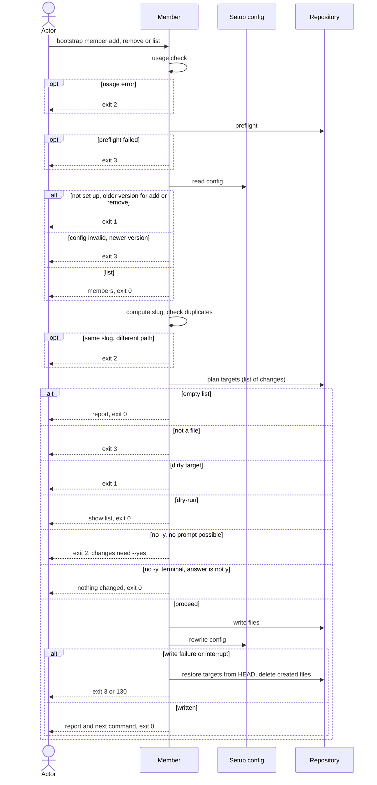

# Flow: Manage members

## Purpose

`bootstrap member add|remove|list` manages `values.members` of a repository that
is already set up: the other repositories of the same product (submodules or
sibling checkouts), each recorded by a relative `path` and a `slug`. `add` and
`remove` record the change in the
[Setup config](../../../entities/setup-config/index.md) and render again the
files that use members: the `MEMBERS` env value in the `mise` config, the
`setup:all --<slug>` flags and the `setup-<slug>` aliases. `list` is read-only.
`bootstrap init --member <path>` (repeatable) adds a member the same way
([Set up a repository](../110-setup-repository/index.md)). It never commits.

Serves: [Zero setup drift](../../../product.md#goal-zero-drift) — the members
every task and alias acts on are the recorded ones, never a hand-kept copy.

## Trigger & Actors

| Actor                            | May trigger                                                                                                                                         | Authorization                                               | Audit-recorded                                                                  |
| -------------------------------- | --------------------------------------------------------------------------------------------------------------------------------------------------- | ----------------------------------------------------------- | ------------------------------------------------------------------------------- |
| Repo owner (any terminal)        | `bootstrap member add <path>...`, `member remove <slug>...`, `member list`; `init --member <path>`; the tui values section edits members too        | write access to the working directory (`list`: read access) | no — the product has no audit foundation; git history keeps every replaced file |
| AI agent or CI (non-interactive) | the same commands; `-y` is necessary for an `add` or `remove` that changes anything, since no prompt is possible without terminals or with `--json` | write access to the working directory (`list`: read access) | no — the product has no audit foundation; git history keeps every replaced file |

## Steps

Flags: `add` and `remove` accept `-y`/`--yes`, `--dry-run`, `--json`, `--quiet`,
`--verbose`, `--no-color` and `--help`. `list` accepts `--json`, `--quiet`,
`--verbose`, `--no-color` and `--help`. Any other flag is a usage error.

The slug of a path is its folder name (the last segment, a trailing `/`
ignored), lowercased, every character other than a lowercase letter or digit
replaced by `-` (`../Api_Server` → `api-server`). A trailing `/` on a path is
dropped before the path is compared and recorded (`../web/` is `../web`).

`member add` takes one or more paths and `member remove` one or more slugs in
one run, with one consent; `member list` takes no argument.

Usage errors come first: no subcommand or an unknown one, a missing `<path>` or
`<slug>`, any argument on `member list`, a `<path>` that is empty or not
relative, an unknown flag or a bad flag value exits 2 with short usage before
the preflight and before `.config/bootstrap.yaml` is read, all reported together
in one error ([errors](../../../conventions.md#errors)). Nothing is written. A
path is never checked for existence. `--help` prints the help and exits 0
anywhere, before the preflight.

1. The command runs, after the usage check, the preflight of
   [Set up a repository](../110-setup-repository/index.md) step 1. `member list`
   is exempt from the `mise` on `PATH` requirement, as
   [Show the setup](../170-show-setup/index.md) step 2 is.
2. The command reads `.config/bootstrap.yaml` under
   [Setup config](../../../entities/setup-config/index.md): absent → exit 1,
   next command `bootstrap init`; invalid (a newer `version` or `format`
   included) → exit 3 per
   [Validity](../../../entities/setup-config/index.md#validity); for `add` and
   `remove`, an older `version` → exit 1 per
   [Version guard](../../../entities/setup-config/index.md#version-guard), next
   command `bootstrap init`. `list` takes no version guard: an older recorded
   `version` is read as recorded. A repair the read finds
   ([Repair on read](../../../entities/setup-config/index.md#repair)) is a
   change on the list of `add` and `remove` (warning in `warnings`) and is
   written back in step 6; `list` never repairs.
3. Per subcommand:
   - `list` prints `values.members`, one `<slug> (<path>)` per line sorted by
     slug (for example `api-server (../Api_Server)`); zero members shows `none`.
     `--json` prints one object per [errors](../../../conventions.md#errors):
     `{exit, members: [{slug, path}], warnings}`, `members` sorted by slug and
     `[]` when none. It writes nothing, asks nothing, prints no next command and
     exits 0; the rest of this list does not apply to it.
   - `add` computes the slug of each `<path>`. The same path already recorded is
     "already recorded" (listed in `already_recorded`) and changes nothing. A
     recorded or given member with the same slug and a different path exits 2
     naming both paths
     ([invariant 9](../../../entities/setup-config/index.md#invariants)),
     nothing written.
   - `remove` drops each member whose slug is named. A slug not recorded is
     reported with the warning "member `<slug>` not recorded", listed in
     `not_recorded`, and changes nothing for it. Removing a member never touches
     the member's folder.
4. The command renders the full file set of the recorded selection with the new
   `values.members` and prepares the list of changes: the files to change,
   create or delete (the `mise` env config, the `setup:all` task and the alias
   file that use members) and `.config/bootstrap.yaml`. Planning, shared and
   `create_only` files, `orphaned` paths and the clean-target check follow
   [safety](../../../conventions.md#safety); the refusals of steps 2 and 3 come
   first ([precedence](../../../conventions.md#safety)). If nothing changes (an
   already-recorded path, a removal of an unrecorded slug, and no repair), the
   list is empty: nothing is written, no prompt is shown, the report is printed
   and the exit code is 0.
5. Consent, as in [config](../../../conventions.md#config) steps 2 to 4 (and
   [errors](../../../conventions.md#errors) for "changes need --yes").
6. The command writes the planned files, then rewrites `.config/bootstrap.yaml`
   last: `values.members` changed, sorted by slug, and `files` per
   [Setup config invariants](../../../entities/setup-config/index.md#invariants).
   Ctrl-C and a write failure follow [safety](../../../conventions.md#safety).
7. The command reports `added`, `already_recorded` (paths, sorted), `removed`,
   `not_recorded` (slugs, sorted), `created`, `changed`, `deleted`, `unchanged`,
   `kept`, `orphaned`, `warnings` and `next_command`, in human output and under
   `--json`. A member change changes a `mise` config file, so the next command
   `MISE_ENV=dev mise run setup:all` is printed per
   [errors](../../../conventions.md#errors) (and the closing line is "commit the
   changes, then run `MISE_ENV=dev mise run setup:all`"); a run that changes
   nothing prints none and has no `next_command` key. A run that changed a file
   ends its human output with one more line, "review `git diff`; restore your
   own lines with `git restore -p <file>`", per
   [errors](../../../conventions.md#errors).

Modes: `--json` follows [errors](../../../conventions.md#errors), with the keys
of step 7 on success. `--dry-run` shows the list, writes nothing, never prompts
and exits with the code the real run (as if `-y` were given) would return;
`--dry-run --json` adds `"dry_run": true` to the document the real run would
return, an error document included. Output rules follow
[Terminal UX](../../../design-system.md#terminal-ux).

## Guarantees

| Step / group | Consistency                 | On failure                                                                                                                                                                                                                                                                      | Idempotency                                                                                                                  | Load & latency          |
| ------------ | --------------------------- | ------------------------------------------------------------------------------------------------------------------------------------------------------------------------------------------------------------------------------------------------------------------------------- | ---------------------------------------------------------------------------------------------------------------------------- | ----------------------- |
| 1–5          | atomic — nothing is written | none — nothing written yet; exits 0, 1, 2, 3 or 130 per step                                                                                                                                                                                                                    | n/a — a re-run starts from the same repo state                                                                               | n/a — one local command |
| 6            | atomic — all-or-nothing     | a write failure or an interrupt restores every changed target from `HEAD` and deletes every created file per [safety](../../../conventions.md#safety); a write failure exits 3 naming the path, an interrupt exits 130; a failed restore exits 3 listing the paths not restored | a re-run with the same arguments records "already recorded" (`add`) or "not recorded" (`remove`), writes nothing and exits 0 | n/a — one local command |
| 7            | atomic — output only        | none — changes no repo state                                                                                                                                                                                                                                                    | n/a                                                                                                                          | n/a — one local command |

## Diagram

## Background Jobs

N/A — runs synchronously in one command invocation.

## Acceptance

A criterion that says only "when member add/remove runs" runs with `-y`; one
that names its flags (no `-y`, `--dry-run`) runs with those only.

- Given a set-up repository, when `bootstrap member add ../Api_Server -y` runs,
  then `values.members` holds path `../Api_Server` with slug `api-server`, the
  `MEMBERS` env value, the `setup:all --api-server` flag and the
  `setup-api-server` alias are rendered, `.config/bootstrap.yaml` is `changed`,
  nothing is committed, the next command is `MISE_ENV=dev mise run setup:all`,
  the human output ends with the closing line, then "review `git diff`; restore
  your own lines with `git restore -p <file>`", and the exit code is 0.
- Given a path that does not exist on disk, when `member add` runs, then it is
  recorded all the same and the exit code is 0.
- Given a recorded member, when `member add` runs with the same path, then
  nothing is written, no prompt is shown, the path is in `already_recorded`, no
  next command is printed and the exit code is 0.
- Given a recorded member `../web`, when `member add ../web/ -y` runs, then the
  trailing `/` is dropped, the path is already recorded (in `already_recorded`
  as `../web`), nothing is written and the exit code is 0.
- Given a recorded member `../web`, when `member add ../other/Web -y` runs (same
  slug `web`, different path), then nothing is written and the exit code is 2
  naming both paths.
- Given a recorded member `api-server`, when
  `bootstrap member remove api-server
  -y` runs, then it leaves
  `values.members` and its env value, flag and alias are no longer rendered, the
  member's folder is untouched, the next command is printed and the exit code
  is 0.
- Given a slug not recorded, when `member remove web -y` runs, then nothing is
  written, `web` is in `not_recorded`, the warning "member `web` not recorded"
  is reported and the exit code is 0.
- Given recorded members `../Api_Server` and `web`, when `member list` runs,
  then the lines `api-server (../Api_Server)` and `web (web)` are printed,
  sorted by slug, nothing is written and the exit code is 0; with `--json` the
  document is
  `{"exit": 0, "members": [{"slug": "api-server", "path": "../Api_Server"}, {"slug": "web", "path": "web"}], "warnings": []}`;
  with no member the human output is `none` and `members` is `[]`; with `mise`
  absent the exit code is still 0.
- Given `bootstrap member add ../api ../web`, when it runs in a terminal without
  `-y`, then one list and one prompt cover both; "y" records both and the exit
  code is 0. Given `member remove api web -y` with both recorded, then both are
  removed with one consent and the exit code is 0.
- Given `member add a/Web b/web`, when it runs, then nothing is written and the
  exit code is 2 naming both paths.
- Given `member list web`, when it runs, then the exit code is 2, short usage is
  shown and nothing is written.
- Given an empty or absolute path, no argument, an unknown subcommand or an
  unknown flag, when `member` runs, then the exit code is 2, short usage is
  shown, nothing is written, and this holds outside a git repository or without
  a setup file.
- Given stdin and stdout are terminals and no `--json`, when `member add` for a
  change runs without `-y`, then the list and "apply these changes? y/N" are
  shown; "y" or "yes" applies it; Enter, "n" or "no" writes nothing, prints
  "nothing changed" and exits 0.
- Given no terminal or `--json`, when `member add` for a change runs without
  `-y`, then nothing is written, no prompt is shown, the exit code is 2, the
  message is "changes need --yes" and the next command is the same command plus
  `--yes`.
- Given `--dry-run`, when `member add` runs, then the list is shown, nothing is
  written, no prompt is shown, no `-y` is needed and the exit code is the one
  the real run would return, 2 for a duplicate slug included; with `--json` the
  document is the real run's plus `"dry_run": true`.
- Given `--json`, when add or remove runs on any exit, then stdout is exactly
  one document with `exit`; on success it has `added`, `already_recorded`,
  `removed`, `not_recorded`, `created`, `changed`, `deleted`, `unchanged`,
  `kept`, `orphaned` and `warnings`, and `next_command` equal to
  `MISE_ENV=dev mise run setup:all` when the run changed a `mise` config file,
  else absent.
- Given `bootstrap init -y --member ../Api_Server`, when init runs, then the
  member is recorded as `member add` records it (flow 110 covers init).
- Given no `.config/bootstrap.yaml`, when any `member` subcommand runs with a
  valid command line, then the exit code is 1 and the next command is
  `bootstrap init`.
- Given a recorded version older than the running cli, when `member add` or
  `member remove` runs, then the exit code is 1, the next command is
  `bootstrap init` and nothing is written; `member list` prints the members as
  recorded and exits 0.
- Given a recorded version newer than the running cli, or a setup file failing
  Setup config validity (two members of one slug included), when any `member`
  subcommand runs, then the exit code is 3 and nothing is written.
- Given a directory outside a git repository, or (for `add` and `remove`) no
  `mise` on the `PATH`, when member runs, then nothing is written and the exit
  code is 3.
- Given a target the render would change that is modified, staged, untracked or
  ignored (the setup file included), when `member add` runs, then nothing is
  written, the exit code is 1 and the path is listed, with no prompt.
- Given a target that is a directory or a symlink, when `member add` runs, then
  nothing is written and the exit code is 3 naming that path.
- Given a repair the read finds, when `member add` or `member remove` runs, then
  the repair is on the list of changes, is written with the member change, is
  reported in `warnings` and needs consent.
- Given a write failure injected mid-run, when `member add` runs, then every
  changed target is restored from `HEAD`, created files are gone and the exit
  code is 3; with a failed restore the output (and `--json` `error.unrestored`)
  lists every path not restored.
- Given an interrupt (Ctrl-C) during the write, or at the prompt, when
  `member add` runs, then the repository is as before and the exit code is 130.
- Abuse case: n/a — runs locally with the caller's own permissions on the
  caller's own repository; every input is validated per
  [baseline](../../../conventions.md#baseline) boundary-validation.

## References

- [baseline](../../../conventions.md#baseline),
  [safety](../../../conventions.md#safety),
  [errors](../../../conventions.md#errors),
  [config](../../../conventions.md#config),
  [Terminal UX](../../../design-system.md#terminal-ux)
- [Set up a repository](../110-setup-repository/index.md) (preflight,
  `--member`), [Add a tool](../140-add-tool/index.md) (shape),
  [Show the setup](../170-show-setup/index.md),
  [Manage scopes](../180-manage-scopes/index.md) (sibling)
- [Setup config](../../../entities/setup-config/index.md)
- API surface: N/A — no service project. Screens surface: N/A — cli has no
  screen platform.
