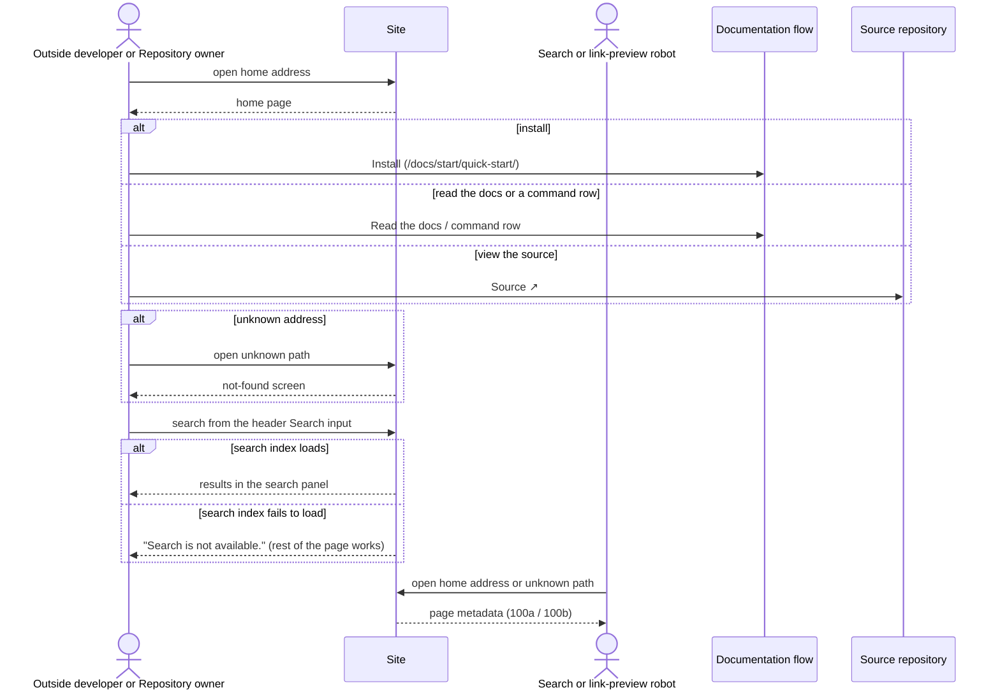

# Flow: Home

## Purpose

A visitor who opens the home address learns in one view what bootstrap does and
can start at once: read the first command, read the docs, or open the source.

Serves: [Outside adoption](../../../product.md#goal-outside-adoption)

## Platforms

| Platform | File              | Notes                                                           |
| -------- | ----------------- | --------------------------------------------------------------- |
| site     | [site](./site.md) | The only surface; a single static page plus its not-found page. |

## Trigger & Actors

| Actor                        | May trigger                                                                                                     | Authorization      | Audit-recorded |
| ---------------------------- | --------------------------------------------------------------------------------------------------------------- | ------------------ | -------------- |
| Outside developer            | Opens the home address (the site address, per [web metadata](../../../conventions.md#web-metadata))             | none — public page | no             |
| Repository owner             | Opens the home address (per [web metadata](../../../conventions.md#web-metadata))                               | none — public page | no             |
| Search or link-preview robot | Opens the home address (per [web metadata](../../../conventions.md#web-metadata)); reads the page metadata only | none — public page | no             |

## Steps

1. Site serves the home page — N/A: the page reads no product data
2. Outside developer or Repository owner reads the command `bootstrap tui` in
   the Command display and the Terminal view of the tui beneath it, which copies
   the catalogs of [Tool category](../../../entities/tool-category/index.md) and
   [Tool](../../../entities/tool/index.md)
3. Outside developer or Repository owner follows "Install", "Read the docs" or a
   command row to its destination in the
   [documentation flow](../110-documentation/index.md), or "Source ↗" to the
   [source repository](../../../conventions.md#web-metadata) (external)
4. Outside developer or Repository owner opens an unknown address: site serves
   screen `100b` (not found) with HTTP status 404 — N/A: it reads no product
   data
5. Outside developer or Repository owner searches from the header Search input
   (per the design-system
   [Component Behaviors](../../../design-system.md#component-behaviors) "Inputs
   (search)"); results open in the search panel — N/A: it reads no product data
6. Search or link-preview robot reads the page metadata only: the Metadata block
   of `100a` at the home address, or of `100b` at an unknown path — N/A: it
   reads no product data and follows no link

## Guarantees

| Step / group | Consistency                                    | On failure                                                                                                                                                                       | Idempotency                        | Load & latency                                                   |
| ------------ | ---------------------------------------------- | -------------------------------------------------------------------------------------------------------------------------------------------------------------------------------- | ---------------------------------- | ---------------------------------------------------------------- |
| all          | atomic — the page is static and holds no state | Unknown address: the `not-found` screen, served with HTTP status 404. Search index fails to load: the search panel shows "Search is not available."; the rest of the page works. | n/a — every step is safe to repeat | default — per [reliability](../../../conventions.md#reliability) |

## Diagram

## Background Jobs

N/A — static pages, no processing.

## Acceptance

- Given the home address, when a visitor opens it, then the home page renders
  every block of screen `100a` in order.
- Given the home page, when a visitor reads the Command display, then it shows
  exactly `bootstrap tui` and the text is selectable.
- Given the home page, when a visitor activates a command row, then the matching
  command page of the documentation flow opens: `/docs/commands/tui/`,
  `/docs/commands/init/`, `/docs/commands/add/` or `/docs/commands/remove/`; the
  Add or remove row opens `/docs/commands/add/` or `/docs/commands/remove/`
  according to the link activated.
- Given the home page, when a visitor reads the Command display, then it has no
  copy button.
- Given the home page, when a visitor activates "Install", then
  `/docs/start/quick-start/` opens.
- Given the home page, when a visitor activates "Read the docs", then `/docs/`
  opens.
- Given the home page, when a visitor activates the header "Docs" link, then
  `/docs/` opens.
- Given the home page, when a visitor activates a "Source ↗" link (header, hero
  or footer), then the source repository
  ([web metadata](../../../conventions.md#web-metadata)) opens, external.
- Given the home page, when a visitor reads the Terminal view
  ([design-system](../../../design-system.md#component-behaviors)), then it
  shows exactly the lines pinned in the `100a` Terminal view row of
  [site.md](./site.md), the full view and not an excerpt, with the heading,
  labels, `none` and footer as pinned in
  [Terminal UX](../../../design-system.md#terminal-ux). A `none` choice shows
  only where the tool is removable
  ([Tool category](../../../entities/tool-category/index.md) invariant 4,
  [Select tools](../../cli/160-select-tools/index.md) step 5).
- Given the home page, when a visitor looks at the Terminal view, then it has no
  label, no copy button and no cursor highlight, its secondary text is muted and
  an unremovable tool shows a dimmed mark and `locked`
  ([design-system](../../../design-system.md#component-behaviors)).
- Given the home page and the Terminal view taller than its box, when a visitor
  scrolls it, then it scrolls vertically, and the box is focusable and scrolls
  with the keyboard
  ([design-system](../../../design-system.md#component-behaviors)).
- Given an unknown path, when a visitor opens it, then the `not-found` screen
  (`100b`) shows and the response status is HTTP 404.
- Given the `not-found` page, when a visitor activates the home link, then
  `100a` opens.
- Given the `not-found` page, when a visitor activates the search link, then
  focus moves to the header Search input.
- Given the `not-found` page and client scripting off, when a visitor opens it,
  then the search link and the Search input are hidden and the home link stays.
- Given the home page, when a robot reads it, then its metadata matches the
  Metadata block of `100a`.
- Given the `not-found` page, when a robot reads it, then the page is not
  indexable.
- Given the home page and the search index cannot load, when a visitor uses the
  search panel, then it shows exactly "Search is not available." and the rest of
  the page works.
- Given the keyboard only, when a visitor uses the home page, then the buttons,
  the command rows, the links and the scrollable Terminal view are reachable and
  show a visible focus, to WCAG 2.2 AA per the design-system
  [Accessibility Standard](../../../design-system.md#accessibility-standard).
- Given client scripting is off, when a visitor opens the home page, then the
  content and the links work, and the search input is hidden, never inert
  ([reliability](../../../conventions.md#reliability)).
- Abuse case: n/a — the page is public, read-only and accepts no input that
  changes state.

## References

- [design-system](../../../design-system.md) — Command display, Empty and error,
  Brand assets, Accessibility Standard
- [web metadata](../../../conventions.md#web-metadata),
  [theming](../../../conventions.md#theming) (dark only),
  [reliability](../../../conventions.md#reliability),
  [observability](../../../conventions.md#observability) (no analytics)
- API surface: N/A — static site, no service project
- Entities: [Tool category](../../../entities/tool-category/index.md),
  [Tool](../../../entities/tool/index.md) — the Terminal view describes the
  catalogs; the sample changes when either catalog changes
