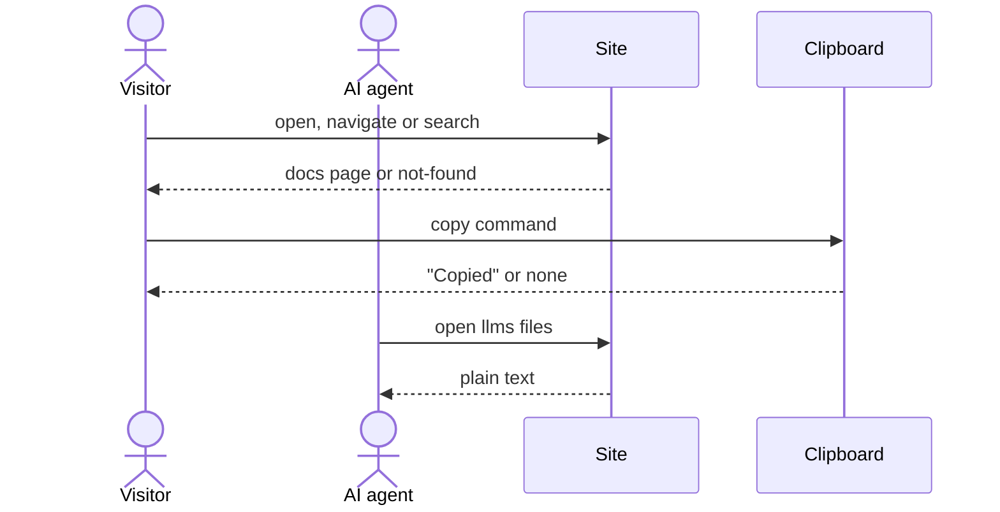

# Flow: Documentation

## Purpose

A visitor who opens a page under `https://bootstrap.virajp.dev/docs/` finds
every command, flag, exit code, tool, setup-config field and JSON report field
of bootstrap. The site also publishes the same pages as plain text for AI
agents. The docs describe only the latest release; there is no version
selector, and the changelog page records older versions.

Serves: [Outside adoption](../../../product.md#goal-outside-adoption),
[Fast new-repo setup](../../../product.md#goal-fast-setup)

## Platforms

| Platform | File | Notes |
| -------- | ---- | ----- |
| site | [site](./site.md) | The only surface; one screen, `110a`, used by every docs page. |

## Page set

The addresses are permanent. The sidebar order is the order of this table, and
previous and next links follow it. The Page column is the page title; the
Description column is the page's one-sentence description, also used in
`/llms.txt`. Each command page describes the cli flow in its Flow column; the Flow column
is not shown on the site.

| Section | Page | Address | Description | Flow |
| ------- | ---- | ------- | ----------- | ---- |
| START | Introduction | `/docs/` (the docs index) | What bootstrap is, what it writes into a repository, and how it keeps that setup current. | n/a |
| START | Quick start | `/docs/start/quick-start/` | Go from an empty git repository to passing gates in under five minutes. | n/a |
| COMMANDS | bootstrap init | `/docs/commands/init/` | Set up a repository: choose tools, give values, write the files. | [Set up a repository](../../cli/110-setup-repository/index.md) |
| COMMANDS | bootstrap check | `/docs/commands/check/` | Report drift between a repository and the shared source, for people and agents. | [Check for drift](../../cli/120-check-drift/index.md) |
| COMMANDS | bootstrap update | `/docs/commands/update/` | Bring a repository back to the shared source and decide per changed file. | [Update a repository](../../cli/130-update-repository/index.md) |
| COMMANDS | bootstrap add | `/docs/commands/add/` | Add one or more non-core tools to a set-up repository. | [Add a tool](../../cli/140-add-tool/index.md) |
| COMMANDS | bootstrap remove | `/docs/commands/remove/` | Remove non-core tools and their files, with backups. | [Remove a tool](../../cli/150-remove-tool/index.md) |
| GUIDES | Adopt an existing repository | `/docs/guides/adopt-existing-repository/` | Move a repository with hand-copied setup onto bootstrap. | n/a |
| GUIDES | Run check in CI | `/docs/guides/run-check-in-ci/` | Fail a build when a repository drifts from the shared source. | n/a |
| GUIDES | Fix drift with an AI agent | `/docs/guides/fix-drift-with-an-ai-agent/` | Let an agent read the JSON report and resolve drift alone. | n/a |
| GUIDES | Keep your own edits | `/docs/guides/keep-your-own-edits/` | Mark files as kept or deleted so bootstrap leaves them alone. | n/a |
| REFERENCE | Tools | `/docs/reference/tools/` | The core set and every non-core tool, with the files that each one writes. | n/a |
| REFERENCE | bootstrap.yaml | `/docs/reference/bootstrap-yaml/` | Every field of the setup file and the rules for each one. | n/a |
| REFERENCE | JSON report | `/docs/reference/json-report/` | Every field of the --json report for each command. | n/a |
| REFERENCE | Exit codes | `/docs/reference/exit-codes/` | What each exit code means and the next command to run. | n/a |
| REFERENCE | Changelog | `/docs/reference/changelog/` | What changed in each release of bootstrap. | n/a |

## Trigger & Actors

| Actor | May trigger | Authorization | Audit-recorded |
| ----- | ----------- | ------------- | -------------- |
| Outside developer, Repository owner | Opens a page under `https://bootstrap.virajp.dev/docs/` | none — public pages | no |
| AI agent | Opens a docs page, `/llms.txt` or `/llms-full.txt` | none — public pages | no |
| Search robot | Opens a docs page; reads the page metadata and content | none — public pages | no |

## Steps

1. Site serves the page — N/A: reads no product data; the pages describe
   [Setup config](../../../entities/setup-config/index.md) and
   [Tool](../../../entities/tool/index.md) but store no data
2. Visitor navigates with the sidebar, "On this page", previous and next links,
   or the Search input ([Inputs (search)](../../../design-system.md#component-behaviors)
   searches every docs page)
3. Visitor copies a command from a code block; the copy button shows "Copied"
   for 1.5 seconds
4. AI agent reads `/llms.txt` (every docs page with its one-sentence
   description and address) or `/llms-full.txt` (every docs page as plain text,
   in sidebar order); both come from the same pages as the site and never
   differ from them

## Guarantees

| Step / group | Consistency | On failure | Idempotency | Load & latency |
| ------------ | ----------- | ---------- | ----------- | -------------- |
| all | atomic — the pages are static and hold no state | Unknown address under `/docs/`: the `not-found` screen of [Home](../100-home/index.md) (`100b`). Scripting off: the copy buttons, the Search input and the mobile-menu button are hidden; content and navigation still work, and on narrow views the navigation shows inline above the content. Clipboard unavailable: no confirmation; the command stays selectable. | n/a — every step is safe to repeat | default — per [reliability](../../../conventions.md#reliability) |

## Diagram

## Background Jobs

N/A — static pages, no processing.

## Acceptance

- Given every address in the Page set table, when a visitor opens it, then the
  site returns that page on screen `110a`.
- Given an unknown address under `/docs/`, when a visitor opens it, then the
  `not-found` screen (`100b` of [Home](../100-home/index.md)) shows.
- Given the docs, when a reader compares them with the cli flows, the entities
  and [errors](../../../conventions.md#errors), then every command, flag, exit
  code (0, 1, 2, 3, 130), tool, setup-config field, JSON report field, the
  not-a-git-repository rule and the `--json` error document defined there
  appears on its docs page.
- Given any docs page, when a visitor reads the sidebar, then it lists exactly
  the pages of the Page set table, in that order, with the current page marked.
- Given any docs page, when a visitor follows previous or next, then the link
  leads to the neighbour in sidebar order; the first page has no previous link
  and the last page has no next link.
- Given any docs page, when the visitor activates a copy button, then the
  clipboard holds exactly the text of that code block and the button shows
  "Copied" for 1.5 seconds.
- Given the clipboard is unavailable, when the visitor activates the copy
  button, then no confirmation shows and the command stays selectable.
- Given the Search input, when a visitor searches, then the results cover every
  docs page.
- Given `/llms.txt`, when an agent reads it, then it lists every docs page with
  its one-sentence description and address.
- Given `/llms-full.txt`, when an agent reads it, then it contains the text of
  every docs page in sidebar order.
- Given a docs page, when a robot reads it, then its metadata matches the
  Metadata block of `110a`.
- Given the keyboard only, when a visitor uses a docs page, then every control
  is reachable with a visible focus, and the mobile menu moves focus in on open
  and returns it to its button on Escape, to WCAG 2.2 AA per the design-system
  [Accessibility Standard](../../../design-system.md#accessibility-standard).
- Given client scripting is off, when a visitor opens a docs page, then the
  content, the sidebar and the links work, and the copy buttons, the Search
  input and the mobile-menu button are hidden, never inert; on a narrow view the
  navigation shows inline above the content
  ([reliability](../../../conventions.md#reliability)).
- Abuse case: n/a — the pages are public, read-only and accept no input that
  changes state.

## References

- [web metadata](../../../conventions.md#web-metadata),
  [theming](../../../conventions.md#theming) (dark only),
  [reliability](../../../conventions.md#reliability),
  [errors](../../../conventions.md#errors),
  [observability](../../../conventions.md#observability) (no analytics)
- API surface: N/A — static site, no service project
