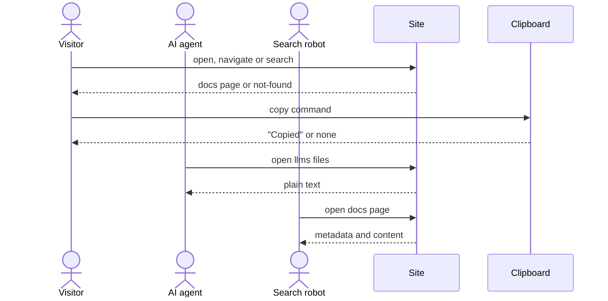

# Flow: Documentation

## Purpose

A visitor who opens a page under `https://bootstrap.virajp.dev/docs/` finds
every command, flag, exit code, tool category, tool, setup-config field and JSON
result field of bootstrap. The site also publishes the same pages as plain text
for AI agents. The `--json` output is called the "JSON result" everywhere. The
docs describe only the latest release; there is no version selector, and the
changelog page records older versions.

Serves: [Outside adoption](../../../product.md#goal-outside-adoption),
[Fast new-repo setup](../../../product.md#goal-fast-setup)

## Platforms

| Platform | File              | Notes                                                          |
| -------- | ----------------- | -------------------------------------------------------------- |
| site     | [site](./site.md) | The only surface; one screen, `110a`, used by every docs page. |

## Page set

The addresses are permanent. The sidebar order is the order of this table, and
previous and next links follow it. The Page column is the page title; the
Description column is the page's one-sentence description, also used in
`/llms.txt`. Each command page describes the cli flow in its Flow column; the
Flow column is not shown on the site.

| Section   | Page                           | Address                                   | Description                                                                                                                                                                                                                                                                          | Flow                                                           |
| --------- | ------------------------------ | ----------------------------------------- | ------------------------------------------------------------------------------------------------------------------------------------------------------------------------------------------------------------------------------------------------------------------------------------ | -------------------------------------------------------------- |
| START     | Introduction                   | `/docs/` (the docs index)                 | What bootstrap is, what it writes into a repository, how it keeps that setup current, and that commands run from any subdirectory of the repository and act on the repository root.                                                                                                  | n/a                                                            |
| START     | Quick start                    | `/docs/start/quick-start/`                | Install bootstrap with mise or Homebrew (mise must be on PATH for every command except `bootstrap show`), then go from an empty git repository to passing gates in under five minutes.                                                                                               | n/a                                                            |
| COMMANDS  | bootstrap init                 | `/docs/commands/init/`                    | Set up a repository or bring it up to date: give the values and tools as flags or take the defaults (the repo path is the recorded one, else read from `origin`), consent with `-y` or at the prompt, and write the files.                                                           | [Set up a repository](../../cli/110-setup-repository/index.md) |
| COMMANDS  | bootstrap add                  | `/docs/commands/add/`                     | Add tools to a set-up repository, or replace the tool of a single-tool category.                                                                                                                                                                                                     | [Add a tool](../../cli/140-add-tool/index.md)                  |
| COMMANDS  | bootstrap remove               | `/docs/commands/remove/`                  | Remove tools and their files (create-only files stay on disk); git keeps every deleted file.                                                                                                                                                                                         | [Remove a tool](../../cli/150-remove-tool/index.md)            |
| COMMANDS  | bootstrap tui                  | `/docs/commands/tui/`                     | The only full-screen interactive command: select tools by category in a full-screen view, edit the values, and set up a repository that is not set up yet.                                                                                                                           | [Select tools](../../cli/160-select-tools/index.md)            |
| COMMANDS  | bootstrap show                 | `/docs/commands/show/`                    | Print the recorded setup, or the fields chosen with filter flags such as `--list-scope`; read-only, never writes.                                                                                                                                                                    | [Show the setup](../../cli/170-show-setup/index.md)            |
| GUIDES    | Adopt an existing repository   | `/docs/guides/adopt-existing-repository/` | Move a repository with hand-copied setup onto bootstrap.                                                                                                                                                                                                                             | n/a                                                            |
| GUIDES    | Roll back with git             | `/docs/guides/roll-back-with-git/`        | Go back to any earlier setup with git.                                                                                                                                                                                                                                               | n/a                                                            |
| GUIDES    | Use bootstrap from an AI agent | `/docs/guides/use-from-an-ai-agent/`      | Run init, add and remove with flags, `-y` to consent to the changes, and `--replace` to replace a tool, since an agent cannot answer the prompt, read the recorded setup with `bootstrap show`, read the JSON result, and know that `bootstrap tui` is the only interactive command. | n/a                                                            |
| REFERENCE | Tool categories                | `/docs/reference/tool-categories/`        | Each tool category, how many of its tools a repository can select, and its tools.                                                                                                                                                                                                    | n/a                                                            |
| REFERENCE | Tools                          | `/docs/reference/tools/`                  | Every tool, its category, and the files that each one writes.                                                                                                                                                                                                                        | n/a                                                            |
| REFERENCE | bootstrap.yaml                 | `/docs/reference/bootstrap-yaml/`         | Every field of the setup file and the rules for each one.                                                                                                                                                                                                                            | n/a                                                            |
| REFERENCE | JSON result                    | `/docs/reference/json-result/`            | Every field of the JSON result (the --json output) for each command, including exit, warnings and dry_run.                                                                                                                                                                           | n/a                                                            |
| REFERENCE | Exit codes                     | `/docs/reference/exit-codes/`             | What each exit code means, including interrupts and restores, and the next command to run.                                                                                                                                                                                           | n/a                                                            |
| REFERENCE | Changelog                      | `/docs/reference/changelog/`              | What changed in each release of bootstrap.                                                                                                                                                                                                                                           | n/a                                                            |

The `/docs/commands/init/` page's first usage example is exactly
`bootstrap init --add-scope cli --add-scope site --yes`. The page states that
the example needs a repo path readable from `origin`, else add `--repo`.

## Trigger & Actors

| Actor                                           | May trigger                                             | Authorization       | Audit-recorded |
| ----------------------------------------------- | ------------------------------------------------------- | ------------------- | -------------- |
| Visitor (outside developer or repository owner) | Opens a page under `https://bootstrap.virajp.dev/docs/` | none — public pages | no             |
| AI agent                                        | Opens a docs page, `/llms.txt` or `/llms-full.txt`      | none — public pages | no             |
| Search robot                                    | Opens a docs page; reads the page metadata and content  | none — public pages | no             |

## Steps

1. Site serves the page — N/A: reads no product data; the pages describe
   [Setup config](../../../entities/setup-config/index.md) and
   [Tool](../../../entities/tool/index.md) and
   [Tool category](../../../entities/tool-category/index.md) but store no data
2. Visitor navigates with the sidebar, "On this page", previous and next links,
   or the Search input ([`110a`](./site.md#110a--doc-page-components))
3. Visitor copies a command from a code block
   ([`110a`](./site.md#110a--doc-page-components))
4. AI agent reads `/llms.txt` or `/llms-full.txt`; both come from the same pages
   as the site and never differ from them
5. Search robot reads each docs page's metadata (per the Metadata block of
   `110a` in [site](./site.md)) and its content

## Guarantees

| Step / group | Consistency                                     | On failure                                                                                                                                                                                                                                                                                              | Idempotency                        | Load & latency                                                   |
| ------------ | ----------------------------------------------- | ------------------------------------------------------------------------------------------------------------------------------------------------------------------------------------------------------------------------------------------------------------------------------------------------------- | ---------------------------------- | ---------------------------------------------------------------- |
| all          | atomic — the pages are static and hold no state | Unknown address under `/docs/`: the `not-found` screen of [Home](../100-home/index.md) (`100b`). Search index fails to load: the search panel shows "Search is not available."; the rest of the page works. Scripting off and clipboard unavailable: per [`110a`](./site.md#110a--doc-page-components). | n/a — every step is safe to repeat | default — per [reliability](../../../conventions.md#reliability) |

## Diagram

## Background Jobs

N/A — static pages, no processing.

## Acceptance

- Given the search index cannot load, when the visitor searches on a docs page,
  then the search panel shows "Search is not available." and the rest of the
  page works.
- Given every address in the Page set table, when a visitor opens it, then the
  site returns that page on screen `110a`.
- Given an unknown address under `/docs/`, when a visitor opens it, then the
  `not-found` screen (`100b` of [Home](../100-home/index.md)) shows.
- Given the docs, when a reader compares them with the cli flows, the entities
  and [errors](../../../conventions.md#errors), then every command, flag, exit
  code (0, 1, 2, 3, 130), tool category, tool, setup-config field, JSON result
  field, the not-a-git-repository rule and the error JSON result defined there
  appears on its docs page.
- Given the docs, when a reader looks for the mise prerequisite, then the Quick
  start states that `mise` must be on PATH for every command except
  `bootstrap show`, shows exit 3 "mise not installed" with its install command,
  and shows the one warning printed when the `mise` found is not
  `~/.local/bin/mise`.
- Given the docs, when a reader looks for the cross-command rules of
  [errors](../../../conventions.md#errors), then: the Exit codes page covers
  exit 130 with "interrupted — nothing written" and "interrupted — repository
  restored", and a failed restore exiting 3 with `unrestored`; the JSON result
  page covers the top-level `exit`, `warnings` and `dry_run`; "Use bootstrap
  from an AI agent" states that init, add and remove ask for consent only in a
  terminal and that an agent passes `-y` (without it, and with no terminal or
  with `--json`, a changing run exits 2 "changes need --yes"), that values come
  from flags and defaults (on init, the repo path is the recorded one, else read
  from `origin`), that a replacement needs `--replace` as well and `-y` is never
  consent to replace, that `--json` prints one JSON document, and that
  `bootstrap tui` is the only full-screen interactive command (it needs stdin
  and stdout terminals); the Introduction states that commands run from any
  subdirectory of the repository and act on the repository root.
- Given any docs page, when a visitor reads the sidebar, then it lists exactly
  the pages of the Page set table, in that order, with the current page marked.
- Given any docs page, when a visitor follows previous or next, then the link
  leads to the neighbour in sidebar order; the first page has no previous link
  and the last page has no next link.
- Given any docs page, when the visitor activates a copy button, then the
  clipboard holds exactly the text of that code block and the button shows
  "Copied" for 1.5 seconds.
- Given the clipboard is unavailable, when the visitor activates the copy
  button, then no confirmation shows and the command stays selectable.
- Given the Search input, when a visitor searches for text that appears in the
  body of any docs page, then that page is among the results, and each result
  shows the page title, the matching section heading, and a short text snippet
  containing the match.
- Given a docs page with level-2 and level-3 headings, when a visitor reads "On
  this page", then it lists those headings, with each level-3 entry indented
  under its level-2 section.
- Given `/llms.txt`, when an agent reads it, then it lists every docs page with
  its one-sentence description and address.
- Given `/llms-full.txt`, when an agent reads it, then it contains the text of
  every docs page in sidebar order.
- Given a docs page, when a robot reads it, then its metadata matches the
  Metadata block of `110a`.
- Given the keyboard only, when a visitor uses a docs page, then every control
  is reachable with a visible focus, and the mobile menu moves focus in on open
  and returns it to its button on Escape, to WCAG 2.2 AA per the design-system
  [Accessibility Standard](../../../design-system.md#accessibility-standard).
- Given client scripting is off, when a visitor opens a docs page, then the
  content, the sidebar and the links work, and the copy buttons, the Search
  input and the mobile-menu button are hidden, never inert; on a narrow view the
  navigation shows inline above the content
  ([reliability](../../../conventions.md#reliability)).
- Abuse case: n/a — the pages are public, read-only and accept no input that
  changes state.

## References

- [web metadata](../../../conventions.md#web-metadata),
  [theming](../../../conventions.md#theming) (dark only),
  [reliability](../../../conventions.md#reliability),
  [errors](../../../conventions.md#errors),
  [observability](../../../conventions.md#observability) (no analytics)
- API surface: N/A — static site, no service project
