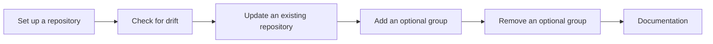

# bootstrap — Product

> **Source of truth for why the product exists and what "good" means.** Lives at
> `docs/blueprint/product.md`, authored by `/vwf:product` — the Phase −1
> foundation before `architecture`. Code- and stack-independent: no technology,
> project, or screen names — those belong to the registry and the entity docs.
> Every flow's Purpose links the goal(s) it serves (entities trace to goals
> through the flows that use them); the blueprint-reviewer flags surfaces that
> trace to no goal.

## Problem

A developer who runs many repositories sets up each one's development tooling
— the formatter, the commit gates, the secret and vulnerability scanners, the
task library, the ignore files, the editor defaults — by copying configuration
from another repository and editing it by hand. That is slow on day zero, and
it keeps costing afterwards: copies go stale, carry the source repository's
names and paths, and drift apart from each other, so time goes into fixing
setup instead of building the product.

Day-zero setup and ongoing drift are one problem: a repository's setup should
come from one shared source, both when the repository is created and for the
rest of its life.

**Why now:** the number of repositories keeps growing, and the current way of
producing this setup — embedded inside another tool's workflow — has become too
complex to maintain.

## Target users

| Persona           | Who they are                                                                                       | Core need                                                                                            |
| ----------------- | -------------------------------------------------------------------------------------------------- | ---------------------------------------------------------------------------------------------------- |
| Repo owner        | A developer maintaining many personal and work repositories                                        | Every repository set up the same way from one source, with no hand-copying and no hand-fixing        |
| AI coding agent   | An agent working in a repository on the owner's behalf                                             | A machine-readable report of how the repository's setup differs from the source, precise enough to act on without guessing |
| Outside developer | A developer outside the owner's repositories who adopts the published tool for their own repositories | A sensible, opinionated setup without having to design one                                           |

## Goals & success metrics

### Zero setup drift {#goal-zero-drift}

- Outcome: every active repository's setup matches the shared source.
- Metric: share of the owner's active repositories whose drift check passes —
  target 100% within 3 months of the 1.0 release
- Measured via: external each repository's continuous-integration drift check
- Re-evaluate if: share below 50% by 6 months after the 1.0 release → re-scope

### Fast new-repo setup {#goal-fast-setup}

- Outcome: a new repository is ready to build in minutes.
- Metric: time from an empty repository to all gates passing — target under 5
  minutes at the 1.0 release
- Measured via: external timed runs in a scratch repository

### Agent-resolvable drift {#goal-agent-resolvable}

- Outcome: an AI agent resolves reported drift without asking a human.
- Metric: share of drift reports an agent fully resolves unaided — target 90%
  within 3 months of the 1.0 release
- Measured via: external agent session logs

### Outside adoption {#goal-outside-adoption}

- Outcome: developers outside the owner's repositories adopt the tool.
- Metric: weekly installs of the published tool — target 100 per week
  within 6 months of the 1.0 release
- Measured via: external public install statistics

## Slice priority

| Rank | Slice (flow / entity)       | Serves goal                                                                    | Validates                                         | Why now                                                                              |
| ---- | --------------------------- | ------------------------------------------------------------------------------ | ------------------------------------------------- | ------------------------------------------------------------------------------------ |
| 1    | Set up a repository         | [Fast new-repo setup](#goal-fast-setup)                                        | —                                                 | The core path — rendering the shared source into a repository — that every other slice reuses |
| 2    | Check for drift             | [Zero setup drift](#goal-zero-drift), [Agent-resolvable drift](#goal-agent-resolvable) | —                                                 | A read-only report is what makes drift visible in every repository and to an agent   |
| 3    | Update an existing repository | [Zero setup drift](#goal-zero-drift)                                         | [Re-applying keeps a repository's own edits](#risks--assumptions) | Brings the repositories that already exist onto the shared source                  |
| 4    | Add an optional group       | [Fast new-repo setup](#goal-fast-setup)                                        | —                                                 | Lets a repository take on a group of setup later, without starting over              |
| 5    | Remove an optional group    | [Zero setup drift](#goal-zero-drift)                                           | —                                                 | Lets a repository drop a group it no longer wants, without leftover files            |
| 6    | Documentation               | [Outside adoption](#goal-outside-adoption)                                     | —                                                 | What an outside developer reads before adopting; ships with 1.0                      |

Rank 1 validates no assumption on purpose: the two riskiest — one shared
source fits every repository, and an agent can resolve drift from the report
alone — are validated by their cheaper methods (rendering against the existing
repositories, and an agent prototype) before slice 1 is built.

## Non-goals

- **No application scaffolding.** It sets up tooling and hygiene only; it never
  generates application code, frameworks or project structure.
- **No automatic drift resolution.** It reports drift and applies only what the
  owner or the agent approves; it never silently overwrites a repository's own
  changes.
- **No language, cloud or deploy setup in 1.0.** Language toolchains and
  cloud or deploy configuration are left out, possibly to become add-ons later.
- **No hosted service.** It runs locally and in continuous integration only —
  no accounts, no server, no telemetry.

## Risks & assumptions

| Assumption                                                                                              | Risk if wrong                                                              | Validation method                                                  | Status   | Evidence |
| ------------------------------------------------------------------------------------------------------- | -------------------------------------------------------------------------- | ------------------------------------------------------------------ | -------- | -------- |
| One shared source fits every repository, with differences confined to values and opt-in groups         | Repositories fork the source to fit, and drift returns                     | usage-data                                                         | untested | —        |
| An agent can resolve drift from the report alone                                                        | Drift still needs a human in the loop, and the agent goal is unreachable   | prototype                                                          | untested | —        |
| Re-applying the source to an existing repository keeps that repository's own edits                    | Owners stop re-applying, and existing repositories drift indefinitely      | slice:update-an-existing-repository                                | untested | —        |
| Outside developers want an opinionated setup rather than designing their own                           | Adoption stays near zero                                                   | accepted-risk — a side benefit that does not block the owner's goals | untested | —        |

The first row is validated by rendering the shared source against the seven
repositories that already carry this setup and counting differences that are
not values; the second by handing an agent a hand-written report for one
repository.
